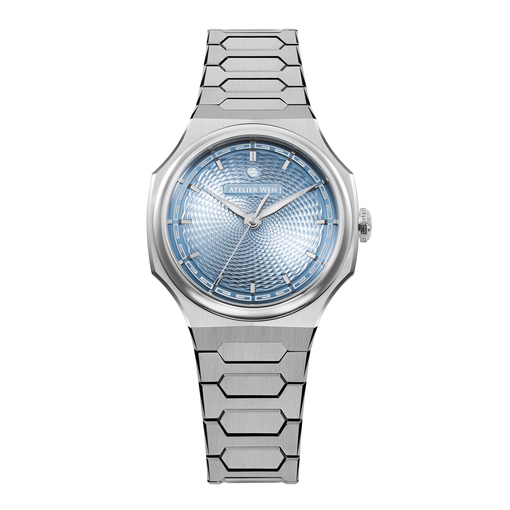
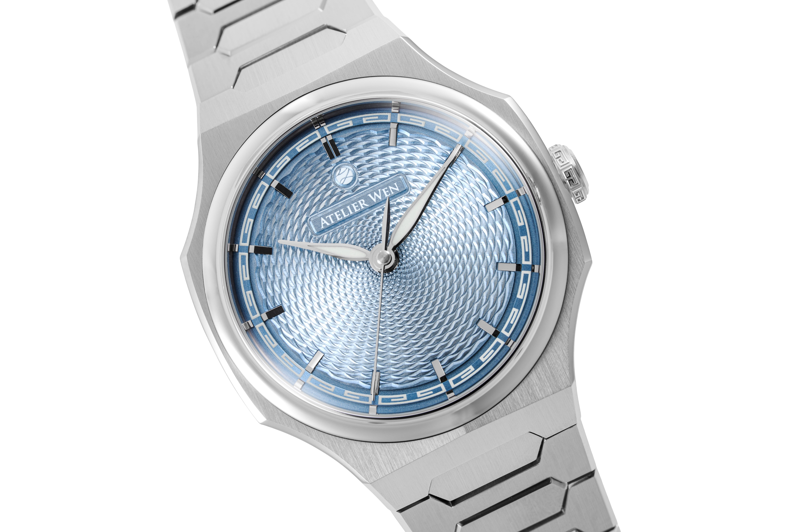
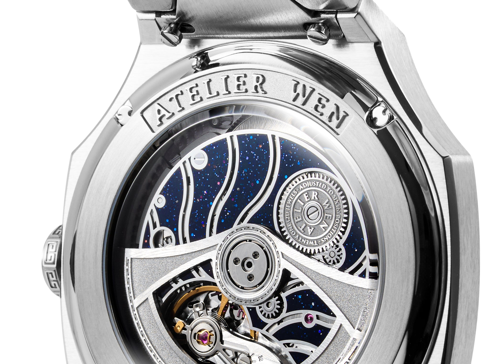
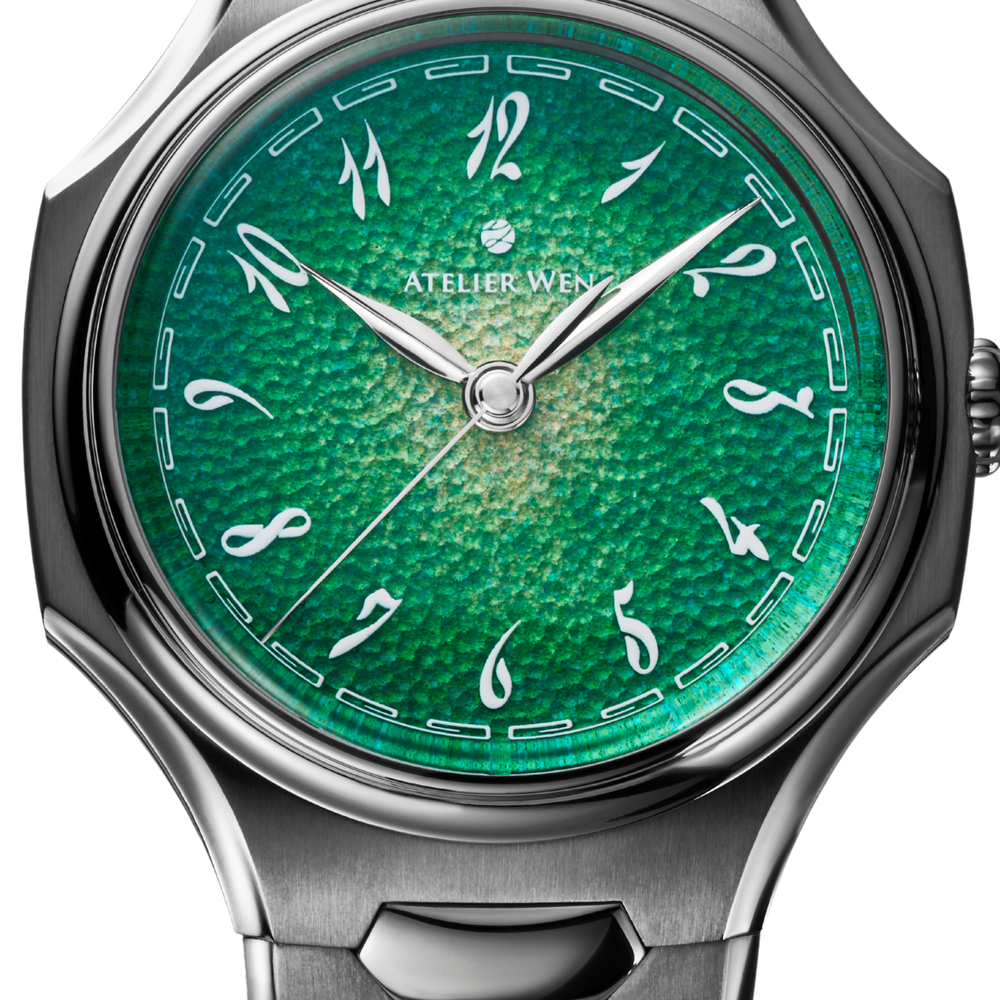
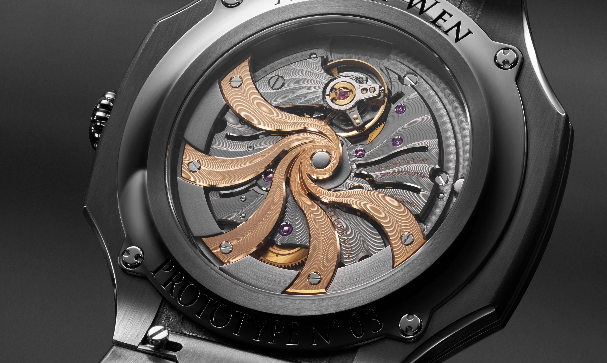

On most watches, the words “Made in China” would be difficult to find even when the case, dial or strap came from a Chinese factory. Brands would rather discuss a Swiss movement, European design and final assembly. Geography matters for as long as it sounds expensive.

Atelier Wen went the other way. It does not merely name China. It has built the brand around the claim that Chinese watchmaking can mean more than inexpensive components. Ancient motifs appear on the dial, the guilloché comes from a workshop in Henan, and the shapes of pagoda roofs and traditional joinery are worked into the design.

This was conceived by two Frenchmen.

That contradiction would already make a good story. Atelier Wen has since moved from a watch funded on Kickstarter to a $4,850 flagship powered by a French movement. The question is no longer whether the brand is Chinese. It is what Chinese identity means when the most valuable component now comes from Europe.

*The 40-millimetre case, integrated steel bracelet and hand-guilloché fish-scale dial of Perception. Full-resolution manufacturer photograph with its background removed: [Atelier Wen](https://sg.atelierwen.com/products/perception).*

## A name that resists a neat translation

Robin Tallendier and Wilfried Buiron became close while studying in Beijing in 2016. Tallendier had been interested in watches since the age of fourteen. He later worked at the French Chamber of Watchmaking in Shanghai and at Christie’s in London, while collecting Chinese watches and learning about the industry that had spent decades making movements and components for other names.

They assembled the brand name in 2018. “Atelier” means workshop. 文, or wen, does not fit as comfortably into one English word. It can refer to culture, writing, learning and qualities acquired through study rather than force. Atelier Wen translates it as “culture workshop.”

The founders began working with Chinese designers Li Ming Liang and Liu Yu Guan in 2017. Their first collection, Porcelain Odyssey, consisted of two classically shaped watches named Hao and Ji. Both had genuine porcelain dials, with details drawn from Chinese ceramics and architecture.

The Kickstarter campaign opened in October 2018 and reached its funding target in under thirty minutes. It was an impressive start, though the first watch also showed that the idea of the dial was stronger than the object built around it. The porcelain was special. The case and the complete design were less resolved.

Atelier Wen then went quiet. It did not release a fresh dial colour every month or try to stretch one successful campaign across the next five years. Almost four years passed before its second watch arrived.

## A sports watch whose dial came from a cave workshop

Pre-orders for Perception opened on 18 April 2022. The first allocation sold out in sixteen hours.

Its outline was immediately familiar: a steel case, an integrated bracelet, broad flanks and a slim profile. It speaks the language of 1970s luxury sports watches, so it is possible to see a Nautilus, a Hublot or something else in its silhouette. Up close, however, it does not copy one model. The concave bezel, sweeping case sides and layered dial construction combine into a recognisable face of its own.

The centre is what matters.

Cheng Yucai did not train under a Swiss master guillocheur. In Atelier Wen’s account, an old Russian tobacco box decorated with guilloché set him on his path. He left his city job, built his own machines and, after several failed attempts, completed a working rose engine in 2018. His workshop operates near Xinmi in Henan province. The brand calls him “China’s first and only guilloché master craftsman.” That should be read for what it is: Atelier Wen’s designation, not an independently awarded title.

The Perception dial carries a fish-scale pattern. It is not stamped in one blow and it is not completed by CNC. Operators guide the machines by hand in Cheng’s workshop. Atelier Wen initially stated that an earlier dial took roughly eight hours; it later described more complex processes and considerably longer production times.

This became a point of dispute. Critics questioned how much work Cheng personally performed, how much was done by apprentices, and whether his self-built equipment should be compared directly with traditional Swiss or German engine turning. Atelier Wen says the work is completed under Cheng’s direction on genuine rose and straight-line engines. In an independent examination, Worn & Wound found small irregularities under magnification that indicated handwork and concluded clearly that the pattern was not stamped.

That does not settle every methodological argument. It does support the more important claim. This is not an industrial texture marketed as handicraft. A small workshop is genuinely doing the work.

*The fish-scale guilloché of Perception at close range. This is not a stamped texture: it is cut on hand-guided engines in Cheng Yucai's Henan workshop. Full-resolution manufacturer photograph with its background removed: [Atelier Wen](https://sg.atelierwen.com/products/perception).*

## Chinese is more than decoration

Perception could easily have become an ordinary watch with a few fortunate motifs attached and sold as cultural heritage. Its details are more considered than that.

The chapter ring uses huiwen, an uninterrupted geometric pattern. The dial’s interlocking layers refer to sunmao, traditional Chinese joinery that works without nails or screws. The curves along the case evoke pagoda rooflines. A stone lion appeared on the caseback, while bridges in the newest movement resemble folding fans.

Any one of these explanations could feel forced. Together they form a consistent language. The watch is not Chinese because somebody put a dragon on its dial. It is Chinese because the proportions, surfaces and part of its production have been organised around the same idea.

The original Perception had a 904L steel case measuring 40 millimetres across, roughly 9.4 millimetres thick and water resistant to 100 metres. Its bracelet flowed into the case, while a push-button system extended the clasp by about a centimetre. That is not a glamorous complication. On a hot day and a swollen wrist, it is worth more than another line of text on the dial.

Early examples used the Dandong Peacock SL1588A automatic movement. It was a thin Chinese calibre beating at 4 hertz with around 41 hours of power reserve. Atelier Wen adjusted it in five positions and subjected it to temperature and shock tests. The calibre nevertheless remained a question mark for buyers concerned about the long-term servicing of an unfamiliar Chinese movement.

This was the most honest test of the brand’s convictions. If Atelier Wen truly wanted to represent Chinese watchmaking, it could not automatically place a Swiss ETA in every case simply because that story was easier to sell.

## The third version became French

Perception V3 arrived in 2026. From the front, it looked like a measured update. The 40-millimetre diameter remained, thickness increased to 10.4 millimetres and water resistance stayed at 100 metres. A bamboo-green dial joined the range, surface finishing and the clasp were revised, and a full sapphire window replaced the partly closed back.

The window was needed because the movement behind it was no longer Chinese.

V3 uses a highly customised version of the French Pequignet EPM03 automatic calibre. It runs at 4 hertz, stores 65 hours of energy, uses bidirectional pawl winding and is regulated to a range of minus 4 to plus 6 seconds per day. Its bridges are shaped like fans, recesses are filled with blue aventurine lacquer, and the finishing goes far beyond the visual treatment of the old Peacock.

*A wide close-up of the Perception V3 caseback. Fan-shaped bridges and blue aventurine lacquer now frame the French Pequignet-based movement. Manufacturer photograph with its background removed: [Atelier Wen](https://sg.atelierwen.com/products/perception).*

By then, Perception no longer represented the limit of the company’s ambition. In November 2025, Atelier Wen presented Inflection, a 40-millimetre flagship whose case and every bracelet link are made from 99.9 per cent pure tantalum. The unusually dense, blue-grey metal sticks to cutting tools, dissipates machining heat poorly and resists fine polishing. Atelier Wen began trials with eleven Chinese partners and needed three years to reach a full tantalum bracelet it considered ready for serial production.

*The green grand feu enamel dial and 99.9 per cent pure tantalum case of Inflection at close range. Cropped but otherwise unaltered manufacturer image: [Atelier Wen](https://atelierwen.com/products/inflection).*

Inflection’s Chinese contribution extends beyond machining the metal. Its grand feu enamel dial comes from Kong Lingjun’s Beijing workshop, the hands and numerals draw on bamboo leaves, and the movement bridges follow wind motifs in historical Chinese painting. Inside, however, is a Swiss Girard-Perregaux 03300 automatic calibre. Planned at only 100 pieces per year, Inflection costs $29,800 on its tantalum bracelet or $19,800 on a sailcloth-rubber strap. This is no longer an accessible microbrand watch. It is an open attempt by a young Chinese independent to enter high watchmaking.

*The heavily customised Girard-Perregaux 03300 movement inside Inflection. Original full-resolution manufacturer macro: [Atelier Wen](https://atelierwen.com/blogs/journal/presenting-inflection-in-tantalum).*

The price moved too. V3 costs $4,850, against about $3,320 for the previous generation. This is no longer a microbrand offering an interesting dial for less. It now competes in the same financial space as established Swiss and Japanese companies with proprietary calibres, dealer networks and more predictable service support.

That brings us back to Chinese identity. Is the French movement a retreat?

Partly. One of the bravest decisions in the early Perception was refusing to disguise the origin of its calibre. V3 gives a safer answer to the buyer’s most common doubt, but loses some of the need to prove what the original watch set out to prove.

On the other hand, Atelier Wen never promised that every component would be Chinese. It spoke about Chinese culture and craft. French founders, a Henan dial and a Morteau movement in one object may describe the company more accurately than any national label. It is not a national manufacture. It is a two-way cultural workshop.

## Where a good story is no longer enough

At a few hundred dollars, we forgive a young brand a great deal. Near five thousand, intent matters less than the object.

Perception’s greatest strength remains its dial. The hand-guided pattern changes constantly in the light, and its small deviations are traces of making rather than defects. The case is slim, the bracelet is carefully finished, and the micro-adjustment is genuinely useful. V3’s movement is a substantial improvement in both engineering and presentation.

Its weakness may be the same abundance. A concave bezel, polished bevels, guilloché centre, luminous huiwen ring, layered markers, shaped bridges and blue lacquer leave little empty space. Anyone seeking restraint may see not a subtle eastern reference, but too many ideas at once.

The integrated-bracelet sports-watch field is crowded as well. Its outline inevitably recalls more expensive predecessors, and not everyone will see Perception as an independent design from across a room. Then comes the ordinary risk of a young company: there is no multi-decade record for parts supply, service or retained value.

Atelier Wen is therefore not the right purchase for everyone. It does not have to be. Near five thousand dollars, buyers are no longer choosing the most rational quantity of watch. They are choosing the object whose compromises they are willing to own.

## Moving the label to the front

Chinese watchmaking is usually presented in two extremes. One is the anonymous mass-produced object. The other is a Swiss-branded watch whose Chinese components are politely left out of the conversation. Atelier Wen is trying to create room for a third picture: Chinese manufacturing and craft that do not need to be hidden.

Not every claim is beyond challenge. The dispute around guilloché showed how quickly a craft story can become a marketing war. The French movement also asks an awkward question about where origin ends and positioning begins.

Still, few small brands have managed in eight years to make not only a compelling watch, but also to disturb an old assumption.

A French calibre now runs behind the Perception’s caseback. On the front, the work of a Henan workshop still catches the light. Atelier Wen’s most important component may not be its movement or dial. It may be the decision not to hide that work behind the name of a country customers already trust.
