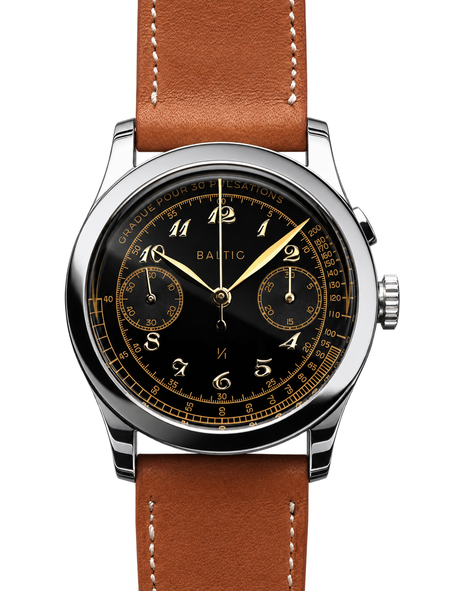

Etienne Malec was sixteen when he opened a suitcase that had sat untouched for roughly a decade. Inside were about a hundred watches. Old military chronographs, Breitling Navitimers, a Zenith El Primero, an Omega Speedmaster, and many more pieces his father had collected.

He barely knew his father. He was a photographer with a passion for cars and watches, but he died when Etienne was five. Alongside the suitcase, however, he left a journal filled with photographs and notes on every watch that had passed through his hands. A teenager began to know his father through those pages.

More than a decade later, that collection and that journal became Baltic.

*The watch journal kept by Etienne Malec's father, with the LIP Genève chronograph beside it. Photo: [Baltic](https://baltic-watches.com/en/about-us).*

## The collection that became a connection

Malec did not come from a watchmaking family in the usual sense. He inherited no workshop, tools or Swiss company name. What he inherited were objects and stories.

His father's collection centred on military watches and chronographs from the 1940s, 1950s and 1960s. Etienne began to work through them one by one. He read forums, attended gatherings, met collectors in Paris, and took up photography himself. The first serious watch he wore was one of his father's LIP Genève chronographs, powered by a Venus 178.

*Etienne Malec, founder of Baltic. Photo: [Baltic Watches, The Smalltalk](https://www.the-smalltalk.com/etienne-malec-baltic-watches/).*

The Baltic name was not chosen merely because it sounded evocative. His father's family came from northern Poland, near the Baltic Sea. It allowed Malec to point both to his roots and to the man whose collection had started everything.

That distinction matters. Many microbrands begin when a founder spots a gap in the market. Baltic began when someone tried to build a connection with a person he had lost too soon.

## Two watches and an enormous first day

Before watches, Malec had started Rezin with two partners, making eyewear from wood and natural materials. That business taught him how a drawing becomes a product that can actually be manufactured. Baltic took about two years to prepare. The idea came together in 2016, and the public launch followed on Kickstarter on 12 April 2017.

There were two watches. The HMS 001 was a simple three-hand automatic with a Miyota 821A. The Bicompax 001 was a hand-wound, twin-register chronograph using the Chinese Sea-Gull ST19. Both had 38mm stepped cases and domed Hesalite crystals. Their proportions drew on chronographs of the 1940s, including Longines 13ZN cases.

*The Bicompax 001, one of the two watches in Baltic's first Kickstarter campaign. Photo: [Baltic](https://baltic-watches.com/en/archives/bicompax-001), modified with AI assistance.*

The target was €65,000. In thirty-five days, 1,044 backers pledged €514,806. Roughly €300,000 arrived on the first day. At the time, it was among the largest crowdfunding results for a French watch project.

The more important date was December. The team had never produced a watch in series, yet it began delivering the first pieces in December 2017, on schedule. On Kickstarter, a handsome campaign is common. A box arriving when promised is much rarer.

## The brand that refused to remain a Kickstarter project

One successful campaign does not make a brand. It can be a single well-judged product followed by the disappearance of both attention and money. Malec later said that the period after Kickstarter was what worried him most.

The first answer was a 200-piece panda chronograph in June 2018. It sold out in an hour. The more serious test was the Aquascaphe, opened for pre-order later that year on Baltic's own website. The company deliberately chose not to return to Kickstarter. It did not want crowdfunding to become its permanent label.

The Aquascaphe diver became Baltic's first true foundation model. It was not a one-off limited edition, but a watch around which a collection could grow. Bronze, GMT, titanium and dual-crown versions followed. In the summer of 2026 came the Aquascaphe MK2, reworked with seven years of experience. It is offered in 37mm and 39.5mm cases, with a Miyota 9039 automatic movement, sapphire crystal and bezel insert, and 200 metres of water resistance.

*The grey version of the 2026 Aquascaphe MK2. Photo: [Baltic](https://baltic-watches.com/en/products/aquascaphe-mk2-grey).*

This was how Baltic crossed the line between a successful campaign and a watch company built to last.

## What French means here

This is worth stating precisely, because origin is one of the foggiest subjects in the watch industry.

Baltic watches are designed in France. A large share of the components comes from Hong Kong and other Asian suppliers. Depending on the model, the movement may be Japanese, Chinese or Swiss. Final assembly, regulation and quality control take place in Besançon. The company has never claimed to make everything in-house.

The first HMS used a Miyota, while the Bicompax used a Sea-Gull. Most Aquascaphe models are also Miyota-powered, the GMT uses a Swiss Soprod, and the more expensive chronographs use Sellita. It is not a romantic manufacture story. It is a global supply chain.

Malec has been unusually direct about this. He said the company investigated fully Swiss production and rejected it on cost, while also discovering that many components used by Swiss brands came from Asia anyway. Baltic does not try to look more impressive by hiding a Chinese case or calibre. It states where the parts come from, then assembles and checks them in France.

That does not make Baltic a French manufacture. It does give a clearer account of how a mechanical watch can be sold for a few hundred euros.

## The small rotor that put Baltic beside the big names

In 2021 Baltic unveiled two watches that changed its place among microbrands.

The first was a unique piece for the Only Watch charity auction. It was a 36mm monopusher pulsometer chronograph powered by a restored Venus 150 from the 1940s. Estimated at CHF 12,000 to 18,000, it sold for CHF 50,000. Four years after Kickstarter, Baltic appeared in the same auction catalogue as Patek Philippe, F.P. Journe and Audemars Piguet.

*Baltic's unique Only Watch 2021 chronograph. Photo: [Baltic](https://baltic-watches.com/en/archives/onlywatch-2021), modified with AI assistance.*

The other was the MR01. A 36mm dress watch with large Breguet numerals, leaf hands and a small seconds display shifted between seven and eight o'clock. On the back was something almost no one offered at this price: an automatic micro-rotor movement.

*The salmon MR01, with its displaced small seconds. Photo: [Baltic](https://baltic-watches.com/en/products/mr-classic-salmon).*

A micro-rotor sits within the plane of a movement rather than above it. That allows a watch to be thinner and leaves almost the entire gear train visible through the back. The Hangzhou CAL5000A inside the MR is a Chinese, industrially decorated calibre with about 42 hours of power reserve. It is not haute horlogerie, but it brought a view previously associated with five-figure watches to a price around €600.

*The Hangzhou CAL5000A micro-rotor movement seen through the back of the MR. Photo: [Baltic](https://baltic-watches.com/en/products/mr-classic-salmon), modified with AI assistance.*

The MR does not copy one particular Calatrava. Its proportions are familiar, but the oversized numerals and displaced seconds give it an identity of its own. This was the point at which Baltic moved from quoting vintage watches to developing a recognisable language.

## Where the price shows

The MR movement is better viewed at arm's length than through a loupe. The bridge decoration is attractive, but mechanical and superficial. Several reviewers noted a stiff, difficult crown, an audibly rattling micro-rotor and straightforward case finishing. Hesalite scratches, while 30 metres of water resistance makes this a genuine dress watch rather than an all-purpose one.

Long-term servicing is a fair question too. Many watchmakers know the Miyota 9039. Parts and a willing workshop may be harder to find for the less common Hangzhou micro-rotor. If major work is needed, replacing the whole calibre may prove more economical than repairing it.

None of this makes the MR a bad watch. It simply puts the promise back in proportion. Baltic is not selling €10,000 finishing for €600. It is selling an extremely well-drawn watch that evokes high watchmaking from a distance and honestly reveals its price up close.

The same is true of the brand as a whole. Baltic's strongest skill is neither movement making nor hand finishing. It is proportion. The company knows how large a vintage-inspired case should be, where a minute track should sit, how much distortion a domed crystal needs, and when to stop adding detail.

## What remained from the suitcase

Baltic today is no longer two Kickstarter watches. It offers twelve collections, from the simple HMS through the Aquascaphe divers and Hermétique field watch to the more expensive MR, Prismic, world timer and Scalegraph chronographs. It now has showrooms in Paris, London and New York.

Yet the starting point remains recognisable. Baltic takes the proportions of old watches and rebuilds them to be wearable and attainable today. Sometimes it moves too close to the originals. At other times, as with the MR's displaced seconds or the Hermétique's recessed crown, the result is distinctly its own.

Etienne Malec's father kept a journal so that every watch passing through his hands would leave a trace. His son did more than preserve it. He began to continue it, no longer by trading old watches, but by making new ones that other people will wear and eventually pass on.

Baltic is not really a story about how to copy the past well. It is about turning inherited objects into a new inheritance.
