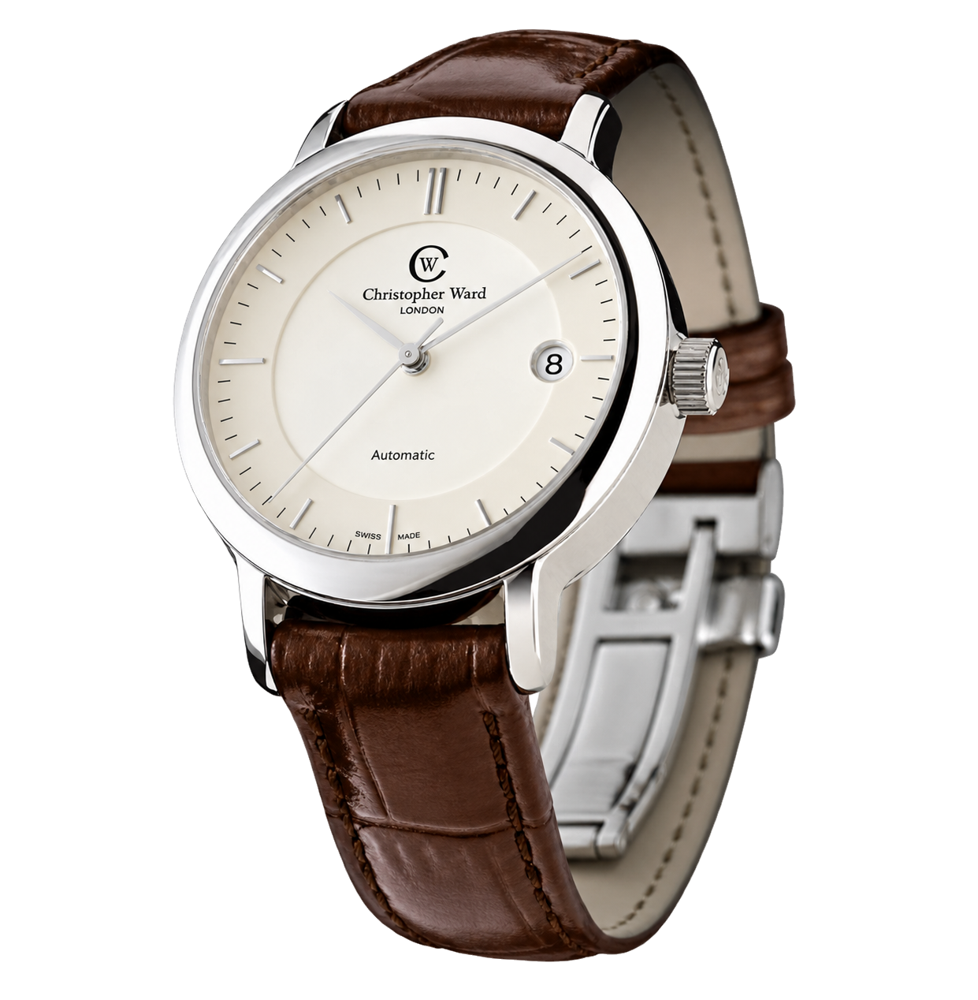
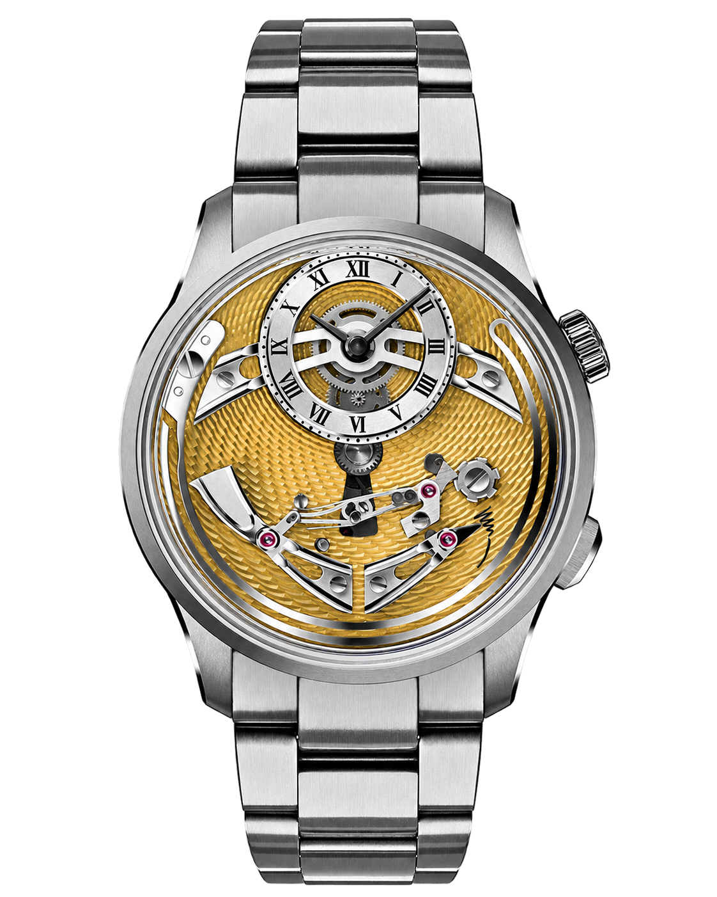
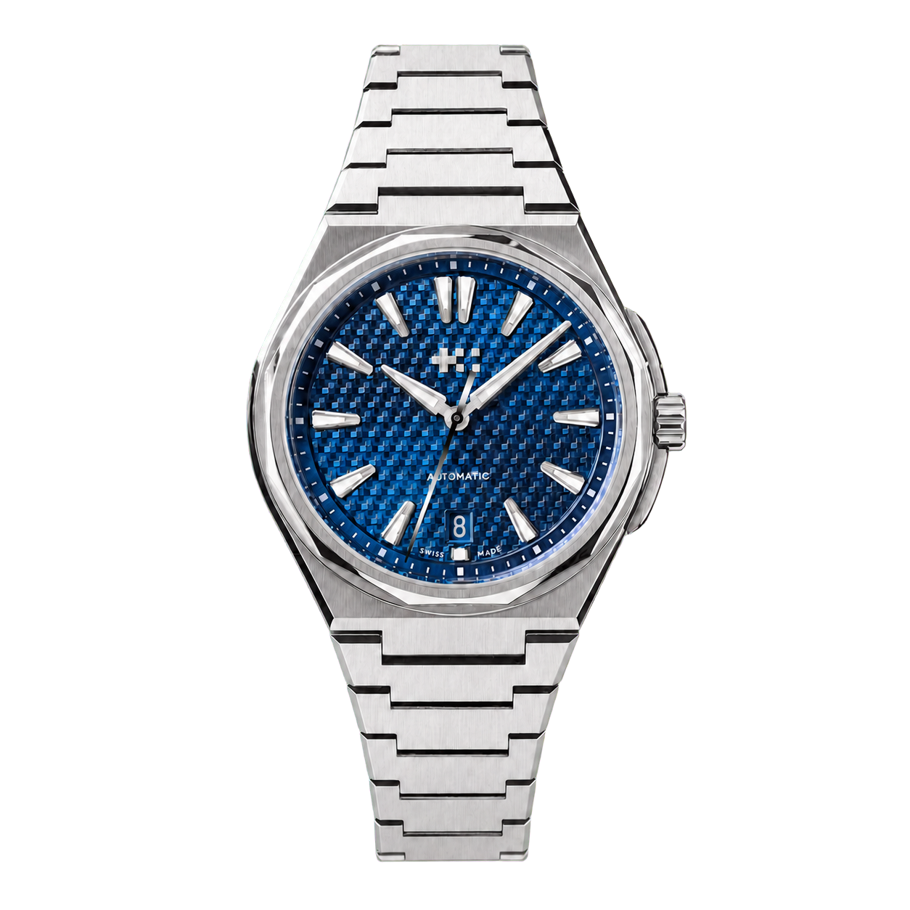
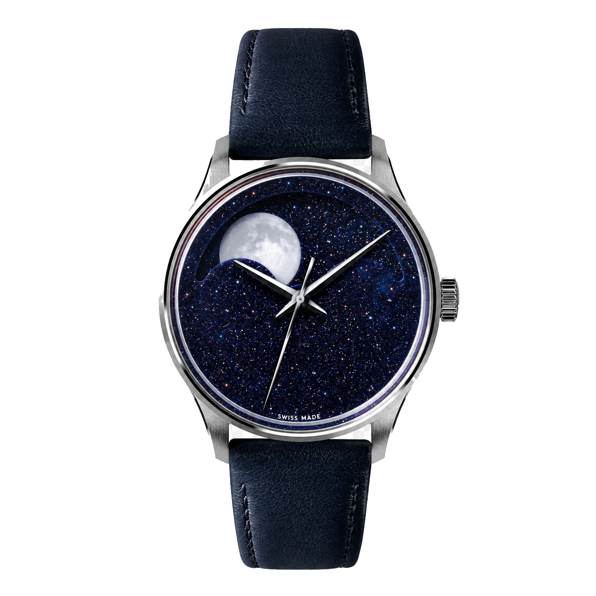
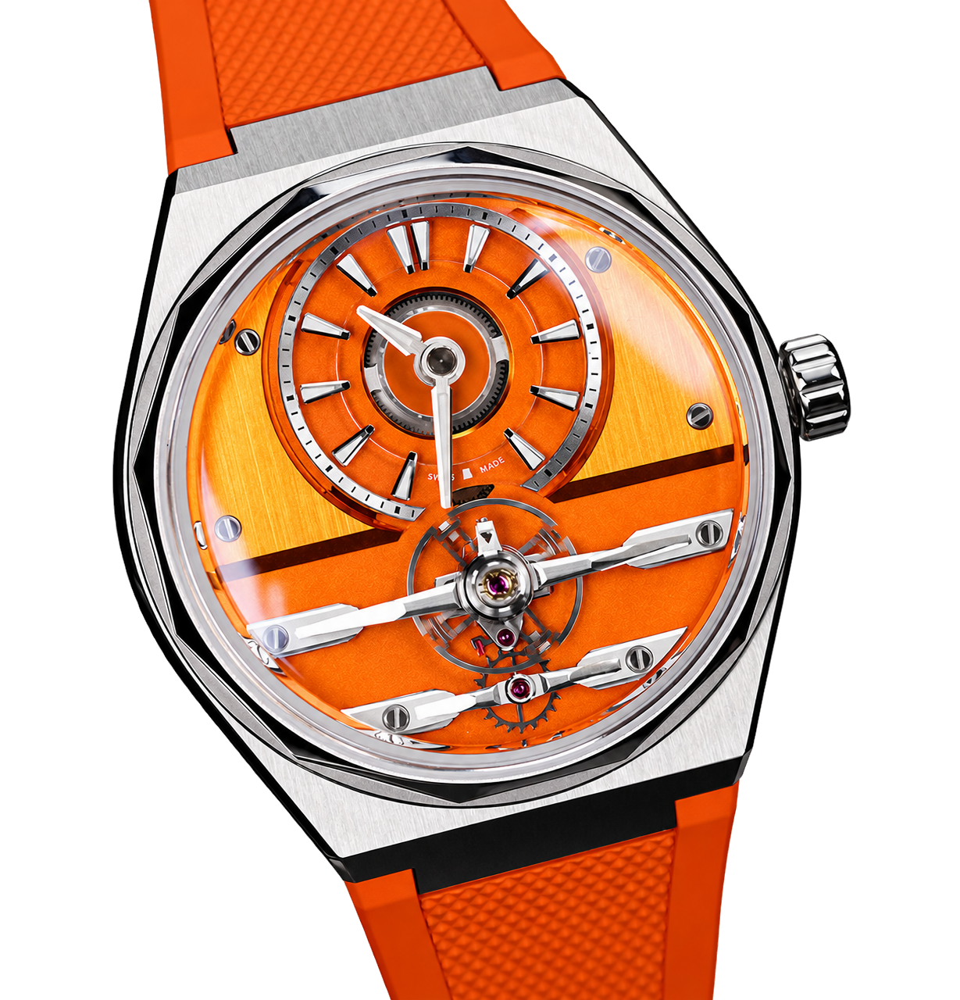

In this column I usually take the week's microbrand in hand. This time, though, the question I am interested in is whether today's subject is still a microbrand at all.

Because Christopher Ward has done precisely what every small brand dreams of: in twenty years it went from a chicken shed to competing with its own movement, its own complication and an international award. And in doing so it also outgrew the category it grew up in. This piece is about that arc.

## A boat on the Thames

The story begins in May 2004, with a boat trip on the Thames. Three friends were aboard: Mike France, Peter Ellis and Chris Ward. All three were entrepreneurs. Ward was importing T-shirts, while France and Ellis had recently sold their toy company, the Early Learning Centre.

The question they asked themselves was simple: why does a good Swiss watch cost what it costs? And their answer was to cut out the retail chain and sell directly to the customer. With that, Christopher Ward became the world's first exclusively online luxury watch brand.

The name was deliberately English-sounding, and belonged to one of the founders. The beginning, though, was anything but lavish: operations started in a converted chicken shed on a farm in Berkshire, and the brand introduced itself with a full-page advertisement in The Independent. The first two watches arrived in 2005, the C5 Malvern Automatic and the C3 Malvern Chronograph.

*The C5 Malvern Automatic, one of the brand's first watches, from 2005. Photo: Christopher Ward (christopherward.com).*

The community picked it up at once. By December 2005 the brand was being mentioned more often than Rolex on the watch forum TimeZone.

## The step nobody noticed

The next two milestones are technically more important than they are spectacular.

In 2008 the brand began working with a Swiss movement maker, Synergies Horlogères of Biel. Then in 2014 it did something nobody expected from a company of that size: it merged with its own movement supplier and introduced its first in-house caliber, the SH21, developed by the watchmaker Johannes Jahnke.

In hindsight this was an enormous thing. A microbrand typically buys a finished, off-the-shelf movement and puts it in its own case with its own dial. Anyone who develops their own caliber has stepped out of that model. The strange part is that in 2014 it barely caused a stir.

There was a harder moment too: in January 2020 Chris Ward, whose name the brand carries, left the company. He later started a new brand called TRIBUS, which became insolvent in the summer of 2022. By then Christopher Ward was run by Mike France, and the company carried on.

## The chime that changed everything

Then came November 2022 and the C1 Bel Canto.

This is a watch that chimes on the hour, which in itself is nothing new. What was new was the price: under four thousand dollars. Until then, that kind of complication essentially belonged to five-figure price tags. What is more, Christopher Ward did not hide the mechanism but put it on the dial: the hammer, the gong and the column wheel became the design itself.

The reception said everything. The first batch of three hundred pieces in Azzurro Blue sold out in seven hours, and the Verde Green batch the following week in two and a half. In a single month more than seven thousand people signed up to the waiting list. In 2023 the model won the Petite Aiguille prize at the GPHG, the brand's first serious international recognition.

*The C1 Bel Canto, with the hammer and the gong on the dial. Photo: Christopher Ward (christopherward.com).*

What the Bel Canto really changed was not the price list but the image of the brand. Until then, Christopher Ward was the brand you recommended as someone's first serious watch. After it, the brand was suddenly cool, an outsider going against the Swiss grain.

## The Twelve, the other big swing

A few months after the Bel Canto, in April 2023, came the other model that mattered: the Twelve.

This is the brand's answer to the integrated-bracelet luxury sports watch, the genre the Royal Oak created in 1972. It has a twelve-sided bezel, which is where the name comes from, a forty-millimetre case, and a thickness under ten millimetres. What made people look twice was the price: it started at nine hundred and ninety-five dollars, and for that you got a fully integrated steel or titanium bracelet with a chronometer-grade movement. Nothing like it existed in that bracket.

*The Twelve, with its twelve-sided bezel and integrated bracelet. Photo: Christopher Ward (christopherward.com), modified with AI assistance.*

In 2024 the line gained a flagship version, the Twelve X, the first Twelve to run the in-house SH21, fully skeletonised, with a case in both grade 5 and grade 2 titanium and a micro-adjustable bracelet. The SH21's twin barrels give a hundred and twenty hours of power reserve, and it is COSC certified.

It was in connection with this that Mike France put the company's guiding principle into words: a piece should never be sold for more than three times the cost of making it. That single sentence more or less explains their entire approach to pricing.

## And the prettier side: the moonphase

The brand has a third face too, one that is not about mechanical bravado but simply about beauty.

The moonphase line began in 2015 with the C9 Moonphase, followed by the C1 Moonglow in 2019 and the C1 Moonphase in 2023. These run their own module, called the JJ04, built on a Sellita base, and it does two things differently. First, the moon does not jump once a day but drifts continuously and smoothly across the dial. Second, its accuracy is such that it tracks the moon for a hundred and twenty-eight years.

The result really is something. The moons are made from Globolight, a mix of ceramic and Super-LumiNova, so they glow in the dark, and a four-colour print of the real Moon is applied over them. The 2023 C1 Moonphase also received an aventurine dial, which looks like a starry night sky, and every single one has a unique pattern.

*The C1 Moonphase, with an aventurine dial and a glowing, three-dimensional moon. Photo: Christopher Ward (christopherward.com).*

Together, these three lines describe the brand rather precisely. The Bel Canto proves that the mechanics of haute horlogerie can be done at an accessible price. The Twelve proves they can do a classic genre properly, for less. And the moonphase proves they are not only engineers, but can simply make something beautiful.

## And where it stands now

The next chapter arrived in 2025, in the shape of the C12 Loco. Here the balance wheel was brought to the front of the dial, and the brand used a free-sprung balance for the first time, a more accurate and more durable solution than the regulator-arm system it had used before. This is the kind of architectural watchmaking that has generally been at home at the level of MB&F and Ulysse Nardin.

*The C12 Loco, with the balance wheel brought to the front of the dial. Photo: Christopher Ward (christopherward.com).*

And the numbers settle the question I opened with. In the 2019 to 2020 business year, revenue stood at a little over ten million pounds. In 2023 to 2024 it grew beyond thirty million, and in the following year to forty-five million, a fifty per cent jump in a single year. They now employ more than a hundred people, have two movements of their own, and sponsor Everton in the Premier League as well as Charlton Athletic.

A brand that sponsors football clubs and is edging toward the fifty largest watch companies in the world is no longer what we tend to call a microbrand.

## So what is it now

The term microbrand has no precise definition. Broadly we mean by it something small and independent, making few watches, run by a tight team, with no large advertising machine behind it. Christopher Ward has now outgrown almost every one of those points, with one exception: it stayed independent, in the hands of its founders and management.

Perhaps that is the right reading. It is no longer a microbrand but an independent brand that grew large under its own power. And that is not a failure; it is exactly the outcome we hope for from small brands.

## The downside, honestly

Two things do have to be said, though, because the picture would be incomplete without them.

The first is the cost of growth. After the success of the Bel Canto, the brand ran into difficulties with customer service, delivery times, and generally with coping with the increased volume of orders. Anyone ordering during that period could easily run into delays. By all accounts this has improved a great deal since, but it is worth knowing about.

The second is value retention. Precisely because Christopher Ward sells directly and is readily available, its watches typically change hands on the secondary market well below list price. That, on the other hand, is decidedly good news for anyone who wants to pick up a Bel Canto pre-owned.

And there is a third, which is a matter of taste. What drew many people to the brand was precisely that not everyone knew it. Since the Bel Canto, that feeling has inevitably been fading. For anyone who loved the underdog charm, that is a loss, even if it is a success for the brand.

## Why this piece is here

I wrote about this brand because it walked a road most small workshops cannot even imagine: it started at a reasonable price, learned along the way how to develop a movement, and ended up making a complication accessible that used to be the privilege of the wealthy.

What makes Christopher Ward interesting is that it was not hype that brought it here, but twenty years of slow, stubborn building, at the end of which the hype arrived. The object, not the hype. Only this time the object turned out so well that the hype came of its own accord.
