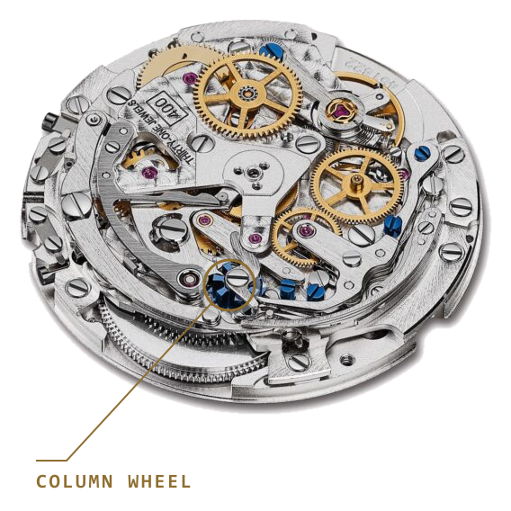

A chronograph is a stopwatch built into a watch. From the outside it could hardly be simpler: press a button and the seconds hand starts; press again and it stops; the other button resets it. Inside, though, this is one of the most complex mechanisms in watchmaking. Every single press has to set off a precise choreography, and always in the right order. Something has to orchestrate it all. In the finest chronographs, that something is a tiny wheel that looks like a castle turret: the column wheel.

## What a single press has to solve

Let's think through what one press must handle. On start, the timing gear has to be connected to the running movement, and the hand released. On stop, the two have to be separated, and the hand braked so it stops exactly where it should. On reset, a hammer has to strike the heart-shaped cams so the hands snap back to the starting line in an instant. And there is an invisible rule too: you must not reset while it is running, or the mechanism breaks.

So this is a sequencing and switching task. There are two proven solutions for it: the column wheel and the cam.

## A rotary switch beneath the dial

The column wheel looks like a little castle turret or a chess rook: vertical columns stand on top, and fine teeth run around its base. Those teeth advance the wheel: every press turns it by exactly one step.

<iframe src="/widgets/oszlopkerek.html?lang=en" title="Interactive column-wheel model" width="100%" height="760" loading="lazy"></iframe>

*Interactive model: press Start / Stop and watch the beak rise onto a pillar or drop into the gap. The "Lights off" button in the header works on this model too — worth trying, because the pillars start to glow.*

Several levers rest against the columns, and here is the whole trick. If a lever's beak sits on top of a column, the lever is pushed back, that is, into its disengaged state. But if the lever's beak drops between two columns, into the gap, the lever is set free and does its job. So the rotating wheel is like a rotary switch: in each position it sets all the levers at once into a different combination.

Let's follow one cycle. You start: the wheel turns one step, the coupling lever drops into a gap, the clutch closes, and the hand sets off. You stop: another turn lifts the lever onto the top of a column, the connection breaks, and a brake holds the hand. You reset (which the mechanism only allows when stopped): the hammers strike the heart-shaped cams, and the hands snap back to zero. Every press is a single, clean, definite step.

## The cam, and the most important myth

The cam system does the same job, only instead of a column wheel a shaped cam and spring-loaded levers switch the functions. This is much cheaper and simpler: the levers can be stamped from flat steel, with no need to precisely machine a single piece of hardened steel. The world's most widespread chronograph movement, the Valjoux/ETA 7750, is cam-actuated too, and it is famously tough and reliable, a true workhorse.

And now comes the most important myth to dispel. The column wheel does not measure time more accurately. Precision comes from the balance and the escapement, not from how you switch the chronograph on. The two do the same job. The difference lies in the craft and in the feel. The column wheel is made from a single piece of hardened steel, its columns must be perfectly uniform in height, spacing and finish, and that is a fearsomely difficult piece of machining. In return, the pusher has a cleaner, lighter, more definite click. Experienced collectors can recognise it from the feel of the button alone. As the saying goes: the allure of the column wheel really lies in the skill and patience behind it.

## What most people blame on the wrong part

There is one more stubborn misunderstanding worth clearing up. Many people say that on a cam chronograph the seconds hand "jumps" a little when it starts, and they blame the cam for it. In reality this is not the cam's fault, but the clutch's, which is a separate part.

There are two kinds of clutch: horizontal and vertical. On the horizontal kind, two gears meet each other on start, and their teeth can clash for a moment, hence the little jump. The vertical kind solves this with friction, from above, far more smoothly. Because cam systems typically come with a horizontal clutch and column-wheel ones often with a vertical clutch, it is easy to conflate the two. But they have different jobs: the column wheel (or the cam) decides when something happens; the clutch takes care of how the two mechanisms connect.

## Where you meet it, and why it is worth knowing

You will find a column wheel in classic, higher-end chronographs: the Rolex Daytona's calibre 4130, the Zenith El Primero (where you can see the column wheel above the word "Manufacture" on the rotor), or Patek Philippe's chronographs.

*The Zenith El Primero calibre 400. The coupling lever's beak rests on the ring of pillars from the right. Highlight added by Lume. Photo: Monochrome Watches (monochrome-watches.com)*

And a lovely history lesson on how the cam is not "worse": NASA certified the Omega Speedmaster for space flight in 1965, back when it still ran the column-wheel calibre 321. Omega later switched to cam movements, and NASA approved those too. In other words, both solutions passed the test of space, which is fairly convincing proof that the cam is not inferior.

The column wheel is not about winning a spec race. It is about how it feels, and how it is made by hand. Next time you press a chronograph pusher, you will know what you are really feeling: a tiny turret turning one step beneath the dial.
