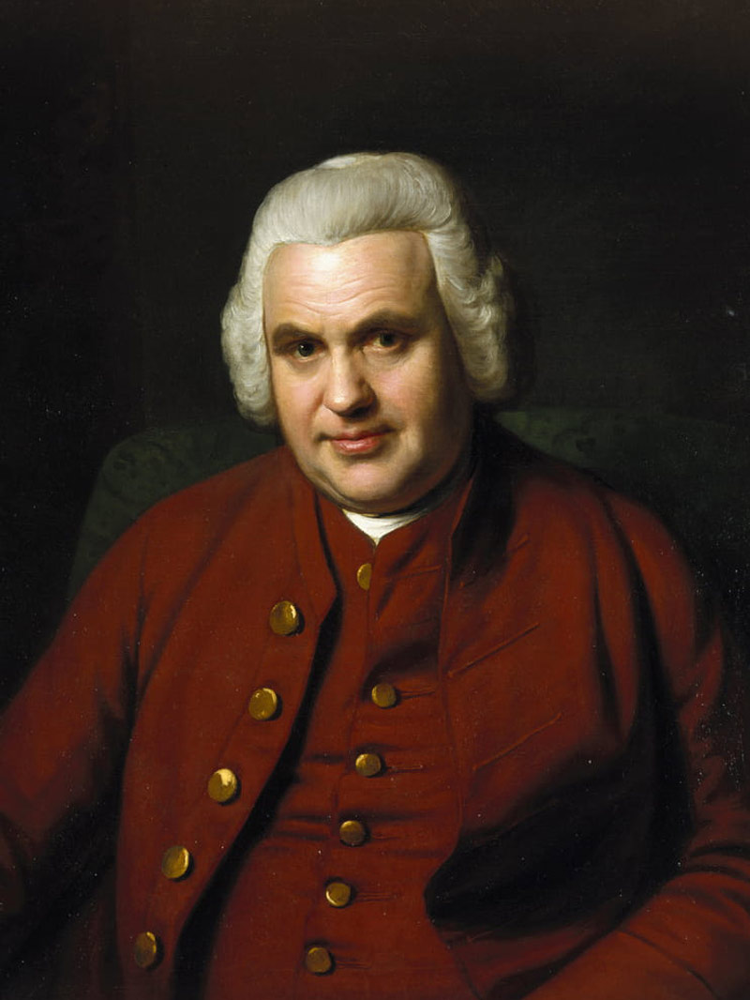

Imagine winding up a toy car and then letting it go. What happens? In an instant it spins out all of its energy, races away, and it is over.

That is exactly the basic problem of a mechanical watch. The spring you wind stores energy, and it wants nothing in the world except to release it immediately. If we let it, the watch would run down in a few seconds and the hands would whirl around at a ridiculous speed.

So the real invention is not the thing that drives the watch. It is the thing that holds it back. That is the escapement, and it is the fingernail-sized cluster of parts that gives you the ticking.

## The doorman who lets people through one at a time

The best analogy I know is this: the escapement is a doorman at a very narrow door.

Outside, a crowd is pushing, which is the force of the mainspring. The doorman, though, lets nobody simply walk through. He opens the door, lets exactly one person past, and closes it. He waits. He opens, lets one through, closes. If the doorman always waits the same length of time, then people trickle through at a steady rate, and from that rate you can tell how much time has passed.

A mechanical watch measures time in precisely this way. It does not "feel" time; it counts how many times the door has opened.

And here is the part that seems strange at first: the accuracy of a watch does not depend on how strong the mainspring is. Only on the doorman counting at a constant rate.

## The three players

Three components work together in the escapement, and each has one job.

The escape wheel is the one that wants to spin. It is the last wheel of the gear train, so all the force of the mainspring arrives here. It typically has fifteen or twenty teeth, and it would constantly push itself forward.

The pallet fork is the doorman. It is a fork-shaped lever that, with a ruby stone at each end, alternately catches and releases the teeth of the escape wheel. Ruby, because it is almost perfectly smooth and harder than steel, so it barely wears.

And the balance wheel is the pendulum. It is a wheel that swings freely back and forth, always pulled back to its centre position by a fine spiral spring. It is the one that sets the rhythm: on every swing it gives the pallet fork a small nudge, and with that it authorises the next tooth.

So the order goes: the mainspring pushes, the balance sets the tempo, the pallet fork carries it out.

## One tick, step by step

Let's watch a single "tick" in slow motion.

The balance swings, and the small ruby pin mounted on it nudges into the slot of the pallet fork. That tips the fork, and one of its ruby stones releases a tooth of the escape wheel.

The escape wheel immediately jumps one tooth forward. As it jumps, it shoves the pallet fork, and the fork passes that shove on to the balance. This push is needed so that the balance does not wind down but keeps swinging, like a playground swing that has to be given a nudge now and then.

Then the fork's other ruby stone drops straight onto the next tooth and stops the wheel. Silence.

Meanwhile the balance swings out to its far point, the hairspring pulls it back, it returns, and it nudges into the fork again, this time from the other direction. The whole thing starts over, only mirrored.

That little knock, when a tooth meets a ruby stone, is the sound you hear as ticking. It is not time ticking. It is a gear tooth knocking against a stone, eight times a second.

<iframe src="/widgets/gatlomu.html?lang=en" title="Interactive escapement model" width="100%" height="760" style="border:0; border-radius:6px;" loading="lazy"></iframe>

Interactive model: start it, then switch on slow motion to see step by step when the pallet fork catches and when it releases. The readout names the phase you are looking at.

## How much is eight times a second

Watchmakers measure this in vibrations per hour (vph), and the number appears on almost every spec sheet.

Older, slower movements run at 18,000 or 21,600, meaning that many vibrations every hour. The most common today is 28,800, which works out to eight beats a second. That is why the seconds hand does not jump but appears to sweep: it steps eight times a second, and our eyes read that as continuous motion.

A higher beat rate is generally more accurate, because small disturbances, a movement of the arm or a knock, throw the balance off proportionally less. In exchange it consumes more energy and causes more wear. That is the eternal trade-off in movement design.

One number for scale: the escape wheel is stationary most of the time, and yet it turns at an average of around ten revolutions per minute. A 28,800 vph watch performs more than seven hundred thousand of these little cycles a day, for years, without an oil change.

## An English watchmaker, 1755

The escapement is not a modern invention. The lever escapement was created by an English watchmaker, Thomas Mudge, around 1755, in his workshop on Fleet Street in London.

*Thomas Mudge (1715–1794), creator of the lever escapement. Source: Oracle of Time.*

The Swiss watch industry then refined his idea, and by the middle of the nineteenth century the form we still use today had taken shape, known as the Swiss lever escapement. One visible difference between the English and the Swiss versions is the layout: in the Swiss design the balance, the pallet fork and the escape wheel sit in a straight line, while in the English one they form a ninety-degree angle.

The other difference is the shape of the teeth. The pointed teeth of the English version bore against the edges of the ruby stones, wearing both. The Swiss solution uses so-called club-shaped teeth, which deliver the impulse across a flat face, so they wear far less, and its pallet stones can also be adjusted to fine-tune accuracy.

This is why the overwhelming majority of mechanical watches today use essentially the same solution an English master devised two and a half centuries ago. Not because there is no better idea, but because this mechanism works astonishingly well.

## Why it is worth knowing

Next time you hold a mechanical watch to your ear, you will know that what you hear is not some abstract measurement of time. A tiny ruby stone is knocking against the tooth of a gear, and a hair-thin spring is pulling a spinning wheel back into place, eight times a second, day and night.

That is what makes a mechanical watch a peculiar object. It is not accurate because it is clever, but because someone very patiently worked out how to release energy in small, identical doses. The object, not the hype. And that sound can now be summed up in a single sentence: it is the doorman, at work.
