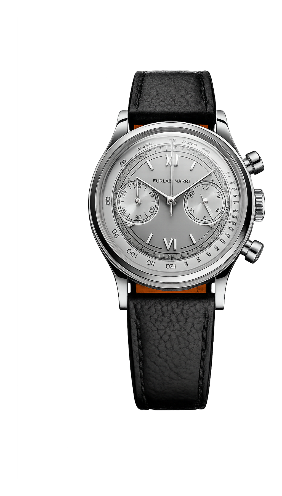
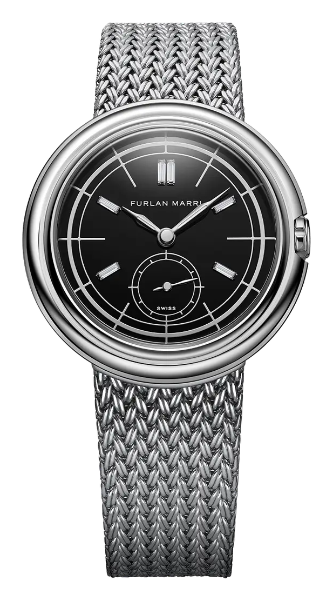
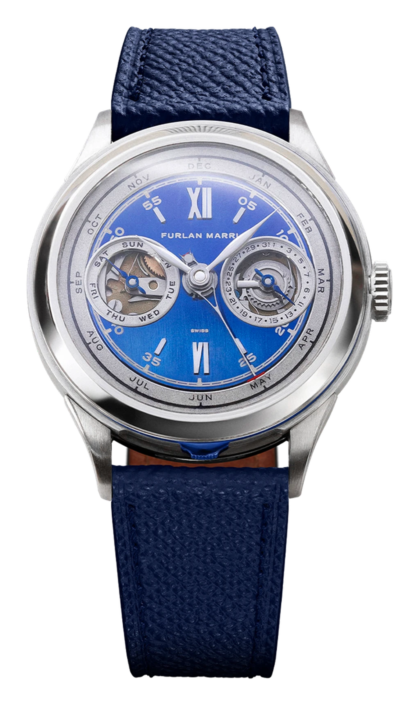
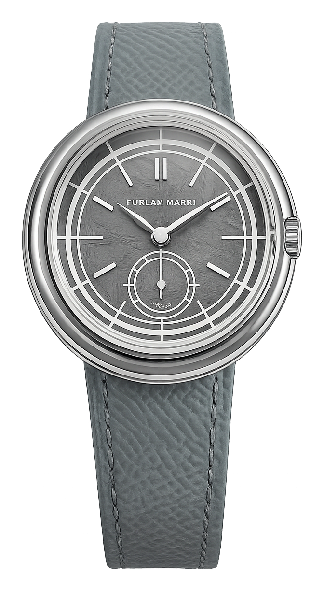

There is a number that says almost everything about Furlan Marri: thirty-five seconds. That is how long it took, in March 2021, for their Kickstarter campaign to reach its goal, before anyone could think twice. In the end they raised more than fourteen times the original target. And there is another watch at the other end of the story: a single piece, in tantalum, with a meteorite dial, made for a Sotheby's auction. Barely four years separate the two. This is the arc of Furlan Marri, and it is exactly why the brand is worth taking in hand.

*The GPHG-winning Ref. 1041-A "Mr. Grey", the sector chronograph that made the brand's name. Photo: GPHG (gphg.org)*

## Two friends, from two sides of horology

Behind the brand are two friends who came from two different sides of the trade. Andrea Furlan is a Swiss industrial designer, an ECAL graduate, who worked for serious watch houses. There is a legendary story about his start: as a young man he wrote to Hublot, was turned down, then found Jean-Claude Biver's personal email address and wrote to him directly. Biver replied at three in the morning and took him under his wing. Furlan later studied and worked for years alongside the renowned Dominique Renaud, on high-end movement development.

His partner, Hamad Al Marri, is a Saudi collector and artist who has hung around auction houses since childhood, and who is in love with the stories behind watches. He was given his first watch, an Omega Seamaster, by his father at the age of fourteen. So one brings the form and the engineering, the other the collector's eye and the story.

## What they actually made

And it is exactly this duality that shows in the products. Furlan Marri started from the elegant chronographs of the mid-twentieth century, above all the old Patek, Lemania and Vacheron pieces, and poured that into a modern yet distinctly vintage form: a 38 mm steel case, a sector dial, two subdials, with period scales. The obsession shows in the details: even the dial typefaces were drawn by noted studios (Hoefler&Co and the Argentine Sudtipos).

The movement was at first the Japanese Seiko VK64 "mechaquartz", a hybrid: quartz-accurate timekeeping, but a mechanical, spring-driven chronograph. An accessible price, serious execution. It is no accident that the GPHG, the Oscars of watchmaking, honoured them just eight months after the Kickstarter with the Ref. 1041-A "Mr. Grey".

## Upward, step by step

From there, though, they did not stop at the entry level. A mechanical line arrived, from the sector watches to the 2024 Disco Volante, with a "flying saucer" shaped case, hidden lugs, and a hand-wound Peseux 7001 movement.

*The 2024 Disco Volante: a "flying saucer" shaped case with hidden lugs. Photo: Furlan Marri (furlanmarri.com)*

Meanwhile, in 2023, they also showed a real tour de force at the Only Watch auction: a secular perpetual calendar, a complication so rare that even the old hands looked twice.

*The secular perpetual calendar, made for the 2023 Only Watch auction. Photo: Furlan Marri (furlanmarri.com)*

In just a few years Furlan Marri went from Kickstarter to the auction houses, without losing its lightness of touch.

## And the watch this piece is really about: the tantalum

In 2025, for one of Sotheby's auctions, Furlan Marri made a single, unique piece: the Disco Volante **AREA 51**. Its case is made of **tantalum**, a dark, bluish-grey, rare metal that is extremely hard, dense and corrosion-resistant, but fiendishly difficult to machine. That is exactly why it is a rarity in watches: a few large houses have reached for it (Panerai, F.P. Journe), but from a microbrand it is a bold gesture.

*Disco Volante AREA 51: a unique piece, a tantalum case, a meteorite dial, 2025. Photo: EveryWatch (everywatch.com)*

The dial, moreover, is real **meteorite**, and the whole thing plays on the brand's playful "flying saucer" theme: a piece from space, in a saucer-shaped case. A one-off tantalum watch from a microbrand, for an auction house, four years after a 35-second launch. It is hard to sum up more concisely how much this brand has grown.

## Why they are worth watching

Furlan Marri is exactly the kind of brand this column exists for. It is not a status symbol, and for a long time it was not expensive either. Two people who know precisely what they like, and who make it with stubborn care, from the entry-level chronograph to the tantalum saucer. The object, not the hype. And if a microbrand gets this far in this much time, that is worth paying attention to.
