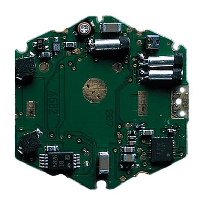

It is easy to look at a G-Shock as an ordinary quartz watch surrounded by too much rubber. The case is large, the bezel protrudes and the strap is thick. Drop it, and the soft exterior absorbs the blow. That must be the whole trick.

Except Kikuo Ibe tried exactly that first, and it did not work.

He kept adding flexible material around the watch. One prototype grew to the size of a softball, yet the inside still broke. G-Shock was not born when its covering became thick enough. It was born when Ibe realised that a single layer could not stop an impact. The energy had to be redirected and divided, while the timekeeping module had to be separated from the case around it.

This article is about what happens inside a G-Shock during the few milliseconds in which it hits the ground.

*The classic square G-Shock form resting on an early technical drawing. Photo: [Casio](https://world.casio.com/development/).*

## One broken watch, two versions of the story

Casio's own accounts are not entirely consistent about the opening moment. One official version says Ibe dropped and broke a watch at work. Another says it was a mechanical watch inherited from his father. The detail changes, but the consequence does not. In 1981 Ibe submitted an internal proposal that amounted to one sentence: he wanted to make a watch that would not break when dropped.

That was not an obvious goal at the time. The watch industry was moving towards thinner, lighter and smaller products. Ibe proposed an object whose first value would be durability, even if that made it larger and stranger.

Casio formed the three-person Project Team Tough. Over two years the group built more than two hundred prototypes. Ibe dropped cases from the third-floor lavatory window of Casio's Tokyo research centre onto the pavement, examined what had failed and started again.

The first assumption was that a soft exterior would solve everything. It did not. Rubber took some of the edge off the collision, but the sudden deceleration of the case still reached the module. The display, solder joints or quartz crystal received the same event through a slightly thicker package.

*Kikuo Ibe, creator of G-Shock, wearing a square model that preserves the original form. Photo: [Casio](https://gshock.casio.com/fr/products/40-years/dream-project-g-d001/).*

## The fall is not the dangerous part, the stop is

A dropped watch accelerates as it falls. The real problem begins when it reaches concrete and its velocity falls to zero in a very short time.

The same change in speed can happen in two ways. If the stop is almost instantaneous, acceleration and peak load are high. If the object stops over a slightly longer distance and time, that load can be reduced. This is why a car has a crumple zone, a shoe has a sole and a parcel uses foam. They do not make energy disappear. They give it time and distance in which to be absorbed.

A G-Shock does the same thing in several consecutive stages.

First the raised bezel or outer covering meets the ground. It deforms and removes some of the sharpness from the collision. The case structure then spreads the load. Finally, the inner module does not follow the outer case's sudden stop as one completely rigid body, because it is supported at only a few points and has a small amount of space around it.

It does not float freely, and it does not swing on springs. “Floating module” is a useful image, not a literal description. The point is that the case and the electronics should not receive the same blow as one solid object.

<iframe src="/widgets/g-shock.html?lang=en" title="Interactive G-Shock impact-resistance model" width="100%" height="900" style="border:0; border-radius:6px;" loading="lazy"></iframe>

The interactive model applies the same fall to two internal arrangements. A rigidly mounted module stops almost together with the case. In the cushioned hollow layout, the outer case has already touched down while the inner unit is still moving for a few moments. This is not a laboratory calculation. It is a schematic model of the path taken by the load.

## The ball whose centre never hits the ground

Ibe's breakthrough arrived on a day off. Casio's story has him watching children play with a rubber ball in a park. The ball hit the ground, compressed and rebounded, while its centre never met the concrete directly.

That suggested the hollow case. The module did not need to be clamped tightly to the housing on every side. It could be supported at a few points with space left around it. The exterior could then deform and move without immediately transferring every displacement to the inner unit.

This became the central solution of the first DW-5000C. Casio described five protective layers: protruding urethane parts, a reinforced case, cushioning materials, the hollow internal structure and protection for the module itself. No one layer makes the watch unbreakable. Together they prevent the collision from reaching the electronics as one short, sharp peak.

*Conventional rigid mounting compared with G-Shock's hollow case: the impact is dispersed rather than sent straight into the module. Illustration: [Casio](https://gshock.casio.com/za/technology/shock/).*

## The shape of the case is not decoration

Every protruding part of the classic square G-Shock has a job.

The bezel stands above the crystal, so on a flat surface the glass is unlikely to take the first blow. The buttons sit between protective forms, reducing the chance of their being driven directly into the module. The back is held away from the ground by the stiff curve of the strap attachments. If the watch lands on its back, the band can arrive first and behave as another springing element.

This is why it is misleading to describe the G-Shock exterior as if it were merely a style. Much of its form is a map made from possible landing positions. It looks the way it does because the watch cannot know which edge will strike the ground.

*The raised bezel, protected buttons and stiffly curved band keep different landing points of the case away from the ground. Illustration: [Casio](https://gshock.casio.com/za/technology/shock/).*

## A quartz watch can still be delicate

A mechanical watch can lose pivots, wheels and fine arbors. That does not make a digital quartz module invulnerable.

The quartz crystal oscillates at high frequency, electrical connections run through the circuitry, and the LCD is made of layers. A strong, brief impact does not need to produce a spectacular fracture. A momentary contact failure, a distorted support or a cracked solder joint is enough.

Casio therefore cushions important components individually as well as protecting the complete module. Material around the quartz oscillator and other critical points deforms at the instant of impact, reducing the risk of loss of contact or malfunction.

The outer case is doing more than guarding the display. The same principle repeats at ever smaller scales: outer covering, internal space, cushioned module, individually protected component.

*Critical components inside the module receive their own cushioning, reducing the risk of contact failure during brief deformation. Illustration: [Casio](https://gshock.casio.com/za/technology/shock/).*

## The three tens that became twenty bar

The original brief is commonly summarised as the Triple 10. The targets were survival of a ten-metre drop, at least ten bar of water resistance and ten years of battery life.

When the DW-5000C arrived in April 1983, it exceeded the water target with a rating of 200 metres, or twenty bar. That is not the same as claiming that every G-Shock will survive exactly the same ten-metre fall onto any surface, at any angle, an unlimited number of times without damage. Shock resistance is engineered and tested resistance, not a suspension of physics.

The name is not a promise of literal indestructibility either. The G refers to gravity, and shock to the sudden change in acceleration that the structure has to manage.

## The same principle in different materials

The 1983 construction did not remain frozen, but its central idea survived.

Triple G Resist, introduced in 2012, treats three loads separately: impact, sustained centrifugal force and vibration. Some models use a silicone-based cushioning material called Alpha Gel inside the case.

A metal G-Shock creates a harder problem because metal is less willing to absorb impact than urethane. Modern full-metal structures use fine resin buffers between the outer bezel case and inner case. Tiny protrusions compress and react against the blow.

Carbon Core Guard, introduced in 2019, reaches the same objective by another route. A carbon-fibre-reinforced resin case is both light and rigid. There is less mass to stop suddenly, while the module sits inside a strong frame. This is one reason a model such as the GA-2100 can be much slimmer than the traditional G-Shock shape without giving up shock resistance.

The material changes, but the rule does not: there is never one straight path for an impact from the outside world to the module that keeps time.

*The GA-2100 Carbon Core Guard: carbon-fibre-reinforced resin gives the module a rigid frame with less mass. Image: [Casio, GA-2100 catalogue](https://gshock.casio.com/content/dam/casio/global/watch/g_shock/catalog/ENG_GA-2100_catalog.pdf).*

## Not a rubber brick, but packaging engineering

G-Shock's most important invention is not its digital display, a special quartz calibre or even the urethane bezel. It is the packaging.

Ibe treated a watch as if he had to send a delicate object through a very angry courier service. He did not simply choose a thicker box. He left space around the object, decided where the packaging was allowed to touch it, spread the load across several materials and protected the parts most likely to fail.

That is why a G-Shock looks the way it does. The exterior does not conceal the technology. It is the visible part of the technology.
