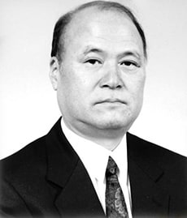
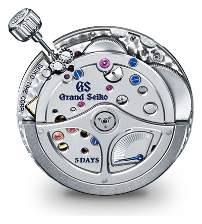
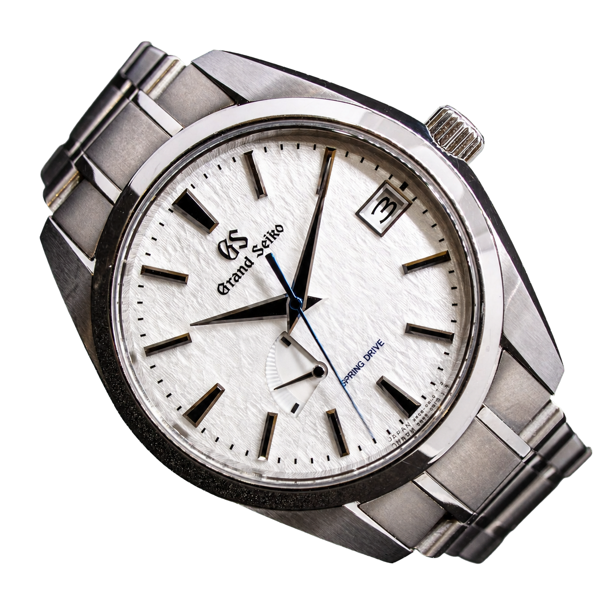

There is a watch with no battery, yet a quartz crystal inside. It has no escapement, so it does not tick, yet a mainspring drives it. And its seconds hand glides perfectly, without a stutter, unlike any mechanical or quartz watch. This is the Grand Seiko Spring Drive, and it took one engineer 28 years to finish.

## One engineer's 28 years

The idea was born in 1977, in the mind of a Suwa Seikosha engineer, Yoshikazu Akahane. He had joined the company a few years earlier, just after the world's first quartz watch, the Seiko Astron (1969). He wanted an "everlasting watch": one driven by a mainspring, but running with quartz accuracy, that is, within about a second a day.

*Yoshikazu Akahane, who set Spring Drive in motion in 1977. Photo: Grand Seiko GS9 Club (grandseikogs9club.com)*

To do that, though, almost everything had to be rethought. The road took 28 years, more than 600 prototypes and countless dead ends. The first Spring Drive appeared in 1999, and the automatic, Grand Seiko version came of age in 2004-2005. More than 230 patents have been filed for the technology worldwide.

## What they took out: the escapement

To understand what Spring Drive is, you first have to see what it throws away. In a traditional mechanical watch, the escapement (the balance wheel, the pallet fork and the escape wheel) meters out the mainspring's energy in tiny, ticking steps: release, stop, release, stop. This is the heart that beats in every mechanical watch. Spring Drive removes that whole assembly and replaces it with a single, continuously spinning part: the glide wheel. There is no more ticking, no back-and-forth motion, all rotation is one-directional and continuous.

## How the Tri-Synchro Regulator regulates

The mainspring still tensions and releases in the usual way, through a gear train (wound by a rotor or by hand). At the end of the gear train, though, there sits not an escapement but the glide wheel, which spins over an electromagnetic coil. As it spins, it generates a tiny electric current, so the wheel itself is a small generator. This current powers a quartz crystal and an integrated circuit (IC). The IC compares the glide wheel's speed to the quartz reference, and with a continuously variable electromagnetic brake it holds it at exactly the right speed: eight rotations per second. No battery is needed, because the mainspring that drives the watch also produces its own electricity.

*The 9R Spring Drive caliber: at the end of the gear train, the glide wheel, in place of an escapement. Photo: Grand Seiko (grand-seiko.com)*

<iframe src="/widgets/spring-drive.html?lang=en" title="Interactive Spring Drive model" width="100%" height="720" loading="lazy"></iframe>

*Interactive model: press Start / Stop and follow the flow of energy from the mainspring to the hand. The brake button lets you switch off the regulation, so you can see that without it the movement runs away. The "Lights off" button in the header works on this model too.*

This is where the name comes from. The Tri-Synchro Regulator manages three energies: the mainspring's mechanical power, the electrical energy produced from it, and the electromagnetic force used for braking. The brake is frictionless, silent, and never stops, unlike the tiny collisions of an escapement.

## The hand that glides

And here is the striking part. Because the glide wheel spins continuously in one direction, and it drives the seconds hand directly, the hand does not step and does not beat, but glides perfectly across the dial. This is Spring Drive's signature, which Grand Seiko calls "the natural flow of time". A single glance is enough to recognise it: not the small steps of quartz, nor the fine sweep of a mechanical watch, but a completely smooth, unstoppable motion.

*The Grand Seiko "Snowflake" (SBGA211), one of the emblematic Spring Drive pieces. Photo: Arlington Watch Works (arlingtonwatchworks.com)*

The accuracy, meanwhile, is close to quartz: most calibers run within ±1 second a day (the top versions within ±10 seconds a month), which is far more accurate than a COSC-certified chronometer.

## Quartz, mechanical, or something else

Spring Drive is one of the most debated movements among collectors, and the debate is fair, because it really does not fit into the usual boxes. It contains a quartz crystal and an integrated circuit, which is why some purists say it is "not a real mechanical watch". Others argue that the opposite is true: it has no battery, it is driven solely by the mainspring, the movement is made of more than 200 hand-assembled parts, and it is an engineering marvel. From this angle the quartz is only a reference; the power and the soul are mechanical.

There is a practical difference too: because of its electronics, a Spring Drive needs a Grand Seiko service centre, whereas any good watchmaker can service a purely mechanical watch. Which is "better" is ultimately a matter of taste: accuracy and technology, or mechanical purity and serviceability.

I will not decide it for you here. What makes Spring Drive exciting is not its category, but that it gave a completely new answer to a centuries-old problem: the rule of the escapement.

## Why it belongs here

That is why Spring Drive belongs in this column. In my earlier pieces on the escapement and on regulation, I explored how a watch meters out time in tiny steps. Spring Drive is the one movement that dropped the steps entirely. It is no louder, and no flashier, than the rest, it just quietly does something no one else does. The object, not the hype.
