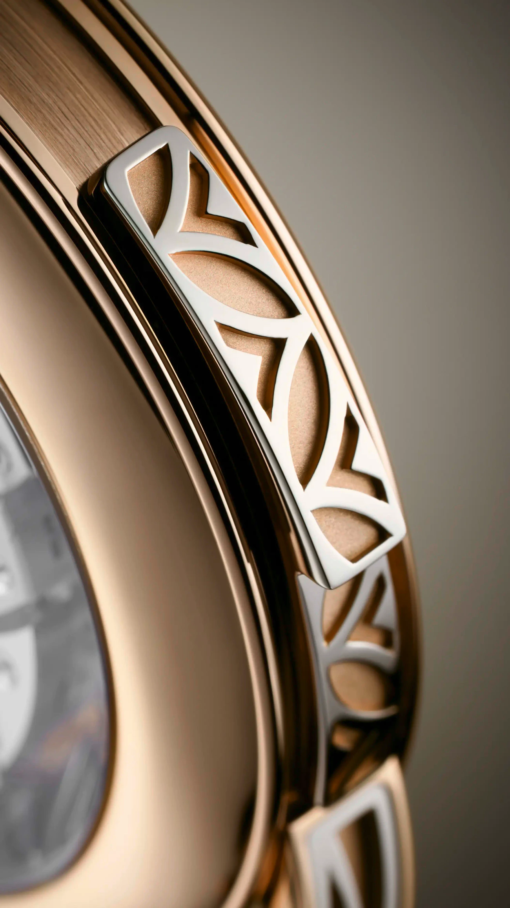
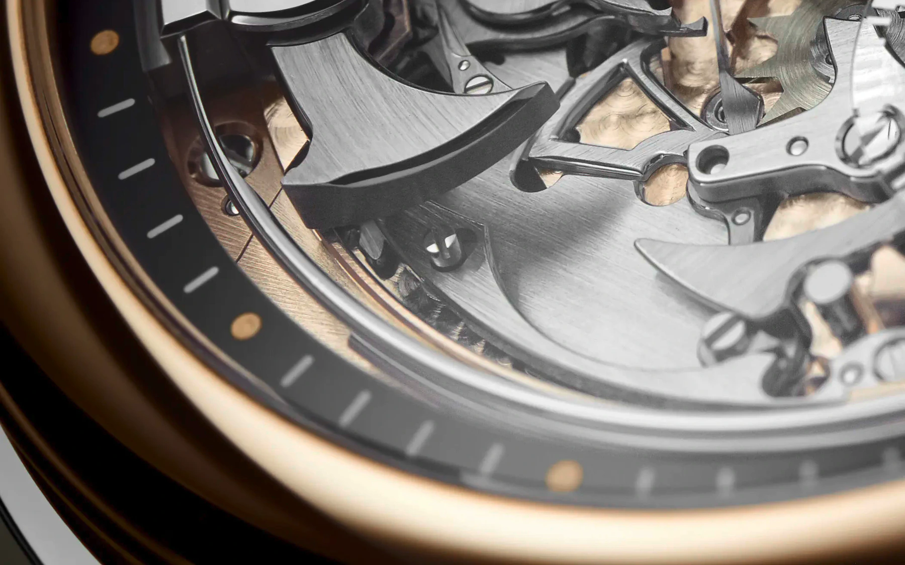
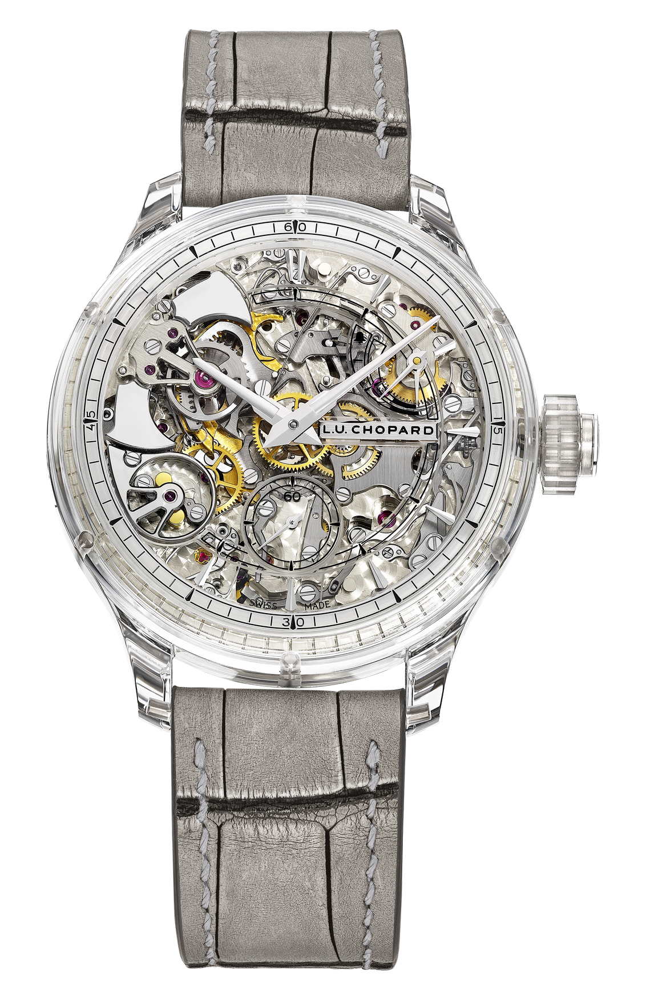
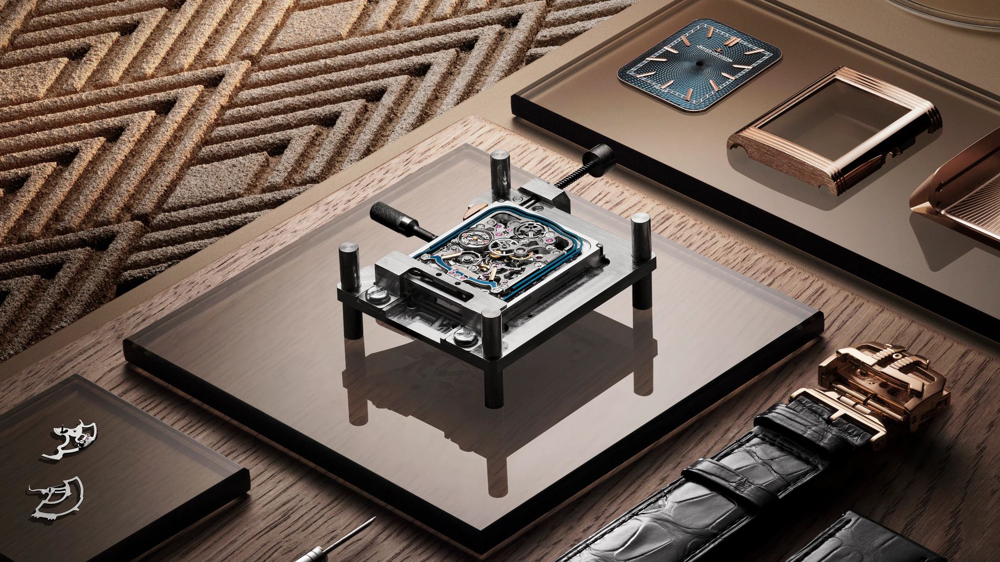

Pull the slide along the side of the case, then let it return. Low notes sound first. Paired notes follow, one high and one low. Finally, only the high note remains.

If you heard ten low notes, two pairs and seven high notes, the watch just told you it was 10:37.

It did not set an alarm or play a melody. Nobody looked at the dial. A completely mechanical movement read the position of the hands, divided the time into three parts, then struck the answer with two tiny hammers.

This is a minute repeater. There is almost no practical need for one today. That is precisely why it remains one of watchmaking's purest demonstrations.

<iframe
  class="lume-widget"
  src="/widgets/minute-repeater.html?lang=en"
  title="Audible interactive model of a minute repeater"
  loading="lazy"
  style="width:100%;height:840px;border:0;border-radius:4px;display:block;"
></iframe>
*Set a time, then start the strike. The model separates the hours, quarters and remaining minutes. Original schematic model.*

## Two notes, three meanings

The minute repeater's code is remarkably economical. It has two gongs. One sounds low, the other high.

The low note counts the hours. At ten o'clock it strikes ten times. A quick pair, high then low, marks each quarter. Two pairs mean half past, three mean three quarters past. The high gong then counts the minutes that have elapsed since the last quarter.

So 10:37 breaks down like this:

1. ten low notes because the hour is ten,
2. two high and low pairs because two complete quarters have passed,
3. seven high notes because seven minutes have passed since half past.

The longest task is 12:59. It calls for twelve low notes, three double notes and fourteen high notes. Patek Philippe counts 32 hammer strikes in total. A minute repeater must form 720 distinct sequences without error, one for every minute in a twelve-hour cycle.

After a few attempts, a person learns to hear the system. The machine, however, must calculate it from scratch every time.

## The slide is not a switch

The long slide on the case flank looks as if it simply switches on the chime. It does more than that. Pulled through its full travel, it winds a separate spring that supplies the energy for the strike.

That distinction matters. Thirty-two blows require real energy, yet the balance controlling the watch must continue to run. Taking a sudden large share directly from the going barrel could disturb the rate. Many repeaters therefore gather the energy they need from the activating gesture. Other designs use a dedicated striking barrel.

The slide must complete its journey. In modern movements, a device known as an all-or-nothing mechanism releases the strike only after full activation. An incomplete pull cannot produce half a sentence, such as a few hour notes with no quarters or minutes.

*A minute repeater is not started by an electrical switch. Moving the slide on the Patek Philippe 5303R supplies mechanical energy to the strike. Photograph: [Patek Philippe](https://www.patek.com/en/collection/grand-complications/5303r-001).*

## The snail that reads the hands

The striking mechanism cannot turn the hands, and it has no digital memory of its own. It has to read the time that already exists in the watch.

It does this with stepped discs called snails. Separate snails encode the hour, quarter and minute. Each moves with the wheel train that drives the hands, so the height of its surface at any moment contains one part of the time.

When the strike begins, a toothed lever called a rack falls onto its corresponding snail. It drops farther when more strikes are needed and stops sooner when fewer are required. The number of available teeth tells the strike train how many times to lift the hammer.

This is not one calculation. Three mechanical questions are asked in sequence: how many hours, how many complete quarters, how many remaining minutes? The shapes of the snails answer, and the racks count.

This is also why setting the time during a strike can be dangerous. The reading levers may already be in contact with the snails. Manufacturer instructions tell the owner to wait until the complete sequence has ended and not to operate the crown while it is sounding.

## Tempo is part of the sentence

A correct count is not enough. If the hammers move too quickly, the notes blur together. If they are too slow, listening to 12:59 becomes a test of patience.

A regulator therefore restrains the separate striking train. Older movements often used an audible buzzing fly governor. A modern, usually quiet centrifugal governor allows the train to turn faster only by forcing small internal weights outward. The increasing resistance holds the tempo steady.

Fine control of the pauses is not merely aesthetic. On the hour there are no quarter notes, so an awkward silence can open between the low hour notes and the high minute notes. One recent Jaeger-LeCoultre solution shortens this dead time. The watch does not only count correctly. It speaks more naturally.

## Two hammers, two coiled steel wires

There is no loudspeaker at the end of a minute repeater. Two small steel hammers hit two hardened metal wires. These gongs curve around the movement because a pocket watch or wristwatch has no space for long, straight sound bars.

*The two polished hammers are visible on the left of the dial. Only slender arcs of the surrounding gongs can be seen, yet they produce the watch's two voices. Photograph: [Patek Philippe](https://www.patek.com/en/collection/grand-complications/5303r-001).*

The blow only begins the vibration. Whether it becomes a dull tick or a clear, lingering note depends on the whole watch. Gong length and profile matter, as do hammer mass, striking force, attachment point, case material, case back and even how tightly the watch rests against the wrist.

Making a repeater is therefore part watchmaking and part instrument building. A movement may be mathematically faultless and still sound lifeless. A good voice must distinguish high and low cleanly, begin promptly, then decay without swallowing the next note.

## When the crystal becomes an instrument

One end of a traditional gong is attached to the movement plate. Vibration travels from there into the case, losing energy across several connections. Modern manufactures have answered this problem in very different ways.

Audemars Piguet fixes the gongs of its Supersonnerie to a thin internal soundboard. The plate works much as the body of a guitar amplifies its strings. Jaeger-LeCoultre connects its crystal gongs directly to the sapphire crystal. Chopard went further: the gongs and dial-side sapphire crystal of the L.U.C Full Strike Sapphire form a single block.

*The two hammers of the sapphire-cased Chopard L.U.C Full Strike Sapphire sit around nine and ten o'clock. Its gongs form one block with the dial-side sapphire crystal. Original manufacturer product image with a transparent background: [Chopard](https://www.chopard.com/en-us/watch/168604-9001.html).*

This is acoustic engineering. The goal is not simply to make a louder watch. Pitch, overtones, decay and the silence between blows combine into a character that can make two movements with the same function sound entirely different.

## Why a wristwatch makes it so difficult

A pocket watch gave the gong more room, allowed a larger case and was often placed on a hard surface while in use. A wristwatch is smaller, and the wrist absorbs some of its vibration. Then there is water resistance. Sound must escape the case, while moisture must stay out. The two demands are not natural allies.

Patek Philippe describes the 5303R, for example, as protected against humidity and dust, but not water resistant. This is not a forgotten gasket. An open voice and a tightly sealed case require a genuine compromise.

The rectangular Reverso adds another obstacle. Circular gongs and their levers have to fit a space with corners. Jaeger-LeCoultre created a shaped repeater movement for it in 1994. Today's Calibre 953 adds crystal gongs, articulated trebuchet hammers and a quicker sequence.

*The rectangular Calibre 953 during assembly. The blue gong follows the edge of the movement while the case, dial and reversible back wait separately. Photograph: [Jaeger-LeCoultre](https://press.jaeger-lecoultre.com/reverso-tribute--minute-repeater/).*

## What it did when it still had a job

At the end of the seventeenth century, nobody could tap a phone screen on a bedside table. A candle was not always burning. Early repeating watches made the hour and quarter audible. Minute-accurate versions followed later.

The word repeater matters. Unlike a clock or a grande sonnerie, it does not strike automatically at every quarter. On request, it repeats the time currently shown by the hands. Its owner could learn the hour in darkness, even while the watch remained in a pocket.

Electric light, followed by luminous paint, gradually removed that practical advantage. The minute repeater did not disappear. It changed roles. A useful device became proof that a machine could sense, count, manage energy and shape sound without electronics.

## Time that must be heard through

A digital display tells you 10:37 in an instant. The minute repeater is less hurried. It asks for ten low notes, two pairs, then seven more high notes. The information unfolds in time.

At first this seems like a detour. It is what makes the mechanism compelling. The movement does not simply display a number. It translates that number into another language, and we have to pay attention or lose the thread.

The minute repeater remains special because it shortens nothing. It tells the whole time, note by note, exactly as slowly as time passes.
