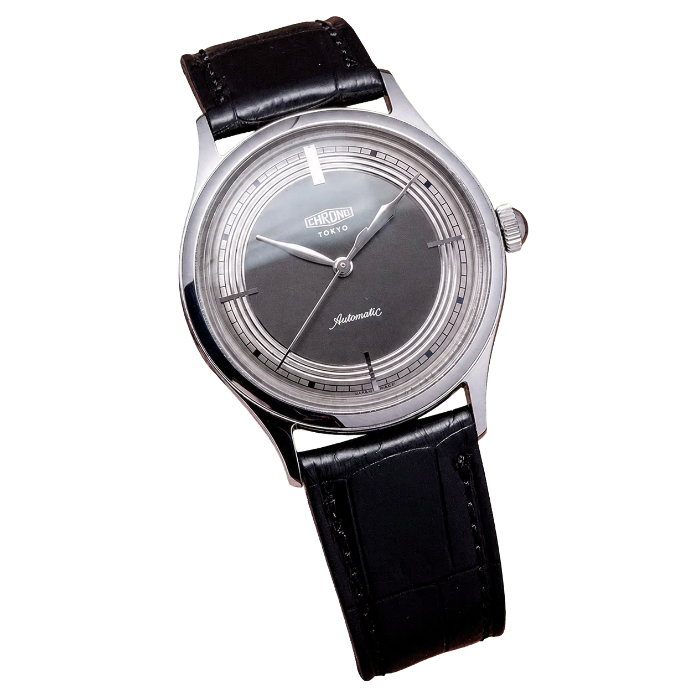
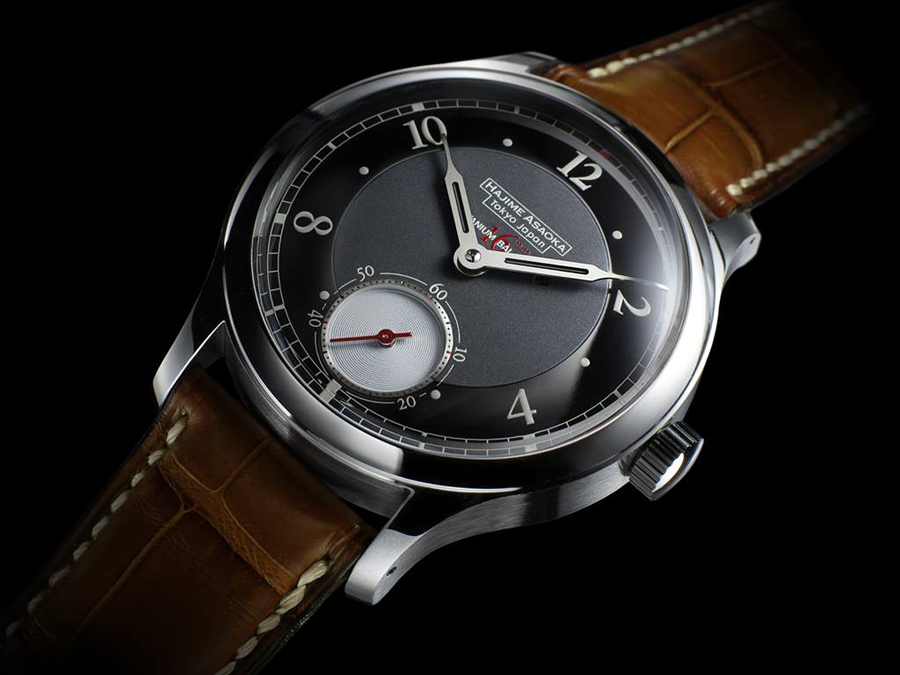
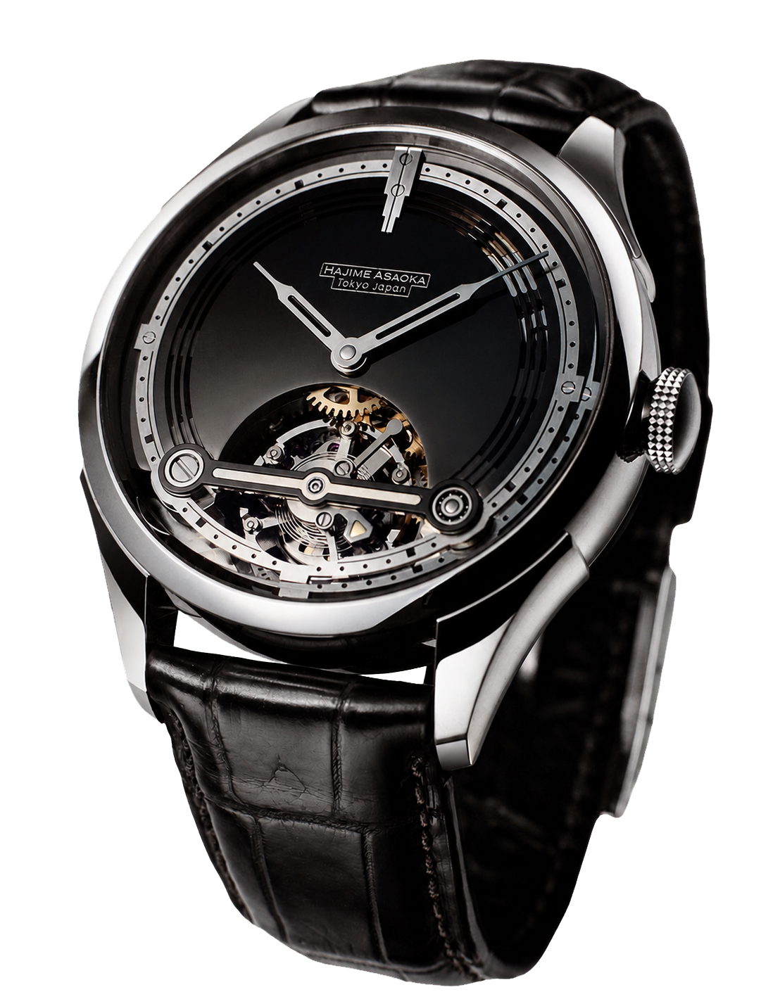
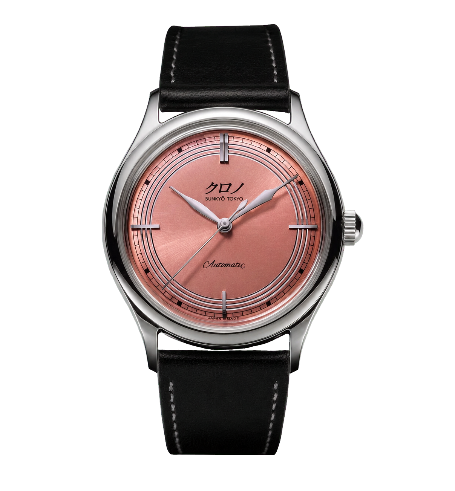
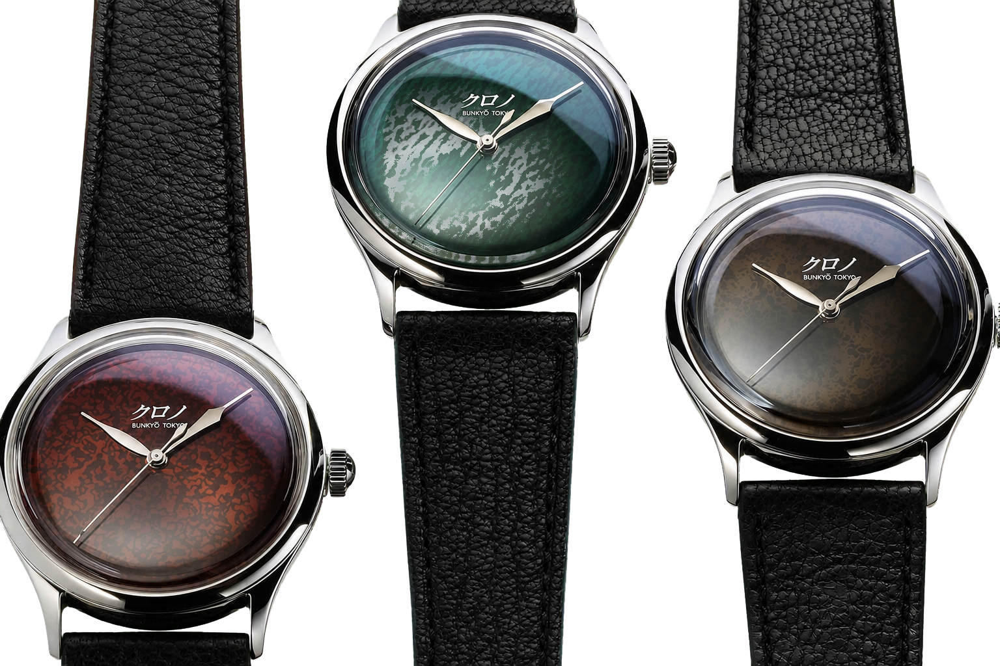

There is a point at which a master watchmaker can decide to remain the master of a select few. A handful of pieces a year, a long waiting list, astronomical prices, and the reputation is secure. At exactly that point, Hajime Asaoka chose the opposite: he created a second brand so that his work could reach people who could never afford a handmade atelier piece.

This is Kurono Tokyo, and this is also the brand that started my interest in microbrands. Which is why this piece runs longer than usual.

*The Kurono Classic, the brand's first and still defining model. Photo: Kibble Watches (kibblewatches.co.uk)*

## A product designer who learned watchmaking from a book

Asaoka was born in 1965 in Kanagawa Prefecture. He graduated in design from Tokyo University of the Arts, then opened his own design office in 1992 and began his career as a product designer. His interest in watches started back in junior high school, when his father gave him a mechanical Citizen chronograph.

The turning point came when he designed a watch and realised he wanted to understand the movement itself. In the early 2000s he bought George Daniels' legendary book, Watchmaking, and from then on taught himself the craft alone. He took apart and studied vintage watches, and learned CAD so he could design components. In 2005 he began making watches in earnest.

What he did next made the industry look up. In 2009 he presented Japan's first wristwatch with an in-house tourbillon movement. Consider what that means: someone with no formal training in watchmaking took, as his first serious work, precisely the complication most watchmakers regard as the summit of the craft. From 2011 he sold watches under his own name, and in 2015 he was admitted to the AHCI, the Swiss academy of independent creative watchmakers, where he is one of only two Japanese members. It is no accident that people call him "the Philippe Dufour of Japan".

*The Hajime Asaoka Tsunami, a 37 mm three-hander with an enormous 15 mm balance wheel on the back. Photo: Hajime Asaoka (hajimeasaoka.com)*

His atelier pieces (the three-hand Tsunami, the Project T tourbillon and the Chronograph) are all made by hand, over months. A few pieces a year, starting in the tens of thousands of dollars.

*The Project T tourbillon, which runs on ball bearings instead of ruby jewels. Photo: Time and Watches (timeandwatches.com)*

## The decision this piece is really about

And here is the heart of it. Asaoka could see that many people loved his design work but had no chance of buying it. So in April 2018 he launched a second brand, first as Chrono Tokyo for the Japanese market, then internationally in June 2019 as Kurono Tokyo.

The logic is simple and clean. The design, the proportions, the dial work and the taste are the same; the movement, however, is not made in-house but sourced from proven Japanese calibers (Miyota, Seiko). That allows larger batches at far lower prices. Where the atelier pieces start at twenty-five thousand dollars, a Kurono sits at around fifteen hundred.

The beauty of the strategy is that the two brands do not cannibalise each other. Those who want the handmade summit still buy an Asaoka piece. Those who want to wear Asaoka's *design* now can. Very few people in independent watchmaking manage this well.

## What you actually get

Kurono is not a stripped-down, cheaper version. It is a clean, Art Deco-inspired design language, carefully drawn numerals, box crystals, and above all the dial work, which is the brand's real strength. The concepts of Japanese aesthetics, *wabi-sabi* (the beauty of imperfection) and *shibui* (understated elegance), are not marketing copy here; you can genuinely see them in the objects.

The first series arrived in June 2019 as simple three-hand watches in three colours (Mystic Gray, Midnight Blue, and the Eggshell White exclusive to Sincere Fine Watches). The same model later ran under the names Reiwa and Classic. The dial carries "クロノ" (Kurono) in hiragana and the words "Bunkyō Tokyo", a reference to the Tokyo ward where Asaoka's workshop sits.

There is one story I particularly like. For the second anniversary, Asaoka wanted a colour that expressed Japanese culture, and chose the pinkish hue of the Japanese ibis (*toki*) in flight. Getting that single colour right took him nearly a year, from idea to production, because he insisted it be decisively different from the "salmon" dials that were everywhere at the time.

*The Anniversary 朱鷺:TOKI, with a dial modelled on the feathers of the Japanese ibis. Photo: Kurono Tokyo (kuronotokyo.com)*

Since then the collection has grown much wider: chronographs, calendar watches, the higher-end Grand series, salon editions and anniversary models. Some dials are made with a traditional Japanese technique, urushi lacquer, applied and polished by hand in Kyoto, layer upon layer, because no machine can replicate that depth.

*Handcrafted urushi lacquer dials, the work of Kyoto master craftsmen. Photo: Worn & Wound (wornandwound.com)*

## The downside, honestly

One thing has to be said, though, because the picture is incomplete without it. Kurono is attainable in price, but it is not easy to get. The pieces appear in limited batches through online "drops", and sell out in minutes. There have been models available to order for precisely ten minutes.

This has an uncomfortable consequence: on the secondary market they regularly change hands well above retail. So the brand solved part of the access problem (it brought the price down) and relocated the rest of it (now the bottleneck is queuing and luck). That is worth knowing before anyone falls in love.

For fairness, the other side too: limited batches are not necessarily an artificial trick at a workshop of this size and craft-led approach. A small team simply cannot produce unlimited quantities without the dial quality suffering.

## Why this brand in particular opens a door

Many people enter the world of microbrands through Kurono, and I think it is easy to see why. Most microbrand stories go like this: someone fell in love with a genre and tried to do it well. Kurono works the other way around: here an established, AHCI-member master stepped *down* the price ladder, deliberately, so that more people could reach him.

That shows that "cheaper" and "lesser" are not the same thing. That a watch costing a few thousand dollars can carry real taste and real craft, if the right person stands behind it. And once you have handled one, or even just looked at one closely, you start looking differently at the entry-level models of the big houses too.

Asaoka did not stop there, either: under his company sit his own name, Kurono, the revival of the old Japanese brand Takano, and Otsuka Lotec as well. One man who learned watchmaking from a book is now one of the engines of Japan's independent watch scene.

That is why Kurono sits among the first pages of this journal. Not because of the hype, but because a simple, rarely made decision stands behind it: good design should not only be admired, it should be worn.
