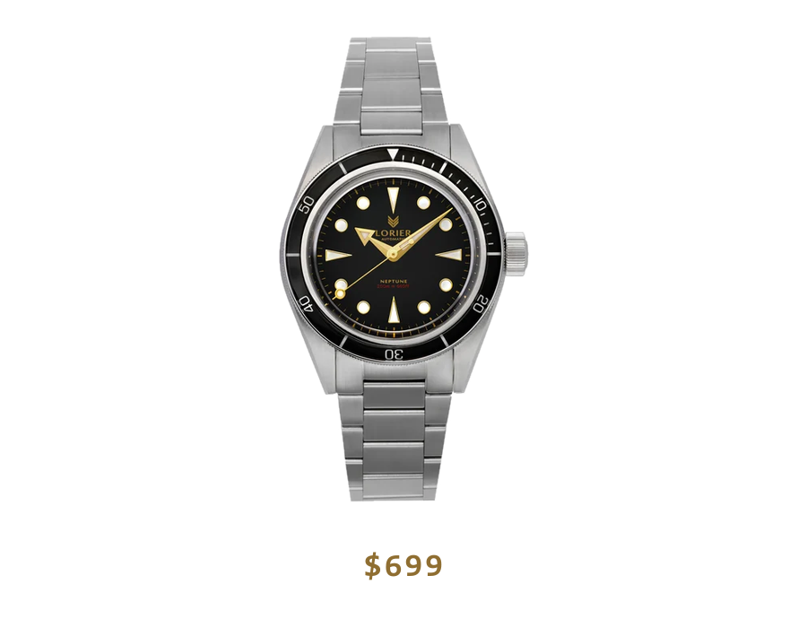
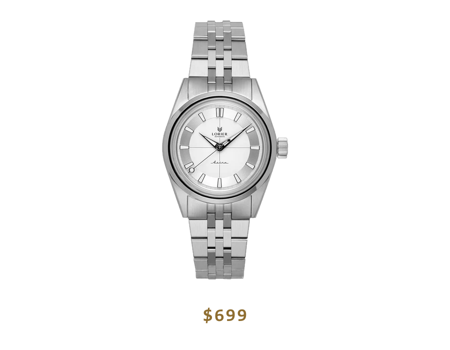
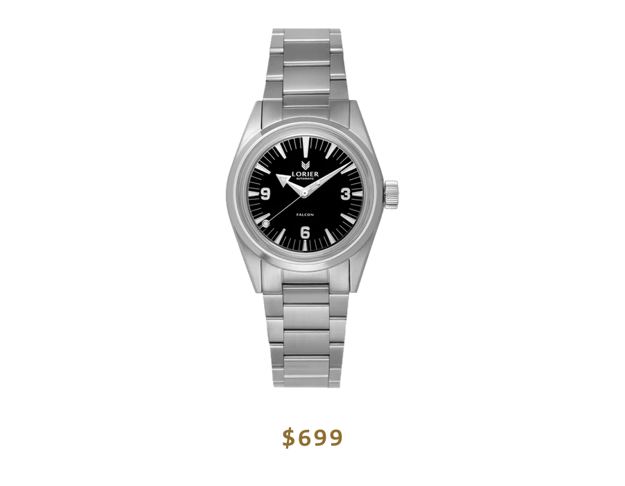
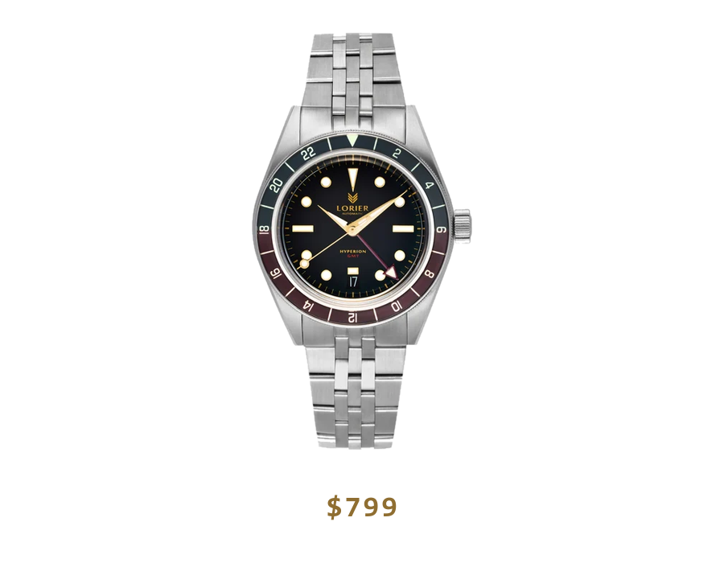

Most good watches are born because someone couldn't find the one they were looking for. Two New York teachers couldn't either, so they poured their savings and a lot of tired evenings into making it themselves. I'm starting this journal with their brand, **Lorier**, because that is exactly the question I care about: why anyone sets out to build something of their own, whether it's a watch or a page like this one.

And let me be honest right at the start: I haven't held this particular watch. This journal is only just beginning too, in the same uncertain, slightly excited state as anything at its first step. Maybe that's precisely why Lorier is the right place to start, because their story is about the very beginning as well.

## The two teachers

Lorenzo and Lauren Ortega are a married couple. Before they made watches, they taught; their passion for horology first caught in college and quietly matured for years, until in 2017 they took the plunge and founded Lorier, to build the watch they would want to wear themselves. Their first watches were finished in 2018.

What makes the decision so bold is that nothing about it added up in the usual sense. They had no industry contacts, which is almost a prerequisite in this trade. They had no prior experience. And they put every cent of their savings on the line. They essentially learned the whole thing as they went, sitting down to their designs in the evenings after teaching, and piecing together, step by step, something that supposedly takes an entire industry.

The risk paid off handsomely: Lorier earned a serious name among enthusiasts with its restrained vintage reinterpretations, typically priced around 500 dollars. And for a long time it stayed a two-person workshop. The design, the photography, the customer service, and the quality control were all handled by the two of them for years. That became their biggest problem, too: demand kept outrunning what two people could produce, and batches often sold out within hours.

So in early 2026 a new chapter began. Worn & Wound, an independent watch media and retail company, acquired Lorier, but not in the usual way. The Ortegas remained partial owners, with Lorenzo staying on as the brand's Creative Director; the two independent companies structured the deal themselves, with no venture capital and no conglomerate, so that both could keep their values. The larger operation takes on the burden of running the business, while the craft stays with the founders, and that is exactly what still makes Lorier feel personal.

## What they actually set out to do

Their goal was never to launch yet another status symbol. Quite the opposite. They wanted watches that aren't about their owner's rank but about the time spent together: watches that earn their value from shared memories, scratches, and stories. To "democratize" the beautiful, well-built watch, that is, to bring back classic forms and the adventurous spirit of vintage pieces at an accessible price.

You can see that outlook in the models: each one evokes an archetype from the mid-twentieth century, as if it had just rolled out of a time machine. They aren't trying to win a spec race, but to make watches you can put on for anything and then forget you're wearing, in the best sense.

This "companion, not trophy" attitude is why Lorier belongs here, on the journal's first page. Not a legend celebrating some heroic age, not an unobtainable grail. Two people who decided to do something well, even on a small scale.

## The collection in broad strokes

The current, relaunched core collection is four watches. Each is a restrained rethinking of a classic archetype, and all of them run on a Miyota automatic movement.

*Neptune. List price $699. Photo: Lorier.*

The **Neptune** is the diver, and it's the watch that put Lorier on the map in 2019. It channels the dive watches of the mid-twentieth century: a black dial, a black aluminium bezel insert, with gold-tone hands and index frames. The house's true, everyday diver.

*Astra. List price $699. Photo: Lorier.*

The **Astra** is Lorier's answer to the classic 1960s dress watch: a 36 mm case, a silver "pie-pan" dial with a printed crosshair. Its finest trick shows itself in the dark, when the fully lumed minute track begins to glow in step with the hands. (After the name of this journal, it's hard not to be fond of it.)

*Falcon. List price $699. Photo: Lorier.*

The **Falcon** is the field watch: also 36 mm, with a 3-6-9 dial that nods to the Rolex Explorer, though it goes its own way with a big arrow-shaped hour hand and a dauphine minute hand. The most compact of the set, the "put it on and forget it" piece.

*Hyperion. List price $799. Photo: Lorier.*

The **Hyperion** is the GMT: 39 mm, with a second time zone for those who travel a lot. The globetrotter of the four.

**The movement.** All four watches run on Miyota 90-series automatics: the no-date Neptune, Astra, and Falcon use the 9039, while the Hyperion steps up to the GMT-capable 9075. These are Japanese workhorses, not in-house, glittering manufacture calibres, but reliable, widely serviceable, and backed by exactly the kind of honest engineering that keeps the watches affordable: robustness and value over bragging rights. The refreshed pieces now come with sapphire crystals, and all arrive on tapered flat-link steel bracelets.

## Why I'm starting here

Because Lorier's story is exactly about what this journal exists for in the first place. Not the latest releases, not the hype, but the object, and that quiet nerve with which someone says: this is worth understanding, and worth doing well.

Two teachers took their savings and built the watch they couldn't find anywhere. And I sat down and began to write about what I want to understand in watches: the small workshops, the real histories of the old houses, the machinery working under the dial. When I think about it, that's the same gesture.

This is the first page. If you're curious where it goes, you're in the right place.
