There is a pistol at the end of the seconds hand.

Not a cinematic trick. On several Omega Bond editions, the 007 emblem really does form the hand’s counterweight. Elsewhere, a dial becomes a gun barrel, or a miniature title sequence starts moving beneath the caseback. Sometimes there are so many clues that a spy would have little chance of remaining unnoticed.

That is the central contradiction of a Bond watch. Within the story, it is something to use. In a shop window, it is something designed to remind us of the story. Occasionally these are the same watch. For much of the partnership, they were not.

Omega’s James Bond and Spectre collection, introduced on 5 October 2026, now gives the other side its own watches too. Before reaching it, we should trace how a blue diver became so many different souvenirs, screen objects and design ideas.

This overview covers factory-produced commercial Bond editions, including their size, strap and precious-metal variants. It is not a catalogue of every Omega seen on screen, every film prop or every unique auction prototype. A special edition is not necessarily limited; a numbered edition does not necessarily have a predetermined production ceiling.

## 1995: before the commemorative watch

In GoldenEye, Pierce Brosnan wore a blue Seamaster Professional 300M. Reference **2541.80.00** had a quartz movement. A 007 special edition was not placed in the film: an existing production watch acquired a role that would change how people saw it.

Costume designer Lindy Hemming’s choice drew on Bond’s naval background. A diving watch could sit somewhere between uniform and tailoring. The blue dial, wave pattern and distinctive bracelet became recognisable without having to spell out the character’s name.

This is where the relationship starts, but the factory anniversary editions arrive later. The loose description “Bond watch” in a used-watch listing can easily erase that distinction.

## 2002: the fortieth anniversary

### Seamaster Professional 300M, 40th Anniversary

**Ref. 2537.80.00 · 41.5 mm · 10,007 pieces**

The Seamaster celebrating forty years since Dr. No fills the familiar blue dial with small, repeated 007 motifs. Built around the automatic calibre 1120, it remains close to the everyday Diver of its period, but the connection no longer needs explaining. This special edition says explicitly what the earlier screen watch only suggested.

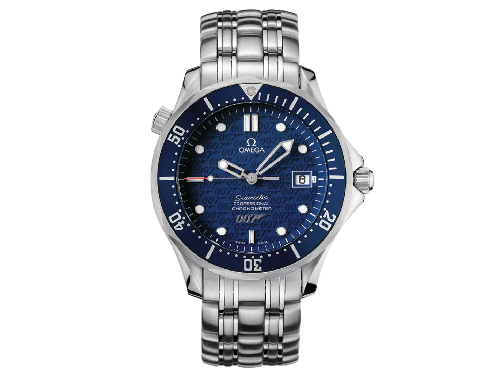
*The 2002 anniversary Seamaster. Ref. 2537.80.00. Photograph: OMEGA; original manufacturer image with a transparent background.*

## 2006 and 2008: blue turns to black

### Two Casino Royale editions

**Seamaster Diver 300M · Ref. 2226.80.00 · 41 mm**

In the year of Daniel Craig’s debut, a gun-barrel spiral replaces the blue Diver’s waves. This 10,007-piece edition uses the Co-Axial calibre 2500 and puts the 007 counterweight on its seconds hand. The colour carries over from the Brosnan era, while the dial points straight to the opening titles.

**Planet Ocean Casino Royale · Ref. 2907.50.91 · 45.5 mm**

The black Planet Ocean has a larger case and black rubber strap, with a red 007 detail on its seconds hand. Calibre 2500 and a rated water resistance of 600 metres underpin a more substantial-looking diver. This Casino Royale commemorative edition should not simply be equated with every black Planet Ocean seen in the film.

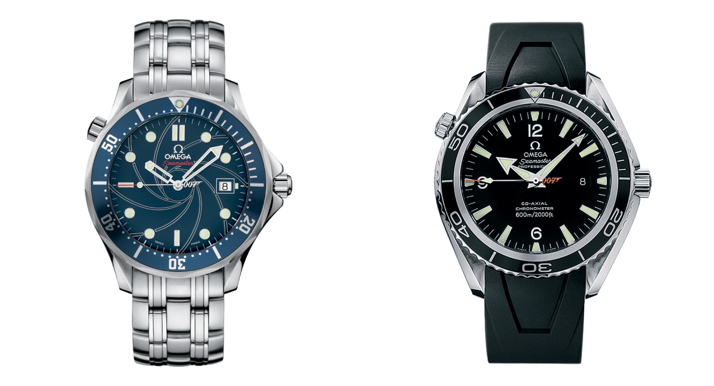
*Left: 2226.80.00. Right: 2907.50.91. Photographs: OMEGA. The layout is not a comparison of their actual sizes.*

### Collector’s Piece and Quantum of Solace

**Seamaster Diver 300M Collector’s Piece · Ref. 212.30.41.20.01.001 · 41 mm**

The 2008 Collector’s Piece turns the wave dial black, leaving the red 007 hand as its strongest colour accent. The 10,007-piece series celebrates the relationship between Bond and Omega rather than carrying a particular film’s title. Automatically calling it a Quantum of Solace edition therefore loses an important distinction, even though both appeared in the same year.

**Planet Ocean Quantum of Solace · Ref. 222.30.46.20.01.001 · 45.5 mm**

This is the model that actually carries the film’s name. Its black dial recalls the texture of a Walther PPK grip, while the title appears on the sapphire crystal. Behind the obvious inscription, this steel-bracelet, calibre 2500 Planet Ocean makes a more interesting connection: a weapon’s tactile pattern becomes the watch’s visible surface.

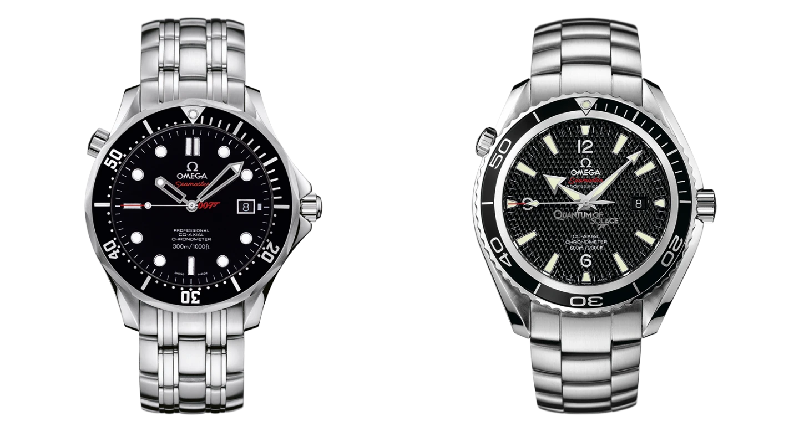
*Left: Collector’s Piece, 212.30.41.20.01.001. Right: Quantum of Solace, 222.30.46.20.01.001. Photographs: OMEGA.*

## 2012: fifty years, three watches

### Bond at 50, in two sizes

**41 mm · Ref. 212.30.41.20.01.005 · 11,007 pieces**

The repeating 007 pattern returns on a black dial, with the number fifty picked out in red on the ceramic bezel. The anniversary becomes part of the diving scale rather than an extra line of text. A gun-barrel caseback and bullet decoration on the calibre 2507 rotor continue the theme on the other side.

**36.25 mm · Ref. 212.30.36.20.51.001 · 3,007 pieces**

The smaller version compresses the same idea into a narrower case, again with automatic calibre 2507. This is not just a different strap or shorter bracelet: it is a separate size with its own reference and production run. Few Bond anniversaries make such a deliberate allowance for different wrist sizes.

### Planet Ocean Skyfall

**Ref. 232.30.42.21.01.004 · 42 mm · 5,007 pieces**

The Skyfall commemorative model places its 007 symbol at seven o’clock on a textured black dial. Calibre 8507 delivers a 60-hour power reserve, and the case is rated to 600 metres. Again, this is a dedicated collector edition: the Planet Ocean seen in the film and the limited model sold under the Skyfall name are not interchangeable descriptions.

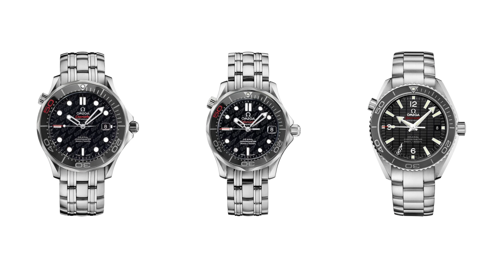
*From left: Bond at 50, 41 mm; Bond at 50, 36.25 mm; Skyfall Planet Ocean. Photographs: OMEGA. The arrangement is not to scale.*

## 2015: a family crest and a screen watch

### Aqua Terra James Bond Limited Edition

**Ref. 231.10.42.21.03.004 · 41.5 mm · 15,007 pieces**

The blue Aqua Terra released in the year of Spectre turns the Bond family coat of arms into a repeating pattern, enlivened by yellow details. Omega’s technical sheet identifies its 60-hour movement as calibre 8507G; the 15,007-piece run also nods to its 15,000-gauss magnetic resistance. This dressier special edition is not the more understated Aqua Terra from the film.

### Seamaster 300 SPECTRE Limited Edition

**Ref. 233.32.41.21.01.001 · 41 mm · 7,007 pieces**

Here the two stories genuinely meet: Omega offered the model worn in the film as a limited edition. A twelve-hour scale replaces diving minutes on its black ceramic bezel, the seconds hand has a round lollipop tip, and a black-and-grey NATO strap completes the design. Built around calibre 8400, it benefits from not covering its dial with emblems. The film’s explosive device is, of course, absent from the commercial watch.

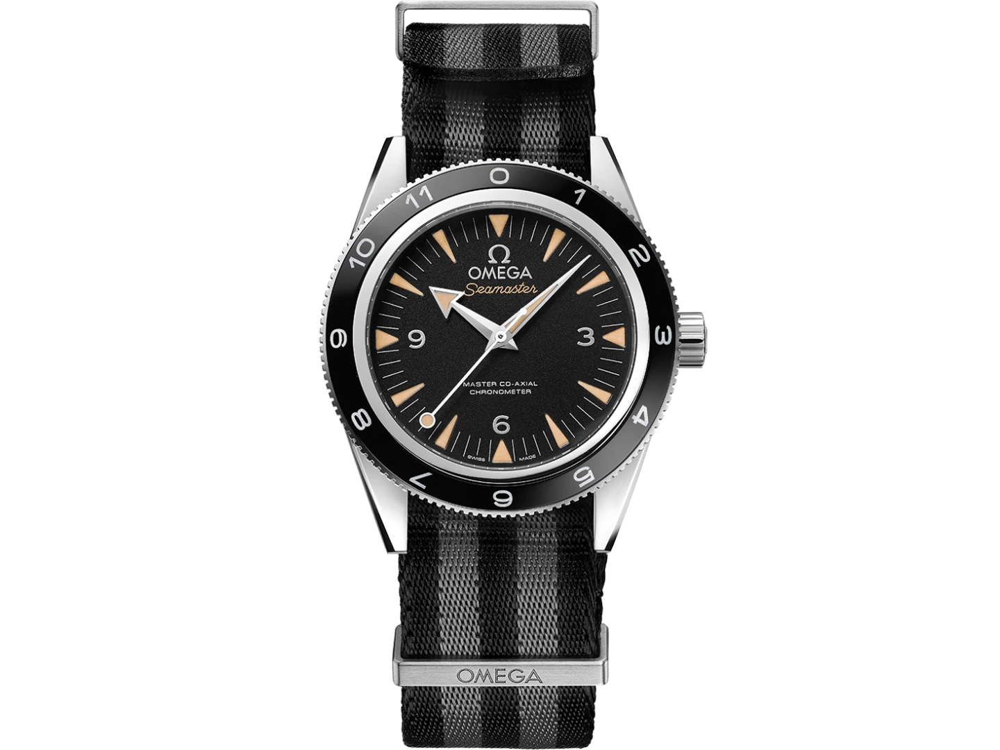
*Seamaster 300 SPECTRE, 233.32.41.21.01.001. Photograph: OMEGA.*

## 2017: Commander Bond

### Commander’s Watch, steel and yellow gold

**Steel · Ref. 212.32.41.20.04.001 · 41 mm · 7,007 pieces**

A white ceramic dial, blue hands and red details make an unusually bright Bond watch. With its blue, red and grey NATO strap, the Commander’s Watch highlights the character’s naval rank rather than a new film premiere. The decorated calibre 2507 rotor and 007 seconds hand retain the collector-oriented character.

**Yellow gold · Ref. 212.62.41.20.04.001 · 41 mm · 7 pieces**

Limited to seven examples, the gold version places the same palette in a yellow-gold case. Its blue ceramic bezel combines a gold diving scale with a red rubber section marking the first fifteen minutes, and a gold bracelet is included in the package. The military connection is now a visual reference, not the practical brief for an issued watch.

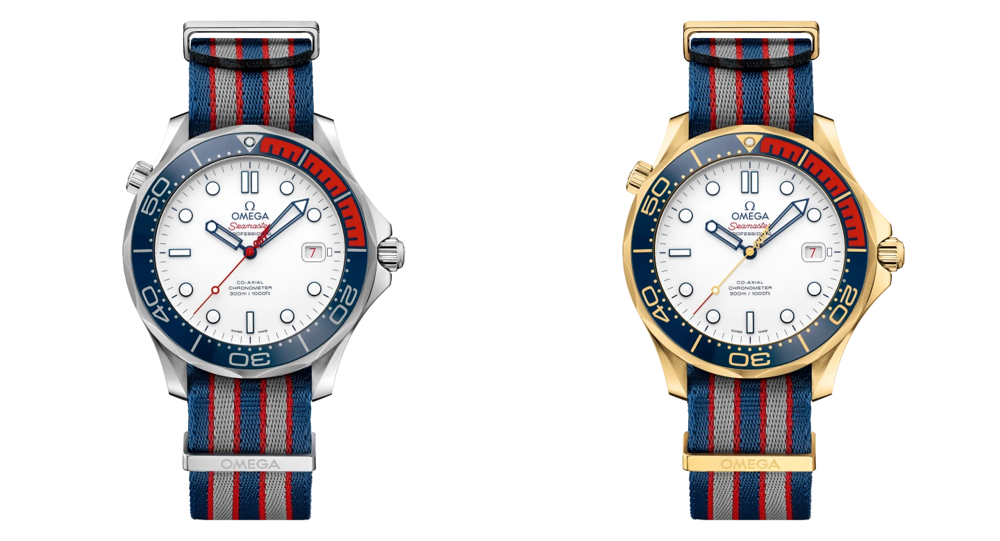
*Left: 212.32.41.20.04.001. Right: 212.62.41.20.04.001. Photographs: OMEGA.*

A unique white-gold Commander’s Watch also appeared in Christie’s 2017 charity auction. It was not a third production series available to order through a boutique. Such one-offs deserve separate treatment, or the history of commercial editions quickly becomes entangled with that of auction objects and props.

## 2019 and 2020: new objects for an old film

### On Her Majesty’s Secret Service, fifty years later

**Ref. 210.22.42.20.01.004 · 42 mm · 7,007 pieces**

Celebrating the 1969 release of On Her Majesty’s Secret Service, this Diver carries a gun-barrel spiral on its black dial and the Bond family crest at twelve. The steel model on black rubber has a date at six and uses Master Chronometer calibre 8800. It is a retrospective tribute to the film, not a reissue of George Lazenby’s screen watch.

### The 257-piece paired set

**Steel · Ref. 210.22.42.20.01.003 · Calibre 8806**

Introduced later in the same year, the set’s steel watch might initially look like the separately sold model’s twin. The absence of a date, and the different movement behind it, are important distinctions. The reference ends in 003 rather than 004 for a reason.

**Yellow gold · Ref. 210.62.42.20.01.001 · Calibre 8807**

Its companion has an 18-karat yellow-gold case and black rubber strap, again without a date. Calibre 8807 adds precious-metal components to its rotor and balance bridge. The two 42 mm watches came in a Globe-Trotter case: 257 refers to the number of paired sets, not the total number of watches across both references.

### James Bond Numbered Edition

**Ref. 210.93.42.20.01.001 · 42 mm · 2020**

The platinum-gold version places an 18-karat white-gold gun-barrel spiral on a black enamel dial. Its side plate bears an individual number, but “Numbered Edition” is not synonymous with a previously announced, fixed production limit. With calibre 8807 inside, this watch makes its statement through material, weight and finish rather than any resemblance to equipment intended for a mission.

## No Time To Die: another direction

**Titanium mesh bracelet · Ref. 210.90.42.20.01.001**

Unveiled in December 2019 and worn in the film that eventually reached cinemas in 2021, this watch has a lightweight Grade 2 titanium case and titanium mesh bracelet. Brown aluminium is used for the dial and bezel, while calibre 8806 dispenses with a date. Daniel Craig contributed to the design discussion; the resulting 42 mm 007 Edition is not a numbered commemorative run and is not limited.

**NATO strap · Ref. 210.92.42.20.01.001**

The striped NATO version gives the same watch a different wearing character. Its brown, grey and beige combination feels less jewellery-like than the woven titanium bracelet. In neither version does the broad-arrow dial motif establish that this is an actual military-issued watch.

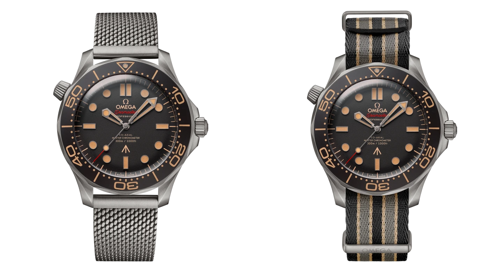
*Left: 210.90.42.20.01.001. Right: 210.92.42.20.01.001. Two configurations, not two separate anniversaries. Photographs: OMEGA.*

One of this watch’s strengths is that its film connection does not necessarily announce itself from across a room. Colour, material and strap work together. You do not have to recognise an emblem for the design to make sense.

## 2022: cinema beneath the caseback

### James Bond 60th Anniversary, steel

**Ref. 210.30.42.20.03.002 · 42 mm · Calibre 8806**

Laser-engraved waves on the blue aluminium dial reach back to GoldenEye, while the steel mesh bracelet continues the more recent Bond design language. A commemorative sixty replaces the triangle at the top of the bezel. The surprise is underneath: a moiré effect connected to the running watch brings Bond’s silhouette and the revolving gun barrel to life.

### James Bond 60th Anniversary, Canopus Gold

**Ref. 210.55.42.20.99.001 · 42 mm · Calibre 8807**

The precious-metal version uses Omega’s Canopus Gold white-gold alloy. Natural grey silicon forms the dial, surrounded by treated diamonds in graduated green and yellow shades. The caseback animation remains, but the watch occupies a different world: openly a piece of jewellery, not equipment in disguise.

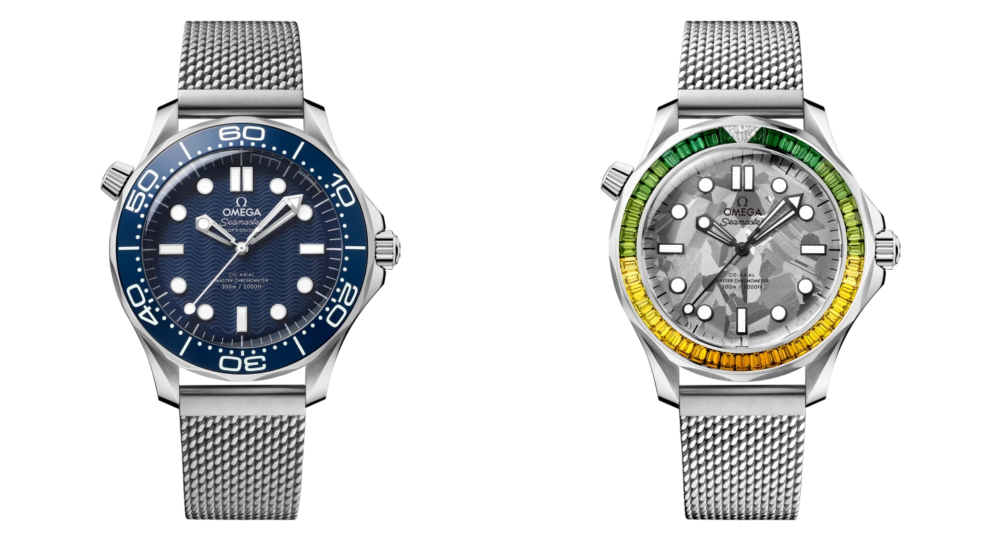
*Left: 210.30.42.20.03.002. Right: 210.55.42.20.99.001. Photographs: OMEGA.*

Moiré is neither a digital display nor a hologram. Fine patterns moving relative to one another create the impression of motion. It is an unusual moment in this series: the cinematic reference becomes a visual effect linked to the watch’s operation, rather than another inscription or badge.

## May 2026: Bond steps out of a game

### Seamaster Diver 300M Chronograph, 007 First Light

**Ref. 210.32.44.51.01.002 · 44 mm · Calibre 9900**

Introduced on 21 May, First Light connects to the 007 First Light video game rather than a new theatrical film. Omega’s first Bond Diver chronograph has a black ceramic dial and bezel, with a bronze-gold PVD finish highlighting the subdial at three. Despite its striped NATO strap, it is no slight object: the case is 17.2 mm thick and the power reserve is 60 hours.

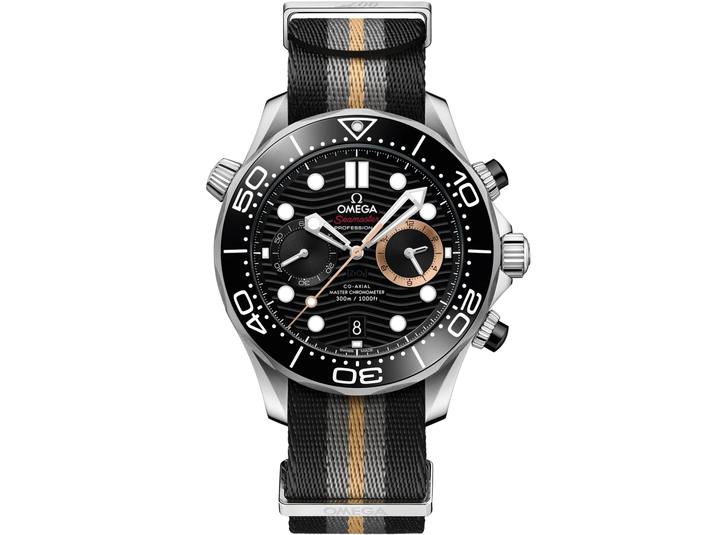
*The video game’s First Light chronograph. Ref. 210.32.44.51.01.002. Photograph: OMEGA.*

The wording matters: this is the first Bond **Diver** chronograph, not the first time any Omega with a stopwatch has appeared in the wider film history. There is no need to stretch the manufacturer’s category into a larger claim.

## 5 October 2026: two sides, six watches

The newest collection does more than place another 007 logo on a dial. It puts two identities alongside each other: Bond and the Spectre organisation. All six watches are 42 mm Diver 300Ms with automatic calibre 8806 and a 55-hour power reserve. Two steel models are available individually; four further watches make up two paired-set editions, limited to 77 sets each.

### The individually available James Bond

**Ref. 210.30.42.20.03.004**

A Grade 5 titanium bezel ring surrounds the blue wave-pattern aluminium dial, with the watch supplied on steel mesh. The Bond connection also appears in the rotor’s gun-barrel decoration. This is not merely a new reference for the 2022 anniversary watch: its material combination and caseback treatment identify a separate edition.

### The individually available Spectre

**Ref. 210.30.42.20.01.023**

A grained black dial and black ceramic bezel move away from the classic blue Bond Diver. The rotor carries Spectre’s octopus emblem, while the case, steel mesh bracelet and movement platform remain shared with the Bond model. The name refers to the organisation, not to a reissue of the 2015 Seamaster 300 SPECTRE.

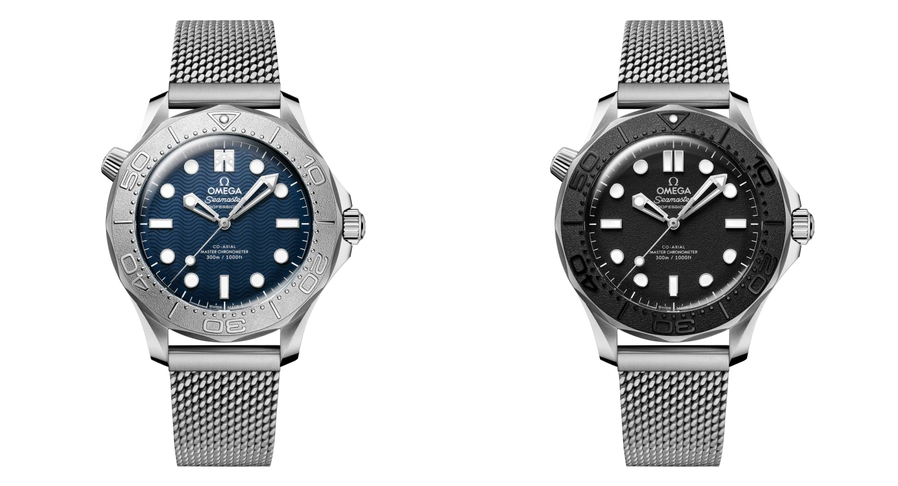
*Left: James Bond, 210.30.42.20.03.004. Right: Spectre, 210.30.42.20.01.023. Photographs: OMEGA.*

### The James Bond paired set

**Steel · Ref. 210.30.42.20.03.005**

The set’s steel watch continues the blue-dial design but adds a plate bearing its individual limited-edition number on the nine-o’clock side of the case. It should therefore not be confused with the separately available reference ending in 004. This watch belongs to the 77 paired sets and is not sold on its own.

**Platinum-gold · Ref. 210.83.42.20.03.001**

Its companion has an 18-karat white-gold dial with a blue PVD gradient and gun-barrel pattern. The blue ceramic bezel uses a platinum scale, the rotor emblem is Moonshine Gold, and the strap is blue alligator. The same calibre 8806 platform now sits within a very different material setting.

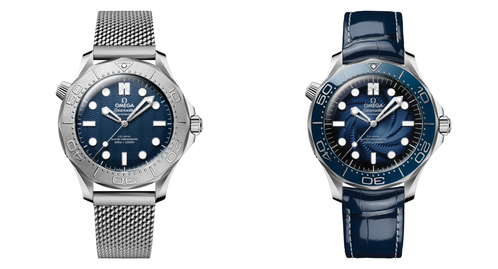
*The Bond set: 210.30.42.20.03.005 and 210.83.42.20.03.001. Photographs: OMEGA.*

### The Spectre paired set

**Steel · Ref. 210.30.42.20.01.029**

The black steel watch likewise distinguishes itself from the separately sold version through its numbered side plate. The octopus rotor motif and dark surfaces remain, but this reference belongs exclusively to the 77 Spectre sets. The 029 ending is not a typo for 023.

**Platinum-gold · Ref. 210.83.42.20.01.001**

The second watch gives its white-gold dial a dark-grey PVD gradient and octopus motif. A black ceramic bezel, platinum scale and black alligator strap complete it, with Moonshine Gold again used for the rotor emblem. Grey and black hold this composition together where the Bond set relies on blue.

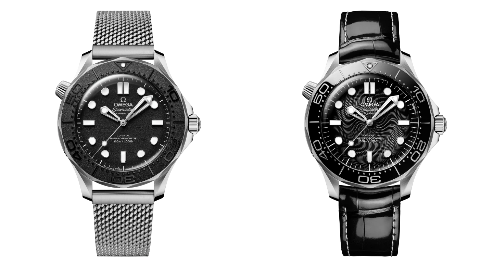
*The Spectre set: 210.30.42.20.01.029 and 210.83.42.20.01.001. Photographs: OMEGA.*

With a shared technical foundation, the choice among these six models is primarily about material, surface and meaning. Time does not run differently inside the villain’s watch.

## What remains if we cover up the 007?

These watches are not all trying to do the same thing. The 2002 anniversary piece makes an affiliation visible. The 2015 Seamaster 300 brings the screen object and the purchasable object together. No Time To Die builds character through colour and material. The steel sixtieth-anniversary model hides a small cinema beneath its caseback.

I find the versions that would still have something to say without the emblem most interesting. A considered bezel, an unusual dial surface, or titanium paired with brown aluminium remains watch design even for someone unable to name every Bond film.

Omega’s relationship with 007 is therefore more than an extended product placement, though not every special edition adds the same amount. It is worth turning the watch over, reading its reference and asking a separate question: do I like this object, or the scene it makes me remember?

Either can be a good answer. They are simply not the same one.

*This overview draws on manufacturer and film-franchise sources checked through 7 October 2026.*
