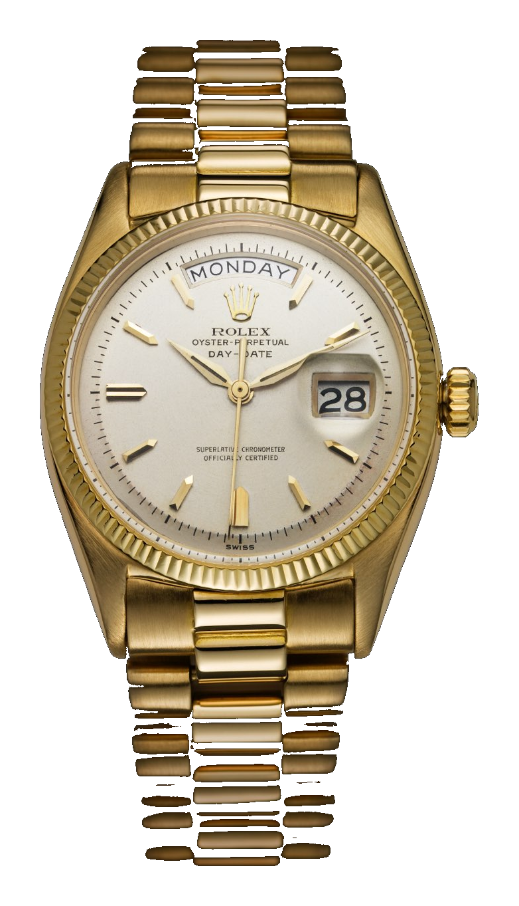
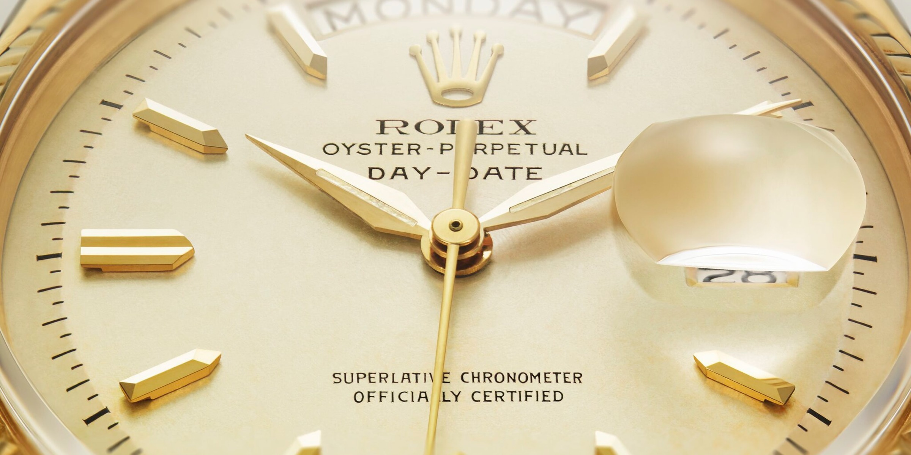
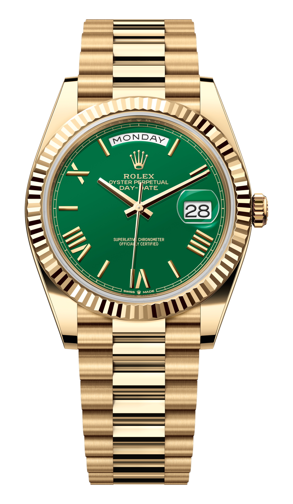
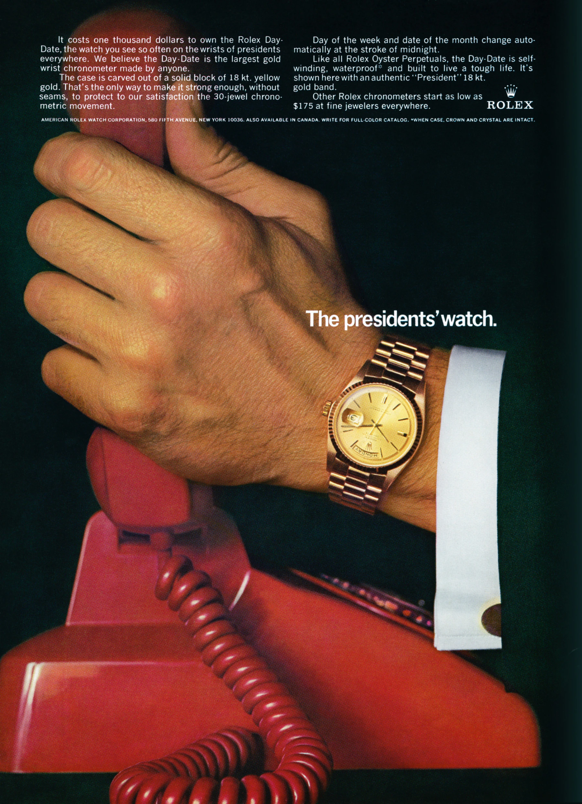
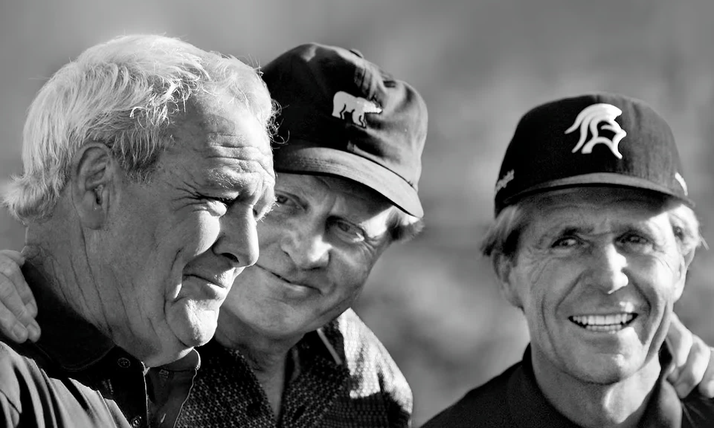

It is easy to call a gold Rolex a President. The name sounds right, the watch already carries authority, and the history of American presidents seems to hang around it. The trouble is that the word folds three different things into one.

Day-Date is the name of the watch. President was originally the name of the metal bracelet made for it. The “presidents' watch” is a nickname built by wearers, advertisements and decades of repetition.

That distinction matters because the best-known figure in the story did not wear the watch now linked to him. Dwight D. Eisenhower certainly owned a gold Rolex. It could not have been a Day-Date because the model did not yet exist.

*The first Rolex Day-Date from 1956. The fully written Monday was already placed at the top of the dial. Photograph: [Rolex](https://www.rolex.com/en-us/about-rolex/history/1953-1967).*

## Fitting a whole day onto a dial

Rolex introduced the Datejust in 1945. The automatic, waterproof wristwatch showed the date in a separate window, then gained the Cyclops magnifier above it in 1953. The next step sounds obvious. If the date can be displayed, why not write out Monday as well?

On a 36 mm watch, this is not simply a typographic problem. The names of the days have different lengths, the disc must stop precisely, and the date disc must advance at the same time. Ideally, neither display should spend half an hour crawling towards its new position around midnight.

The Oyster Perpetual Day-Date, launched in 1956, placed the date at three o'clock and the fully written day in an arc-shaped window at twelve. Rolex describes it as the first wristwatch to combine both in this form. Its two discs changed together, instantaneously.

The innovation did not arrive in steel. From the beginning, the Day-Date was made only in gold or platinum. Rolex was not trying to put an inexpensive calendar watch on as many wrists as possible. It turned ordinary information into an object of status.

*The two defining windows of the Day-Date. The day is written in full at twelve, while the magnified date sits at three. Photograph: [Rolex](https://www.rolex.com/en-us/watches/day-date/those-who-shape-the-world).*

## President was the bracelet before it was the watch

A new bracelet was created for the Day-Date in 1956. Its three-piece construction resembles the Oyster at a glance, but the links are semi-circular, shorter and more closely spaced. The centre row is polished while the outer links are brushed. The clasp is concealed, with only a small Rolex crown revealing where it opens.

Rolex called it the President bracelet. President was therefore not a later collector invention, nor was it a Day-Date renamed in honour of a particular head of state. It was an official component name from the launch of the model.

That small linguistic detail almost disappeared over time. The bracelet became so closely tied to the watch that people first called the complete Day-Date a President, then applied the word to almost any similar gold Rolex. Rolex still separates the two. Day-Date is the model. President is the bracelet.

*The three rows of semi-circular links on a modern Day-Date 40. The background was removed from an original manufacturer image. Photograph: [Rolex](https://www.rolex.com/watches/day-date/m228238-0061).*

## Eisenhower's gold watch arrived five years too early

The Eisenhower story clings to the Day-Date because almost every part of it is true. The model is the exception.

In the early 1950s, Rolex offered its 150,000th officially certified chronometer to Dwight D. Eisenhower. He was not yet president of the United States. He accepted it as a five-star general and NATO's first Supreme Allied Commander Europe. Five stars, the initials D.D.E. and the date of his appointment, 19 December 1950, were engraved on the case back.

The watch was an 18 ct yellow-gold Datejust, identified by the cited sources as reference 6305, on a Jubilee bracelet. Eisenhower wore it on the cover of Life in 1952 and continued to wear it after entering the White House. A gold Rolex was therefore linked to the American presidency before the Day-Date had even been introduced.

It is only a short, incorrect step from there to saying that Eisenhower wore a Rolex President. He wore a president's Rolex. That is not the same thing.

## The president who put the name in its proper place

Lyndon B. Johnson really did wear a Day-Date. Rolex's own history ties 1963, when Johnson entered the White House, to the moment the model joined the visual language of political power.

The watch suited him. Johnson was a large man known for close, physical persuasion. He negotiated by telephone, leaned in, shook hands and gripped arms. The yellow-gold watch regularly emerged beside his shirt cuff. It did not need a formal introduction. The shape of the Day-Date did the work.

Rolex had long built its identity around achievement, leadership and historical figures. Yet the brand rarely tied the model name to one politician. It found a broader, more durable line instead: men who guide the destinies of the world wear Rolex watches.

By 1967, an advertisement compressed the idea into three words: “The presidents' watch.” It did not show a recognisable president. There were two clasped hands, a gold Day-Date and a red telephone. The scene was specific enough to suggest the White House but anonymous enough to stand for any office of power.

*Rolex was already calling the Day-Date the “presidents' watch” in this 1967 advertisement. It cost 1,000 dollars while the brand's least expensive chronometers started at 175 dollars. Image: [Rolex archive](https://www.rolex.com/en-us/about-rolex/history/1953-1967).*

## A thousand dollars, a red telephone and a careful plural

The small print is almost as revealing as the picture. The Day-Date cost 1,000 dollars. On the same advertisement, Rolex noted that its other chronometers started at 175 dollars. The President was not simply a slightly better Rolex. It sat at the top of the range without relying on diamonds or a long list of complications to justify the position.

Gold case. Automatic movement. Water resistance. The day written in full. That was enough.

The plural in “presidents'” matters too. Johnson authenticated the association, but the advertisement did not lock the watch to one man. It suggested that the object belonged to a role. Reach the head of the table and the Day-Date would already be waiting.

That is how a wearer becomes a category. The nickname survived not because every American president wore a Day-Date. They did not. It survived because one word captured what the watch sold beyond accurate time.

## A conservative shape that kept changing inside

From a distance, the Day-Date barely moved away from its 1956 template. The day window remained at the top, the date and Cyclops at three, the fluted bezel around the dial and the closely linked bracelet below. This consistency made it as recognisable as a uniform.

Inside and in its details, however, the watch continued to change. Reference 1803 became the defining Day-Date of the 1960s. By 1967 the day display was available in 26 languages. During the 1970s, dials appeared in lapis lazuli, malachite, tiger's eye, onyx, coral and turquoise. Inside an outwardly disciplined case, the Day-Date became one of Rolex's freest places for experimentation.

Calibre 3155 brought double quickset in 1988, allowing the day and date to be corrected without repeatedly turning the hands. The 2008 Day-Date II enlarged the case to 41 mm. Its somewhat heavy proportions gave way in 2015 to the 40 mm Day-Date 40 and calibre 3255. Today's movement offers around 70 hours of power reserve while the dial remains instantly familiar.

This sort of evolution is not dramatic. It was never meant to be. The Day-Date's job is to contain a new movement, a different size or an adventurous stone dial within the same authoritative outline.

## When the presidents' watch left politics

The President name eventually became larger than the White House. Day-Dates appeared on the wrists of athletes, business leaders, musicians and actors. Rolex's own history gives Arnold Palmer, Jack Nicklaus and Gary Player a place beside Martin Scorsese and Lindsey Vonn.

That did not weaken the presidential image. It changed its meaning. President no longer described a job. It described a level of arrival, someone who does not need an introduction because everyone in the room already knows who they are.

*Arnold Palmer, Jack Nicklaus and Gary Player. The Day-Date soon moved beyond political leaders into sport and culture. Photograph: [Rolex](https://www.rolex.com/en-us/watches/day-date/those-who-shape-the-world).*

All the while, the watch kept something unusually ordinary at its centre. Its most visible complication is not a moonphase, perpetual calendar or minute repeater. It simply tells you what day it is. Monday. Tuesday. Wednesday. Information everyone knows, presented in gold.

Perhaps that is why the Day-Date works so well as a symbol of power. It does not explain rank. It assumes it. The watch says that its owner's calendar matters.

Eisenhower did not wear a Day-Date. Johnson did. President began as a bracelet, became a nickname and ended as a visual shorthand for an entire role.

The legend is less accurate than reality. Reality is the better story.
