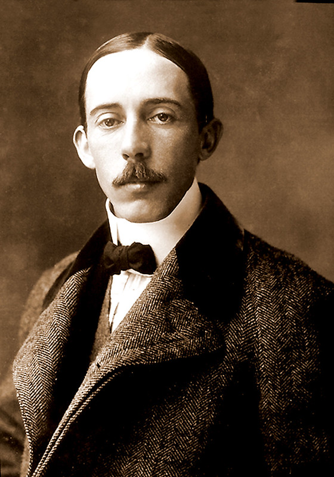
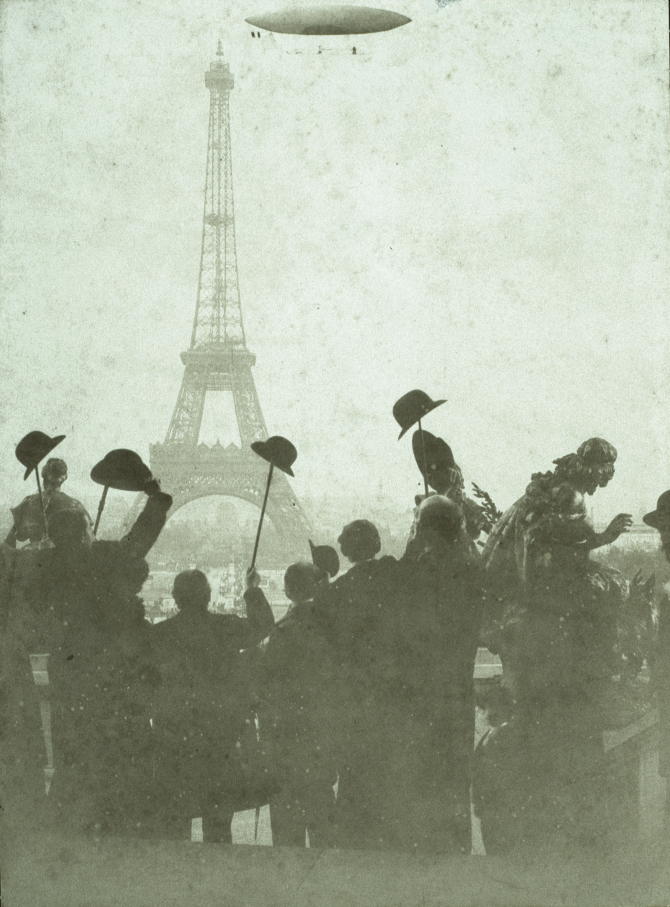
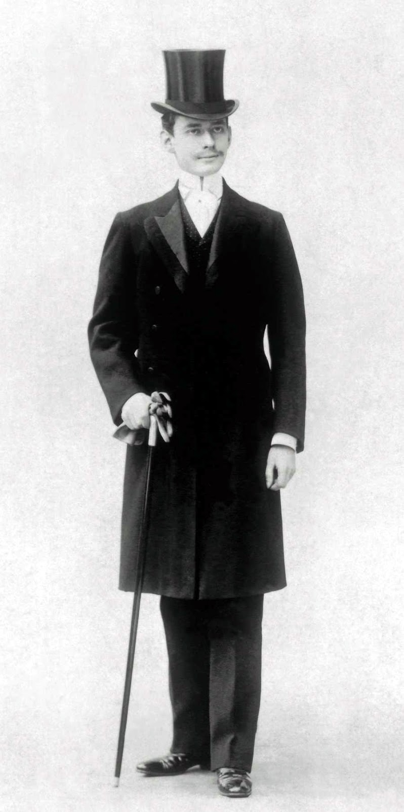
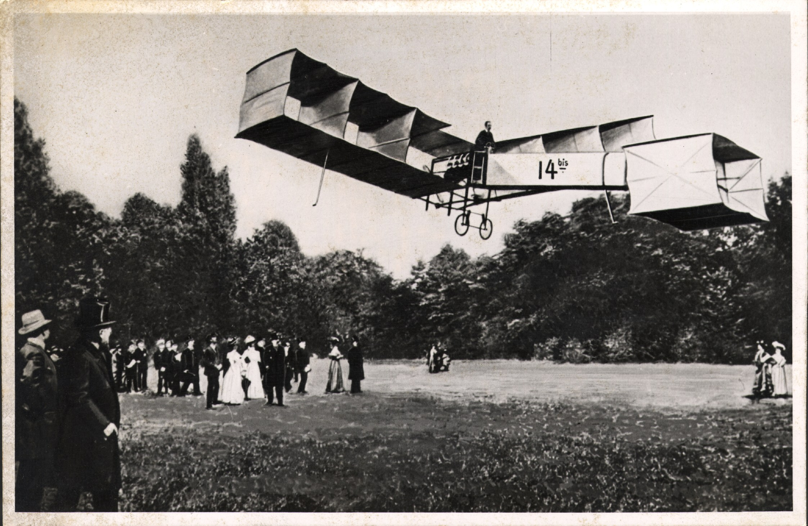
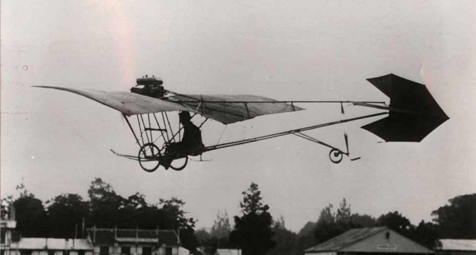
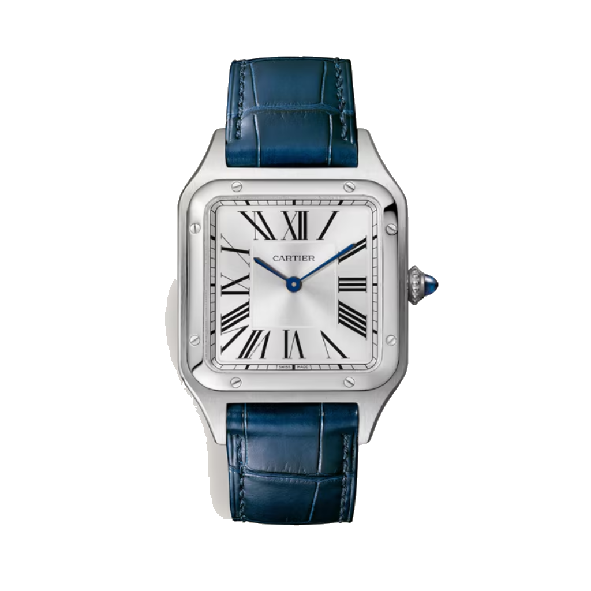

Most watch articles begin the story here: in 1904 Louis Cartier made a square wristwatch for his friend, and with it the first men's wristwatch was born. That is roughly true. It is just that the more interesting half of the story is about who that friend was, and what he did with that watch.

Because Alberto Santos-Dumont was not a wealthy client after an unusual accessory. He was one of the most famous men of his age, a man who designed airships and aeroplanes, and who gave every one of his inventions to the world for free.

*Alberto Santos-Dumont, one of the most celebrated men of his era. Photo: Militares Estratégia (militares.estrategia.com).*

## The coffee planter's son who went to Paris to fly

Santos-Dumont was born in Brazil in 1873, the child of a wealthy coffee-growing family. He went to Paris to study engineering, spent most of his life there, and there he fell in love with flight.

He turned first to airships, and not merely as others had: he is essentially the man who made the steerable airship work. He was the first to give the balloon an elongated shape, to fit it with a petrol engine, a propeller and a rudder, and to use weight-shift trim and pressure compensation. Between 1898 and 1905 he built fourteen airships.

The great moment came on October 19, 1901. He rose from Saint-Cloud in his airship No. 6, rounded the Eiffel Tower and returned, covering roughly eleven kilometres in under half an hour. With it he won the 100,000-franc Deutsch Prize and became world famous. And he gave the prize money away, distributing it among his workers and the poor of Paris.

*Airship No. 6 rounding the Eiffel Tower, 1901. Photo: Museu Paulista da USP / Wikimedia Commons, public domain.*

## The other man in the story: Louis Cartier

Before I turn to the watch, it is worth pausing on the man who made it, because he is no bit player either.

Louis Cartier was born in Paris in 1875. His grandfather, Louis-François Cartier, founded the workshop in 1847, his father Alfred carried it on, and Louis took over the running of it in 1903, when his father retired. Together with his brothers Pierre and Jacques he turned a family jeweller into a global name: in 1899 the Paris shop moved to the elegant Rue de la Paix 13, beside the Place Vendôme, and London (1902, Jacques), Moscow (1908) and New York (1909, Pierre) followed.

The house already carried weight: it was King Edward VII of England who called Cartier "the jeweller of kings and the king of jewellers". And Louis's motto is precisely why this story could happen at all: never imitate, always innovate.

*Louis Cartier, the creative head of the house and the maker of the Santos. Photo: Richard Jean-Jacques (richardjeanjacques.com).*

One thing, though, he lacked: the movement. Cartier was a jeweller, not a watch manufacturer, so Louis joined forces with the watchmaker Edmond Jaeger, who brought the expertise and the calibers. The relationship was formalised by contract in 1907, with Jaeger supplying Cartier's watch movements exclusively, and it was from this thread that Jaeger-LeCoultre eventually grew. So behind the Santos stands the meeting of two separate crafts: Parisian form and Swiss watchmaking.

Louis did not stop at the Santos. From his hand came the Tonneau (1906), the Tortue and the Baignoire (1912), then the Tank (1917), whose rectangular case echoes the overhead view of the tanks on the Western Front. He was also behind the famous "mystery clocks", whose transparent dials make the hands appear to float in mid-air. These forms have been running virtually unchanged for more than a century.

## The request that became a watch

And here comes that particular conversation. Santos-Dumont complained to his friend that it was impossible to consult a pocket watch while flying: he needed both hands on the controls, and by the time he had fished the watch out, he would lose command of the machine. Cartier did not adapt an existing watch; he rethought where a watch belongs, namely on the wrist, the one place visible at a glance while flying.

The answer, in 1904, was a flat, square wristwatch on a leather strap. The house favoured platinum, and the design language already anticipated Art Deco, well before it came into fashion. The details that have been the Santos signatures ever since:

- a square case, a daring choice at a time when every watch was round,
- a polished bezel with exposed screws, an industrial, machine-like gesture from a jeweller, and the Santos's best-known visual signature,
- a white dial with Roman numerals and blued hands, so that a single glance would be enough,
- a blue cabochon stone on the winding crown, still a recurring mark of Cartier watches,
- and the slimmest possible construction, so that nothing would catch.

The movement came from Edmond Jaeger. One important detail: this was not a mass-market product. For seven years Santos-Dumont alone wore the model; the public could not buy one until 1911, initially in platinum or yellow gold, on a leather strap.

## What the "first men's wristwatch" claim actually means

Here, though, it is worth pausing, because that sentence deserves qualifying. Wristwatches existed long before 1904; they were simply worn almost exclusively by women, as jewellery. Men wore pocket watches, and considered the wristwatch effeminate.

What the Santos did was not to invent the wristwatch, but something else: it was the first wristwatch designed specifically for a man and specifically as a working tool. And because it was worn conspicuously by an immensely popular man with a reputation for daring, it suddenly became acceptable, even desirable, for a man to wear his watch on his wrist. So the Santos is a cultural first rather than a technical one. Its historical significance remains just as great either way.

## The aeroplane that took off on its own

Meanwhile Santos-Dumont had concluded that the airship was a dead end. As he put it, it was like trying to push a candle through a brick wall. From 1905 he turned to heavier-than-air machines.

The great moment came on October 23, 1906: at the Bagatelle field he took off in the canard biplane known as the 14-bis and flew some sixty metres at a height of two to three metres. With it he won the Archdeacon Prize. The date matters because this was the first public, powered, heavier-than-air flight in Europe, and because the machine rose on its own undercarriage, without external assistance.

Barely three weeks later, on November 12, he flew 220 metres in 21.5 seconds. It was the first time a person was filmed in flight. On his wrist was his Cartier.

*The 14-bis in the air, 1906. Photo: Ciência Escrita (cienciaescrita.com).*

That business of taking off under its own power sits at the heart of a debate that continues today. Many Brazilians hold that Santos-Dumont in fact flew first, not the Wright brothers, because the 14-bis lifted itself off the ground while the Wright machine used an external catapult to launch. Out of respect for the facts, both sides deserve stating: the Wright brothers flew a powered machine first, in 1903, so they came earlier in time; Santos-Dumont, though, flew publicly, before witnesses, taking off unaided, in Europe. It depends on what we take the definition of "flight" to be.

## The Demoiselle, and the patent he never filed

What followed is perhaps the most characteristic thing about the whole man. Between 1908 and 1909 he built the Demoiselle, a high-wing monoplane that became the world's first series-produced aeroplane. It was a light, simple machine that he claimed could be assembled in fifteen days.

And then came the gesture that is hard to imagine today: he filed no patent on it, and published the plans freely so that anyone could build one. He believed that flight was the shared inheritance of humanity, not commercial property.

*The Demoiselle, the world's first series-produced aeroplane. Photo: Airway (airway.com.br).*

Louis Blériot, who would later be the first to fly across the English Channel, put it to him this way: he had done nothing but follow and imitate him, and Santos-Dumont's name was a flag to aviators.

## An ending the story does not deserve

The end of the story is sad, and I will not leave it out. Santos-Dumont gave up flying in 1910 after an accident in a Demoiselle, retired as his health declined, and returned to Brazil during the First World War.

What truly broke him was his own dream. He had to watch as the aeroplane, which he had imagined as an instrument of human freedom, became a weapon and dropped bombs. He died in 1932, at fifty-nine; the widely accepted account is that he took his own life, deeply broken by what had been made of his invention.

In Brazil he is honoured as a national hero. His birthplace was renamed after him, and October 23 became "aviator's day".

## The watch's road from 1911 to today

The watch's own fate is interesting too. After its commercial launch in 1911 the square Santos became fashionable among the elite, then faded during the Second World War, when round, military-issue watches dominated.

The return came in 1978: the Santos de Cartier in a steel and gold combination, with exposed screws on the bezel and on the metal bracelet. It became one of the most copied watch designs in the world, and it launched Cartier's modern watchmaking. From that line grew the larger, chunkier Santos 100 for the centenary (2004), and then today's Santos de Cartier, renewed in 2018.

The distinction matters, though, because these are two separate models. The Santos de Cartier is the sportier line, with the screwed bezel and the metal bracelet. The Santos-Dumont, by contrast, is the quieter, slimmer, screwless version on a leather strap, the purest heir to the 1904 original. The latter is typically hand-wound (with the 430 MC caliber) or quartz, precisely so the case can stay as thin as possible. Its proportions are almost unchanged to this day.

*The Santos-Dumont today, the purest heir to the 1904 original. Source photo: Cartier (cartier.com); background extraction: Lume, with AI assistance.*

There is also a strange coincidence in the two men's story that is hard to pass over. Santos-Dumont died on July 23, 1932. Louis Cartier died exactly ten years later, on July 23, 1942. The same day, two decades after a complaint over dinner gave rise to one of the most enduring watch designs in the world.

## Why this column is about this

If you look only at the watch, you see an elegant, square Cartier that remains one of the finest designs in the industry.

But behind the object stands a man who wanted to own nothing of what he invented, who gave away his prizes, and who asked for a wristwatch so that he could keep both hands on the controls. This watch is not an icon because a famous man wore it, but because it was made for a specific, serious job, and in doing so it accidentally rewrote what a man wears on his wrist.

The object, not the hype. And sometimes behind the object stands an entire life's work.
