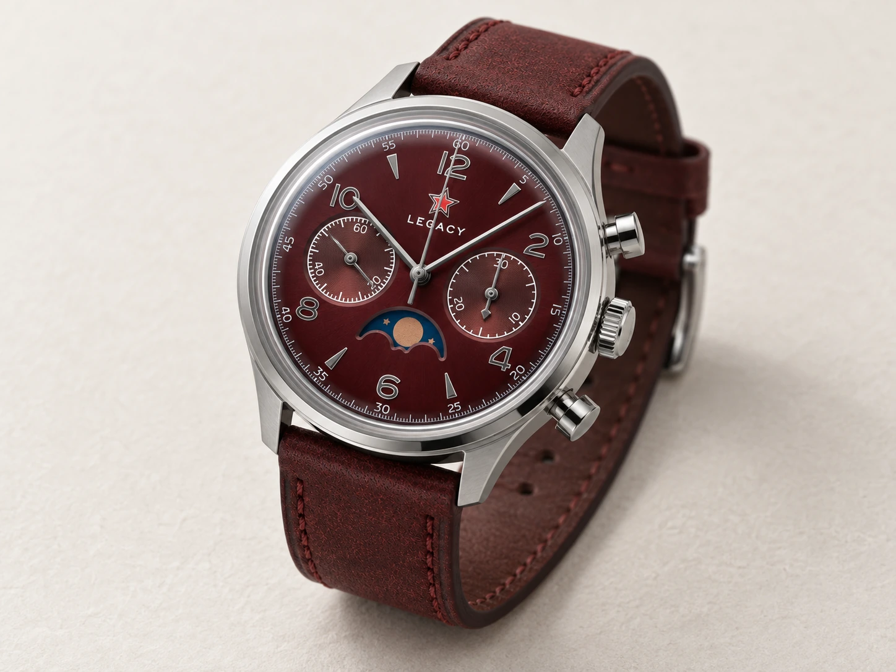

You notice the red star before you look for a name. Then the blue hands, the gold-coloured numerals and the thin red line reaching from the centre of the dial almost to its edge. The two small circles immediately identify a chronograph, yet it somehow looks less severe than an aircraft instrument.

More like something carefully kept in a drawer.

Conversations about the Seagull 1963 tend to begin with its price. A mechanical chronograph, a column wheel, a movement worth looking at, all for less than the familiar Swiss names. Framed that way, though, the watch remains a cheaper version of something else. Its more interesting quality is not what it replaces, but where it comes from.

To understand that, we first need to put the year in its place. And establish what we mean by a 1963 today.

## A commission still called 304

In April 1961, China's Ministry of Light Industry commissioned the Tianjin watch factory to develop a chronograph for the air force. The classified assignment was numbered 304. The samples completed in 1963 were followed by further work; the manufacturer's detailed retrospective dates the first delivery of 1,400 watches to 1966.

The name does not tell the whole story. It picks out a stage in the development.

That is a different beginning from a collection launch. There was no need for a memorable model name, a founder's portrait or a campaign explaining the colour of the dial. The task was to produce a working instrument: a watch able to measure the duration of a separate event as well as tell the time.

Today's buyer looks for a historical design. The original customer had a problem to solve.

## The Swiss relative worth acknowledging

There is a Swiss branch to this Chinese chronograph's family tree: the Venus 175. Sea-Gull still traces the ST19 family to that underlying architecture. It identifies the early military calibre as the ST3, whose modernised successor would become the ST19.

That relationship does not make the modern watch Swiss. It does remind us that a national watchmaking history rarely stays within a single country's borders.

The origin of a design, the production of its components and the assembly of a finished watch are three different questions. Design ancestry matters, but it does not make a watch by itself. Dimensions must match repeatedly, wheels must engage, springs must work, and the mechanism must perform the same sequence the next time someone presses the pusher.

The 1963 can therefore be misread in either direction. We do not have to deny its Swiss ancestry to take Chinese manufacturing seriously. Nor do we need a Swiss name to excuse the watch for being Chinese.

## A dial that does not need translating

The red-star version has a particularly appealing sense of balance. The cream background is warm; the gold-coloured numerals and wedges are almost formal. The long red chronograph hand cuts through that composure. The blue hour and minute hands form another distinct layer above the dial.

No single colour dominates. The colours have jobs to do.

At nine o'clock, the running seconds continue to turn; at three, the stopwatch accumulates elapsed minutes. The central red hand is not the ordinary seconds hand. It belongs to the separately operated timer, which is why it can remain at twelve on a watch that is running perfectly normally.

*The red-star design on a civilian reissue photographed in 2016. This is neither an original military watch nor a product photograph of the current 40 mm model. Photograph: [Daniel Zimmermann](https://commons.wikimedia.org/wiki/File:中国制造_-_Seagull_1963_Closeup_%2825871232304%29.jpg), [CC BY 2.0](https://creativecommons.org/licenses/by/2.0/). Background removed with an AI-assisted mask, resized and converted to WebP by Lume. Watch details come from the original photograph.*

The watch in the photograph also shows how little a recognisable object needs. There is no prominent brand name or assertive sports bezel, yet the dial is anything but anonymous. The small star, the colours and the two opposing registers form a stronger signature than a long inscription could.

What served as identification and instrumentation in a military setting has acquired a graphic character of its own. The two meanings are connected, but they are not the same for the person wearing it.

## The other side of a pusher

The ST1901 is a manually wound chronograph. It has no rotor collecting energy from the motion of the wrist. The crown winds the watch; the two pushers on the side of the case operate the stopwatch.

The upper pusher starts and stops it, and the lower one resets it. The manufacturer's operating instructions say to stop the chronograph before resetting. It is not operated like a flyback, which can begin a new measurement while already running.

A watch like this does not demand constant attention, but it occasionally asks for your hand again. Wind. Start. Read. Stop. These are separate gestures, and the object gives each of them a place.

*A separately photographed ST1901, not a dismantling of the watch in the opening photograph. Photograph: [Czarcaustic, Wikimedia Commons](https://commons.wikimedia.org/wiki/File:Seagull_ST1901.jpg), [CC BY-SA 4.0](https://creativecommons.org/licenses/by-sa/4.0/). Background removed with an AI-assisted mask, resized and converted to WebP by Lume. Movement details come from the original photograph; the adaptation is available under the same licence.*

The column wheel does not generate accurate time. It controls the switching of the chronograph, coordinating the running watch and its separately operated timer. On the dial, all we see is a hand starting or stopping. We explored the process in more detail in [our article on the column wheel](/en/movement/column-wheel/).

The visible mechanism offers more than a decorated caseback. It shows the other side of the decision made by your finger. The press of a pusher has a location and a consequence inside the movement.

## Three different things around one name

The phrase “Seagull 1963” makes it easy to confuse the original military watch, Sea-Gull's own modern reissues and watches made by other companies using a Sea-Gull movement.

The distinction is not pedantic.

[Baltic's factory archive for the Bicompax 002](https://baltic-watches.com/en/archives/bicompax-002), for example, explicitly identifies the ST1901: a manually wound column-wheel chronograph with a 42-hour power reserve and a thirty-minute counter. That does not make the Baltic a Sea-Gull-branded watch. We can name the movement supplier and the maker of the finished object separately.

We should preserve the same distinction with a red-star watch. A genuine Sea-Gull calibre inside does not, by itself, prove that the complete watch is Sea-Gull's own product. A familiar dial design tells us even less about who checked the assembly or who provides the warranty.

The point is not to pronounce something authentic or counterfeit from a photograph. It is to avoid answering three different questions with a single name.

*The Chinese inscription is part of the dial's character. A photograph alone cannot establish the provenance of an individual watch. Photograph: [Daniel Zimmermann](https://commons.wikimedia.org/wiki/File:中国制造_-_Seagull_1963_Dial_%2826391398891%29.jpg), [CC BY 2.0](https://creativecommons.org/licenses/by/2.0/). Resized and converted to WebP by Lume.*

## Even the factory reissue is not just one watch

What the year signifies varies within Sea-Gull's own range. Alongside the red-star Times Edition introduced in 2023, the 2024 Long Sky returns to a military “flying arrow” emblem and a different hand design. That alone should discourage us from treating one familiar online dial as the entire history.

The Chinese specification page for the 40 mm Times Edition lists a thickness of approximately 14.5 mm, a sapphire crystal, a solid caseback and a nominal water-resistance rating of 30 metres. Its ST1901 is listed with 22 jewels and a frequency of 21,600 vibrations per hour. Power reserve is given separately: 37 hours with the chronograph running, 45 without it.

Those are the specifications of that version, not of every watch sold under the 1963 name.

The 1963A on the manufacturer's international site, for example, is a 37.3 mm version with a display back. Even the familiar claim that seeing the movement is one of the great pleasures of a 1963 cannot be applied universally. First we have to establish which 1963 we are discussing.

Case diameter does not tell the whole story either. A tall crystal over a small dial and a substantial chronograph movement create a very different object from a thin three-hand watch. Old-fashioned proportions do not necessarily mean slenderness.

## When the story takes on a burgundy dial

The Legacy Burgundy Edition gives the familiar design a different mood. Against the burgundy dial and silver-coloured hands, the red star is no longer the first patch of colour to catch the eye. It settles into the dial while the blue aperture above six creates a new visual centre of gravity. The two registers remain, but the watch looks less like a discovered instrument and more like a deliberately dressed object.

The [retailer's specification page](https://seagull1963.com/products/limited-edition-1963-legacy-burgundy-edition-seagull-movement-moonphase) lists a 40 mm case, a manually wound ST1908 and a moonphase display. This is not the ST1901 version discussed earlier. Seagull1963.com identifies itself as an independent retailer, not an official Tianjin Sea-Gull partner, so we do not present the Legacy as a factory historical reissue.

*Legacy Burgundy Edition. AI illustration: Lume. Not an actual product photograph; details may differ from the real watch.*

It is still an interesting continuation. We do not have to call it the same object to recognise what the designs share. It shows how far a dial can travel from its military origins while two small circles and a star continue to hold the composition together.

## Leave some room for the watchmaker

A military past can easily overrule sensible questions. If it was made for pilots, surely it can withstand anything. If it is mechanical, it must be repairable forever. If it has a column wheel, it must be better.

None of those conclusions follows automatically.

A modern reissue is governed by its own manufacturer's instructions, not the legend of an old commission. Access to a watchmaker and a clear warranty commitment tell us more about the prospect of keeping it running than a component name in an advertisement.

That is not a reason to drain the enjoyment from the watch. It is a way of avoiding disappointment in a story that never had the power to make those promises.

This is not a Lume long-term test. We have not measured our own example, and we are not scoring its pusher feel or comfort on the wrist. We are examining the design, the verifiable history and the documented mechanical solution. Those cannot establish the daily accuracy of an individual watch.

## Not a cheaper Swiss story

The 1963 becomes most interesting when its price no longer has to defend it.

The dial speaks its own language. The story begins with an industrial assignment rather than a luxury shop. The movement preserves a family connection that leads to both Switzerland and China. Those qualities remain even if the watch beside it is more accurate, thinner or more carefully finished.

We do not have to claim that it is better at everything. It is enough to recognise that it is not interchangeable.

Beneath the red star is a stopwatch. Behind the year is the history of a factory. And when we look at the dial again, the question is no longer simply how much this chronograph costs.

It is also how far it had to travel to exist.
