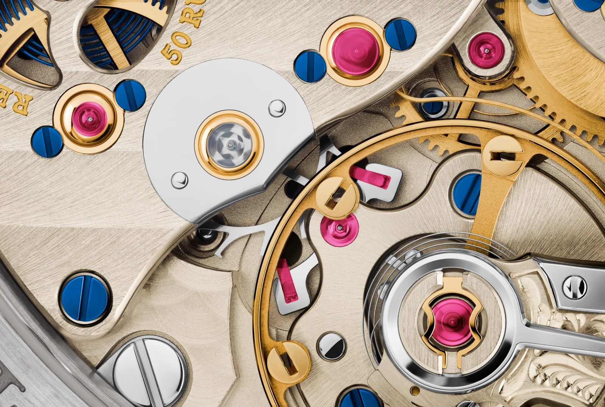
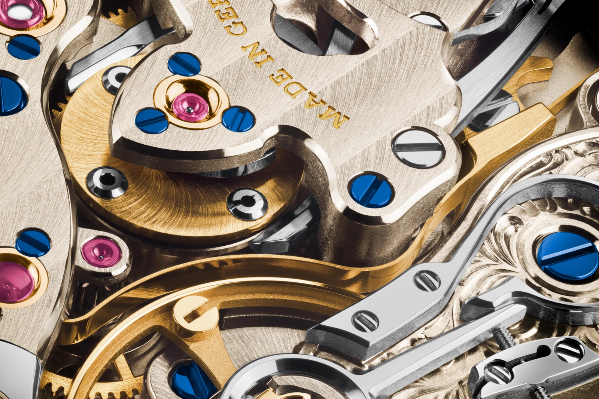
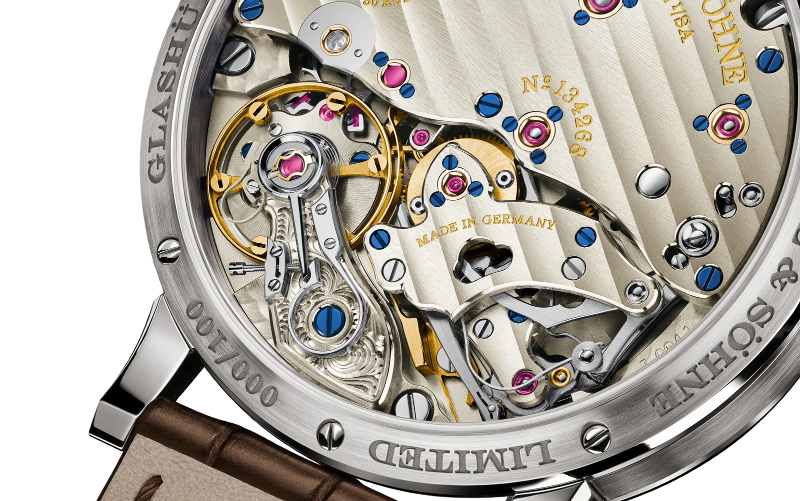

The seconds hand stops at a marker. Waits. Then moves to the next one. If you have spent any time around watches, you may already have reached a conclusion: quartz.

It is one of the quickest judgements we make about a dial. A mechanical hand sweeps; a battery-powered one ticks. A useful shortcut, until a hand-wound watch comes along and makes exactly the same measured movement. Behind its caseback, a balance is oscillating and a spring is under tension. There is no quartz crystal.

Nothing is broken. Someone went to considerable trouble to make it behave like this.

## The seconds hand is not the timekeeper

Jumping seconds, also called *deadbeat seconds* or *seconde morte*, is a display in which the hand rests between whole seconds before advancing to the next marker. The pause belongs to the hand, not to the movement.

A conventional mechanical seconds hand does not move continuously either. Our eyes blend its small steps into something resembling a sweep. A 3 Hz balance completes three full back-and-forth oscillations per second: six half-oscillations. In a conventional arrangement, that gives six small hand movements. At 4 Hz, there are eight.

Jumping seconds does not slow that internal rhythm. It separates the display from it. The balance keeps oscillating while the seconds hand waits.

<figure data-jumping-seconds-diagram="rhythm" style="margin:2rem 0;padding:clamp(16px,3vw,28px);background:var(--surface);border:1px solid var(--line);">
<figcaption style="display:block;color:var(--ink);font-family:var(--font-sans);font-size:1rem;"><strong>One second, two ways to display it</strong> A schematic 3 Hz example. Each stroke marks an instant when the hand advances.</figcaption>

Conventional mechanical display: six small steps

<svg viewBox="0 0 360 60" role="img" aria-label="Six evenly spaced hand movements within one second" style="display:block;width:100%;height:auto;color:var(--brass)"><path d="M18 45H342" fill="none" stroke="var(--line)" stroke-width="2"/><path data-pulses="6" d="M72 45V12M126 45V12M180 45V12M234 45V12M288 45V12M342 45V12" fill="none" stroke="currentColor" stroke-width="5"/></svg>

Jumping seconds: one larger step

<svg viewBox="0 0 360 60" role="img" aria-label="The hand waits, then advances once at the end of the second" style="display:block;width:100%;height:auto;color:var(--ink)"><path d="M18 45H342" fill="none" stroke="var(--line)" stroke-width="2"/><path data-pulses="1" d="M342 45V12" fill="none" stroke="currentColor" stroke-width="7"/></svg>

0 s1 s

Both examples have six balance half-oscillations. This diagram shows timing, not the hand’s angular position. Original schematic: Lume.

</figure>

On the dial, the arithmetic is straightforward. A circle contains 360 degrees and a minute contains sixty seconds. The jumping hand therefore moves six degrees at a time. The conventional 3 Hz example covers the same distance in six movements of one degree each.

They arrive at the same place. They simply describe the journey differently.

<!-- lume-model ugro-masodperc -->

## Waiting takes work

The obvious solution might seem to be a brake: hold the hand, then release it once a second. But you cannot simply clamp the gear train that is keeping the watch running. Stopping the display must not stop the timekeeping.

That calls for a mechanical link between a working movement and an intermittently moving hand. The particular wheels, springs and locking devices depend on the construction. There is no single component that does precisely the same job in every jumping-seconds watch.

From an engineering perspective, getting the hand moving is only part of the problem. It must arrive at the marker, stop and remain there. Moving parts have inertia; mechanical connections have play and friction. A calm, decisive display therefore depends as much on controlling the stop as on initiating the jump.

The pause is not an absence of work. It is what the work achieves.

## A star and a released lever

The Richard Lange Jumping Seconds gives this idea a tangible form. Lange describes a five-pointed star that turns once in five seconds. Each second it releases a lever called the *flirt*, which makes one rapid revolution before the next star point stops it. Gearing translates that revolution into a single step of the seconds hand.

Three motions do different jobs: the star schedules the release, the lever turns a full circle, and the hand advances one marker. Following those roles is more useful than treating everything that rotates as one continuous mechanism.

This is Lange’s solution, not a universal recipe for seconde morte.

The actual L094.1 in a manufacturer photograph of the 2025 edition. Beside the balance and hairspring, the star sits beneath the small transparent bearing jewel. Photograph: Lange Uhren GmbH, B09. Proportionally resized, without retouching.

## A spring that keeps the movement fed

Another important element in the Richard Lange is the *remontoir*: a small intermediate spring that is periodically re-tensioned from the mainspring. Between those events, it supplies energy to the going train, reducing the direct influence of changing mainspring torque.

Here, re-tensioning happens once a second and is coordinated with the hand’s jump. The balance is not reduced to a single working beat per second. The intermediate spring bridges the time between switching events.

Two tasks meet: making the energy supply more uniform and arranging the display into whole seconds. Their combination in this watch does not mean every jumping-seconds movement contains a constant-force device.

Bridges, wheels and levers occupy several levels. This is an actual movement detail, not a spatial reconstruction of the model above. Photograph: Lange Uhren GmbH, 2025, B11. Proportionally resized, without retouching.

## Giving the second the largest space

Introduced in 2016, the Richard Lange Jumping Seconds puts its large seconds circle above smaller hour and minute displays. This regulator layout gives visual priority to the very indication around which the movement is organised.

The hand-wound L094.1 runs at 3 Hz and has a stated power reserve of 42 hours. Its 390 components do not all exist merely to produce the jump: that is the count for the entire movement, not for one complication.

Pulling the crown activates ZERO-RESET. It stops the balance and returns the seconds hand to zero, making the time easier to set. This is distinct from the regular jumps during running. A hand that resets for time-setting does not, by itself, turn the watch into a stopwatch.

A wider view through the caseback, with the reset levers beside the balance. This is the 2025 Richard Lange Jumping Seconds edition, not a Habring² movement. Photograph: Lange Uhren GmbH, B10. Exterior background removed using an AI-assisted mask; the original watch pixels and framing are unchanged.

## Erwin does not need to look like an instrument

The Habring² Erwin gives the same display principle a different character. It is a more conventional centre-hand watch with an understated dial. Its manufacturer specifies a hand-wound A11S movement running at 4 Hz, with a 48-hour power reserve. Yet its seconds hand advances only once per second.

Eight half-oscillations inside correspond to the single movement visible outside. The Erwin and the Lange do not share a calibre, and Lange’s remontoir arrangement should not be casually attributed to the Habring².

For me, the restraint is part of the attraction. There need not be another subdial or a conspicuous opening to announce the complication. The interesting feature reveals itself when you stop glancing at the watch and spend a few seconds watching it.

## The pause predates quartz

This complication was not invented to imitate quartz watches. Ferdinand Adolph Lange’s 1867 concept for stoppable jumping seconds, followed by the 1877 patent, belongs to a much earlier story. Clearly separating whole seconds was already a useful aim.

The later 1815 “Homage to Walter Lange” offers a particularly telling demonstration: its subsidiary seconds hand takes six steps per second, while the central jumping hand takes one. The two rhythms share a dial.

Modern eyes can nevertheless read a whole-second jump as a sign of quartz. Yet a quartz oscillator also runs much faster than its hands. For example, the Seiko V192 uses a 32,768 Hz crystal, a frequency-divider circuit and step motors for its displays. You are not watching every crystal oscillation on the dial either.

The rhythm of a hand does not, on its own, identify what measures time behind it.

## What it improves, and what it does not

Jumping seconds draws a clearer boundary between displayed seconds. It can make it easier to see which marker the hand occupies. But legibility, display resolution and rate accuracy are three different questions.

If the watch runs fast, its jumping hand will count seconds too quickly as well. A tidy movement from marker to marker does not prove that the watch keeps good time. Nor does a particularly smooth-looking sweep establish the quality of the mechanism producing it.

That is why seconde morte remains interesting even if we have no practical need for it. It exposes how readily we confuse an appearance with its cause. The same single step can be the ordinary behaviour of a simple electronic display or the outcome of an additional mechanical construction.

The next time a seconds hand jumps, it is worth looking a moment longer. Not to decide which watch is more valuable, but because something may be happening behind the pause.
