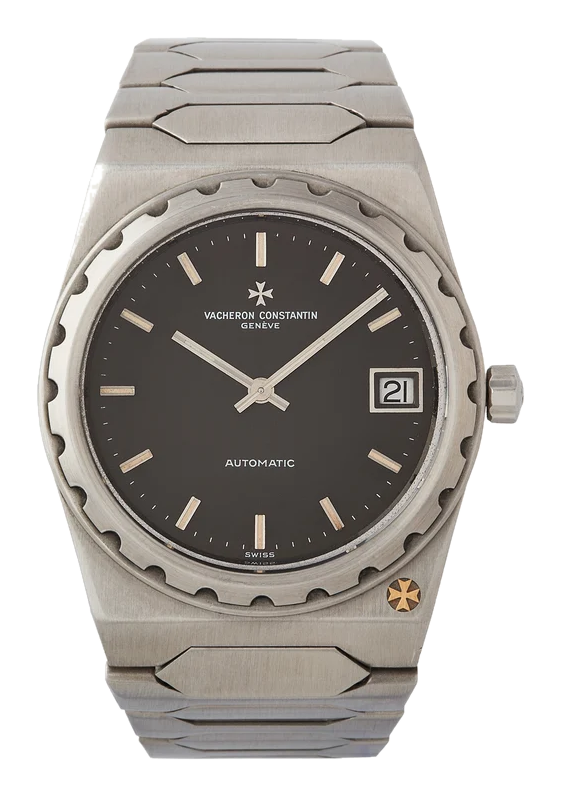
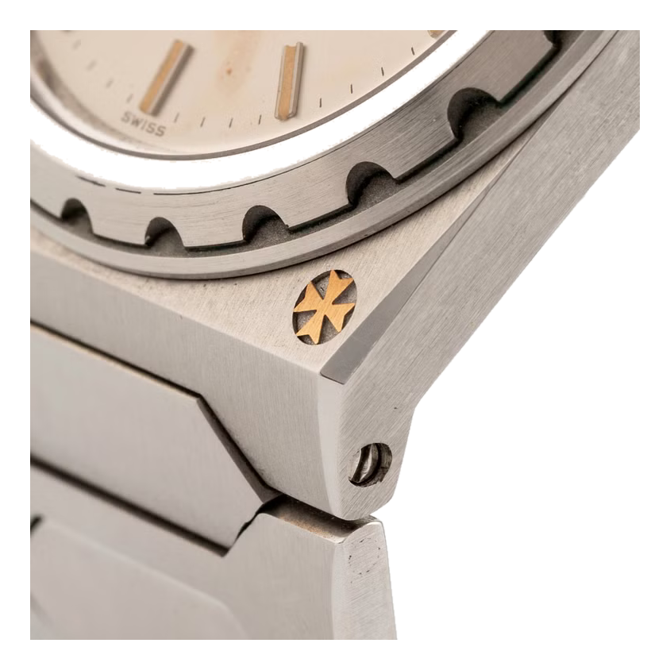
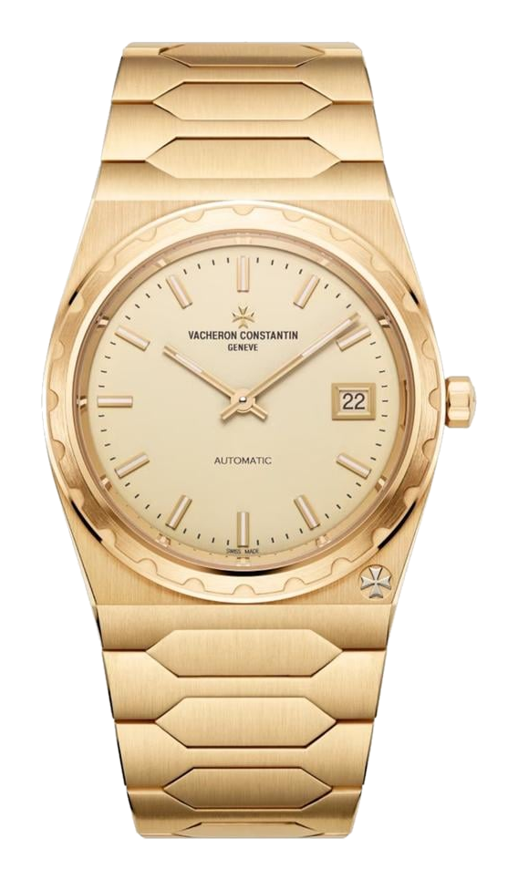

Let's start with the name, because the whole story hides there. Why "222"? Because in 1977 Vacheron Constantin was celebrating its 222nd birthday. The house was founded in 1755, and when, 222 years later, it launched a bold new sports watch, it simply put the anniversary on the dial. A number that is really a date. And a watch that hides an even bigger misunderstanding.

*The Vacheron Constantin 222. Photo: source to be added*

## A genre is born, and a stubborn myth

The mid-1970s were one of the low points for the mechanical watch: the quartz crisis was raging, and the traditional Swiss houses were fighting for their very survival. The answer that eventually created a whole new genre was the luxury sports watch made of steel. Audemars Piguet came out with the Royal Oak in 1972, Patek Philippe with the Nautilus in 1976. Both were designed by the same genius, Gérald Genta: an integrated metal bracelet, an industrial yet refined form.

Vacheron entered the same arena in 1977 with the 222. And here comes the myth that still lingers today. Because the integrated-bracelet sports watches of the era became so tied to Genta's name, many people automatically assume he was behind the 222 as well. Even dealer listings occasionally describe a "Genta-designed" 222. But it simply is not true.

## The young designer no one expected

The 222 was drawn by a then almost unknown designer, Jörg Hysek. As Vacheron's style and heritage director, Christian Selmoni, put it: contrary to the Genta myth, Hysek simply walked in with his drawings and sold them to the house.

The house needed a knockout novelty anyway. Two years earlier, in 1975, it had tried a rectangular piece with scalloped corners, the 2215 Chronometer Royal, which essentially attempted to blend the cues of the Nautilus and the Royal Oak. It flopped, and was withdrawn in 1977. It was precisely this failure that gave an urgent push to the search, just as Hysek was starting to sell his services.

Hysek was born in East Berlin in 1953, and moved to Geneva with his family at the age of seven, shortly before the Berlin Wall went up. He fell in love with watches young, worked at Rolex for a few years, then opened his own design studio. Vacheron was one of his very first clients. So the 222 is not a late echo of a legend, but a newcomer's first big shot.

## What Hysek actually drew

The design itself was confident. Hysek started from the tonneau cases of the early twentieth century and translated them into the language of the seventies: an integrated, flat-link metal bracelet, a fluted bezel, and in the lower right corner Vacheron's signature, the Maltese cross. The case was of monobloc construction, meaning the movement had to be fitted from above, and thanks to the screw-down bezel it was water-resistant to 120 metres.

*The Maltese cross, Vacheron's signature, at the corner of the case. Photo: source to be added*

Production followed the "horizontal" model typical of the era: each component was made by a master of its own field. The dial came from Stern, the movement from Jaeger-LeCoultre, the bracelet from Gay Frères. The 222 was made in three sizes; the most coveted by collectors is the 37 mm "Jumbo", with a stylised 222 engraving on its caseback.

## The shared heart beneath the surface

And here is one of the loveliest twists in the story, one that is rarely mentioned. The 222's remarkable slimness came from an ultra-thin automatic calibre based on the Jaeger-LeCoultre 920 (known at Vacheron as the 1120). This is the same base movement that also powered the Royal Oak Jumbo and the Nautilus. In other words, the three great rivals of the seventies beat with a shared heart beneath the surface. The look differed; the engineering foundation was shared.

## The stepchild that came home

The 222 never earned the adoration and fame of the Royal Oak and the Nautilus. It stayed quieter, the stepchild of the "holy trinity". That is exactly what makes it interesting: those who know it love it not for the hype, but for its form and its story. Its sporty DNA later lived on in the Vacheron Overseas collection (from 1996), which is still running today.

In the end, the house itself returned to it. In 2022, in the Historiques series, the 37 mm Jumbo was reborn in 18-karat yellow gold, faithful to the original, right down to references to the greenish tint of the old tritium lume. And in 2025 came what collectors had waited for most: the steel version, with a blue dial, a case barely 7.95 mm thick, and an in-house calibre.

*The 222 in yellow gold. Photo: source to be added*

The 222 is exactly the kind of watch this column exists for. It matters not because of how loud it is, but because the real story is better than the legend pinned on it.
