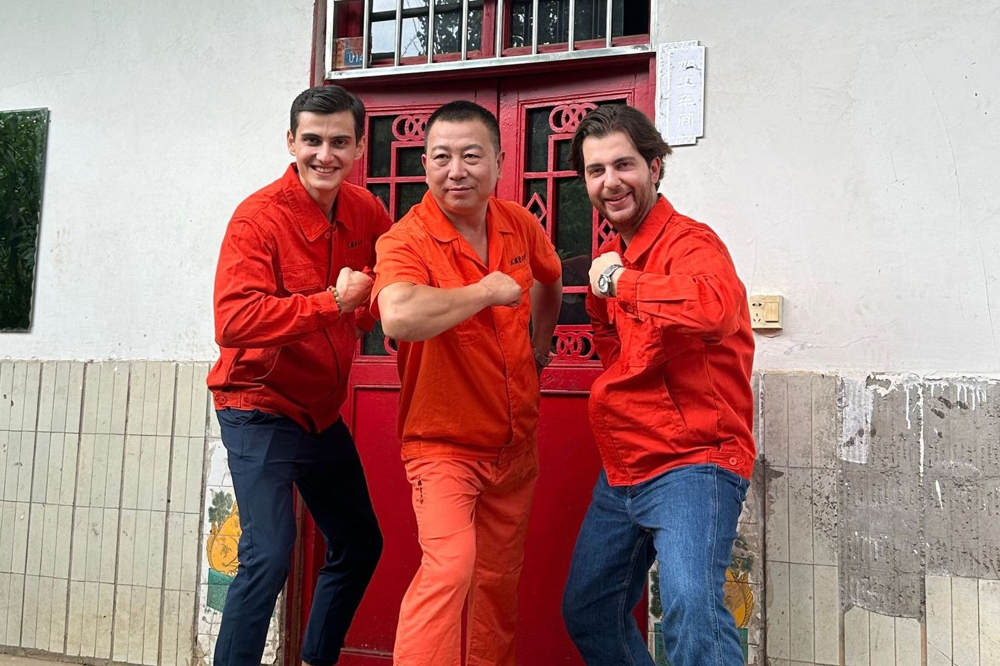
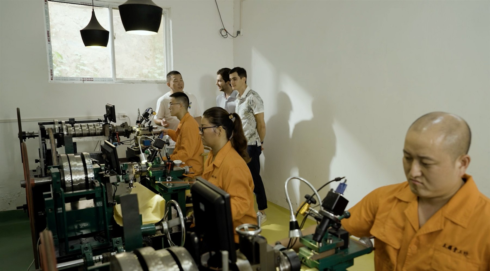
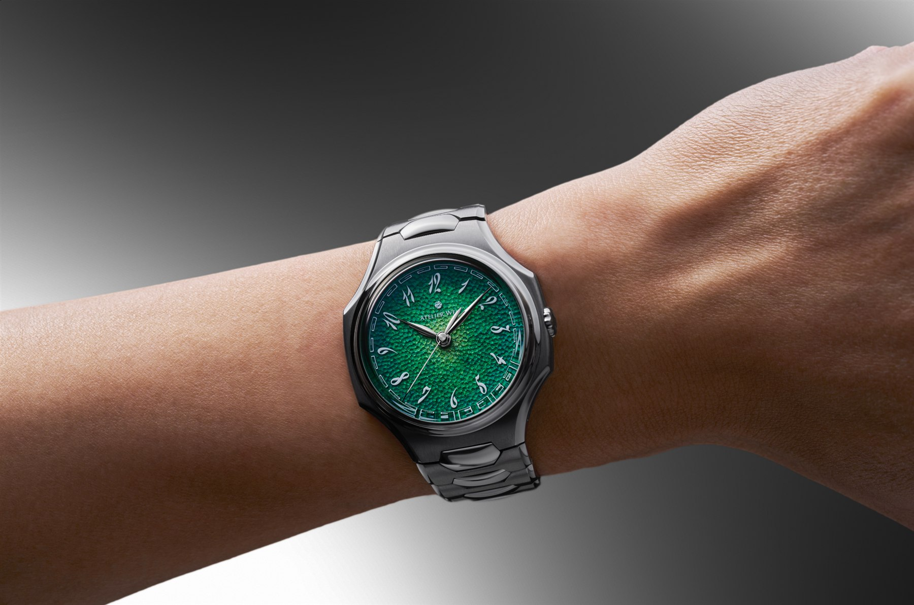

A legtöbb órán a „Made in China” feliratot akkor is nehéz lenne megtalálni, ha tudjuk, hogy a tok, a számlap vagy a szíj valahol Kínában készült. A gyártók inkább beszélnek svájci szerkezetről, európai tervezésről és végső összeszerelésről. A földrajz addig fontos, amíg jól hangzik.

Az Atelier Wen az ellenkező irányba indult el. Nemcsak megnevezi Kínát, hanem az egész márkát arra építette, hogy a kínai óragyártás többet jelent az olcsó alkatrésznél. A számlapon ősi motívumok jelennek meg, a gilosálás egy Henan tartományban működő műhelyből érkezik, a tok formájába pedig pagodatetőket és hagyományos faillesztéseket magyaráznak bele.

Ezt két francia férfi találta ki.

Már önmagában ez az ellentmondás elég lenne egy jó történethez. Az Atelier Wen azonban közben eljutott a néhány száz dolláros Kickstarter-órától egy 4850 dolláros modellhez, amelynek már francia szerkezet dolgozik a hátlapja alatt. A kérdés ezért nem az, hogy kínai-e. Inkább az, hogy mit jelent nála a kínai identitás, amikor a legdrágább alkatrész már Európából jön.

*Robin Tallendier és Wilfried Buiron Cheng Yucai műhelyénél. Fotó: [Atelier Wen](https://eu.atelierwen.com/blogs/journal/inside-the-atelier-cheng-yucai).*

## A név, amelyet nem lehet rendesen lefordítani

Robin Tallendier és Wilfried Buiron 2016-ban kerültek közel egymáshoz, amikor Pekingben tanultak. Tallendier tizennégy éves kora óta foglalkozott órákkal, később dolgozott a Francia Óráskamara sanghaji irodájában és a Christie’s londoni részlegénél is. Közben kínai órákat gyűjtött, nemcsak az ismert Sea-Gull kronográfokat, hanem azt a kevésbé látható ipart is, amely évtizedek óta szerkezeteket és alkatrészeket készített másoknak.

A márka nevét 2018-ban rakták össze. Az „atelier” műhelyt jelent. A 文, vagyis wen jóval nehezebben fér el egyetlen magyar szóban. Utalhat kultúrára, írásra, műveltségre és valamire, amit az ember tanulással, nem erővel szerez meg. Az Atelier Wen saját fordításában kulturális műhely.

Az első óráikhoz már 2017-ben kínai tervezőket kerestek. Li Ming Liang és Liu Yu Guan segítségével született meg a Porcelain Odyssey, két klasszikus formájú modell, a Hao és a Ji. A számlapjuk valódi porcelánból készült, a részletek pedig kínai kerámiákból és építészetből érkeztek.

2018 októberében elindult a Kickstarter-kampány. A finanszírozási célt fél órán belül elérték. Ez látványos kezdés volt, de az első órán még látszott, hogy a számlap gondolata erősebb a köré épített tárgynál. A porcelán különleges volt. A tok és az összhatás kevésbé.

Az Atelier Wen ezután egy időre eltűnt. Nem kezdett havonta új színt kiadni, és nem próbálta egyetlen sikeres kampányból kifacsarni a következő öt évet. A második órájára közel négy évet kellett várni.

## Egy sportóra, amelynek a számlapja egy barlangból jött

A Perception előrendelése 2022. április 18-án nyílt meg. Az első adag tizenhat óra alatt elfogyott.

Az óra formája első pillantásra ismerős. Acéltok, integrált fémszíj, széles oldalelemek, vékony profil. Az 1970-es évek luxus-sportóráinak nyelvét beszéli, ezért lehet benne Nautilust, Hublot-t vagy bármi mást látni. Közelről viszont nem egyetlen modellt másol. A homorú lünetta, a tok oldalán futó ívek és a számlap sokrétegű szerkezete együtt már saját arcot ad neki.

A lényeg középen van.

Cheng Yucai korábban nem egy svájci gilosáló mesternél tanult. Az Atelier Wen története szerint egy régi, gilosált orosz dohánydoboz indította el. Feladta a városi munkáját, saját gépeket épített, több használhatatlan próbálkozás után pedig 2018-ra elkészült az első működő rózsagépe. A műhelye Xinmi közelében, Henan tartományban működik. A márka „Kína első és egyetlen gilosáló mestereként” említi, ezt azonban érdemes annak kezelni, ami: az Atelier Wen megfogalmazásának, nem függetlenül hitelesített címnek.

A Perception számlapján halpikkelyre emlékeztető minta fut. Nem préselik bele egyetlen ütéssel, és nem CNC marja készre. A mintát kézzel irányított gépeken alakítják ki Cheng műhelyében. A korábbi változatoknál egy számlap elkészítésére nagyjából nyolc órát adtak meg, később összetettebb munkafolyamatokról és jóval hosszabb időről beszéltek.

E körül vita is kialakult. Kritikusok megkérdőjelezték, mennyit dolgozik egy-egy számlapon maga Cheng, mennyi jut a tanítványaira, és mennyiben hasonlítható a saját építésű gépekkel végzett eljárás a hagyományos svájci vagy német gilosáláshoz. A márka szerint a munka Cheng irányítása alatt, valódi rózsa- és egyenesvonalú gépekkel készül. Független tesztben a Worn & Wound nagyító alatt apró szabálytalanságokat látott, amelyek kézi munkára utaltak, és egyértelműnek találta, hogy a minta nem préselt.

Ez nem zár le minden módszertani kérdést. A fontosabb állítás viszont láthatóan teljesül: nem egy ipari mintával díszített számlapot neveznek kézművesnek. Egy kis műhely ténylegesen dolgozik rajta.

*Cheng Yucai műhelye az egyedi építésű rózsa- és egyenesvonalú gépekkel. Fotó: [Atelier Wen](https://eu.atelierwen.com/blogs/journal/inside-the-atelier-cheng-yucai).*

## A kínai rész nem dekoráció

A Perception könnyen válhatott volna olyan órává, amelyre néhány szerencsés motívumot ráhelyeztek, majd kulturális örökségként eladták. A részletek ennél átgondoltabbak.

A percgyűrűn a huiwen nevű, megszakítás nélkül futó geometrikus minta jelenik meg. A számlap rétegei és egymásba illesztett elemei a szeg és csavar nélkül működő hagyományos kínai faillesztésre, a sunmaóra utalnak. A tok oldalának íveit pagodák tetővonalához kötik. A hátlapon kőoroszlán jelent meg, a legújabb szerkezet hídjai pedig legyezőket idéznek.

Egyenként ezekből bármelyik lehetne erőltetett magyarázat. Együtt viszont következetes formanyelvet adnak. Az óra nem attól kínai, hogy sárkány került a számlapjára. Attól, hogy az arányokat, a felületeket és a gyártás egy részét ugyanahhoz a gondolathoz rendezték.

Az eredeti Perception 904L acéltokot kapott, 40 milliméteres átmérővel, 9,4 milliméter körüli vastagsággal és 100 méteres vízállósággal. A fémszíj a tokba simul, a csat pedig gombnyomásra nagyjából egy centimétert engedett. Ez utóbbi nem látványos komplikáció, csak az a részlet, amelyet nyáron, egy megdagadt csuklón az ember többre értékel egy újabb számlapi feliratnál.

A korai modellekben a Dandong Peacock SL1588A automata szerkezet dolgozott. Kínai kaliber, vékony felépítéssel, 4 hertzes járással és körülbelül 41 órás járástartalékkal. Az Atelier Wen öt helyzetben szabályozta, hőmérsékleti és ütésteszteket végzett rajta. A szerkezet mégis kérdőjel maradt azoknak, akik egy ismeretlen kínai kaliber hosszú távú szervizelhetőségétől tartottak.

Ez volt a márka következetességének legőszintébb próbája. Ha valóban a kínai óragyártást akarta képviselni, nem tehetett automatikusan svájci ETA-t minden tokba csak azért, mert azt könnyebb elmagyarázni.

## A harmadik változat francia lett

2026-ban megjelent a Perception V3. Kívülről finom frissítésnek tűnik. A 40 milliméteres tok maradt, a vastagság 10,4 milliméterre nőtt, a vízállóság továbbra is 100 méter. Jött egy bambuszöld számlap, átdolgozták a felületkezelést és a csatot, hátul pedig a részben zárt fedél helyére teljes zafírablak került.

Az ablakra azért lett szükség, mert mögötte már nem kínai szerkezet látható.

A V3 a francia Pequignet EPM03 automata kaliberének erősen átdolgozott változatát használja. A szerkezet 4 hertzen jár, 65 órányi energiát tárol, kétirányú kilincses felhúzást kapott, és napi mínusz 4, plusz 6 másodperces tartományra szabályozzák. A hidak legyezőformájúak, a mélyedéseket kék aventurinlakk tölti ki, a csavarok és felületek kidolgozása pedig messze túlmutat a korábbi Peacock látványán.

Ekkorra a Perception már nem is a márka végső ambícióját jelentette. 2025 novemberében bemutatták az Inflectiont, egy 40 milliméteres zászlóshajót, amelynek tokja és minden egyes szíjszeme 99,9 százalékos tisztaságú tantálból készül. A kékesszürke, szokatlanul sűrű fém ragad a szerszámhoz, rosszul vezeti el a megmunkáláskor keletkező hőt, és a polírozása is nehéz. Az Atelier Wen tizenegy kínai partnerrel kezdte a kísérleteket, majd három év fejlesztés után jutott el a sorozatgyártható, teljes tantálszíjig.

Az Inflection kínai része nem áll meg a fém megmunkálásánál. A grand feu zománcszámlap Kong Lingjun pekingi műhelyében készül, a mutatók és a számok bambuszlevelekből merítenek, a szerkezet hídjai pedig régi kínai festmények szélmotívumait követik. Belül ugyanakkor egy svájci Girard-Perregaux 03300 automata kaliber dolgozik. Az évi száz darabra tervezett modell tantálszíjon 29 800 dollár, szövet-gumi szíjon 19 800 dollár. Ez már nem elérhető microbrand-óra, hanem nyílt kísérlet arra, hogy egy fiatal kínai független belépjen a magas órásmesterség területére.

*Az Inflection 99,9 százalékos tisztaságú tantáltokkal és -szíjjal. Fotó: [Atelier Wen](https://atelierwen.com/blogs/journal/presenting-inflection-in-tantalum).*

Az ár is továbblépett. A V3 4850 dollár, míg az előző generáció 3320 dollár körül járt. Ez már nem az a microbrand, amely olcsóbban ad érdekes számlapot. Ugyanabban a pénzügyi térben mozog, ahol nagy múltú svájci és japán gyártók kínálnak saját szerkezetes órákat, kereskedőhálózattal és kiszámíthatóbb szervizháttérrel.

Itt érkezünk vissza a kínai identitáshoz. Visszalépés-e a francia szerkezet?

Részben igen. A korai Perception egyik legbátrabb döntése az volt, hogy a tokon és a számlapon kívül a kaliber eredetét sem rejtette el. A V3 biztonságosabb választ ad a vásárló leggyakoribb kételyére, és közben elveszít valamit abból a bizonyítási kényszerből, amely az első órát érdekessé tette.

Másrészt az Atelier Wen soha nem azt ígérte, hogy kizárólag kínai alkatrészekből épít órát. Kínai kultúráról és kézművességről beszélt. A francia alapítók, a henani számlap és a morteau-i szerkezet ugyanabban a tárgyban talán pontosabban mutatják meg, mi ez a vállalkozás: nem nemzeti manufaktúra, hanem kétirányú kulturális műhely.

## Ahol már nem elég a jó történet

Néhány száz dollárnál egy fiatal márkának sok mindent megbocsátunk. Közel ötezer dollárnál már nem a szándékot, hanem a tárgyat kell nézni.

A Perception erőssége továbbra is a számlap. A kézi irányítású minta fényben folyamatosan változik, apró eltérései pedig nem hibák, hanem a készítés nyomai. A tok vékony, a szíj kidolgozása részletes, a mikroállítás valóban használható. A V3 szerkezete műszakilag és látványban is sokkal komolyabb lett.

A gyenge pontja éppen a gazdagsága lehet. Homorú lünetta, fényes élek, gilosált közép, világító huiwen gyűrű, rétegzett indexek, formázott hidak, kék lakk. A Perception nem hagy sok üres helyet. Aki visszafogott órát keres, annak ez nem finom keleti utalás, hanem túl sok egyszerre.

Az integrált szíjas sportóra kategóriája szintén zsúfolt. A forma óhatatlanul felidéz drágább elődöket, és hiába van a Perceptionnek saját részlete, távolról nem mindenki fogja önálló tervnek látni. Ehhez jön egy fiatal cég kockázata: a hosszú távú alkatrészellátásról és értéktartásról nincs több évtizedes tapasztalat.

Ezért az Atelier Wen nem jó vétel mindenkinek. Nem is kell annak lennie. Ötezer dollár körül már nem a racionálisan legtöbb órát választjuk, hanem azt a tárgyat, amelynek a kompromisszumait is vállaljuk.

## Mit változtat meg a felirat helye

A kínai óraipart gyakran két szélsőségben látjuk. Az egyik a névtelen tömegtermék. A másik a svájci márka órája, amelynek kínai alkatrészeiről udvariasan nem beszélünk. Az Atelier Wen a kettő között próbál helyet csinálni egy harmadik képnek: olyan kínai gyártásnak és kézművességnek, amelyet nem kell letagadni.

Nem minden állítása támadhatatlan. A gilosálás körüli vita megmutatta, milyen könnyen lesz a kézműves történetből marketingháború. A francia szerkezet pedig kényelmetlen kérdést tesz fel arról, meddig tart az eredet és hol kezdődik a pozicionálás.

Mégis kevés microbrand jutott el nyolc év alatt odáig, hogy ne csak egy jó órát, hanem egy rossz beidegződést is megpiszkáljon.

A Perception hátlapján most francia kaliber dolgozik. Az elején azonban továbbra is egy henani műhely munkája fogja meg a fényt. Az Atelier Wen legfontosabb alkatrésze talán nem is a szerkezet vagy a számlap, hanem az a döntés, hogy ezt a munkát nem rejti el egy ismerősebben hangzó ország neve mögé.
