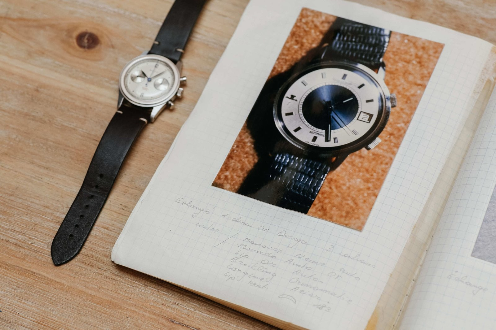
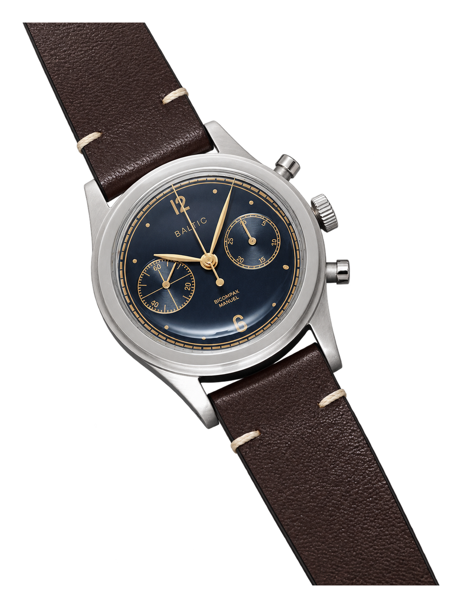
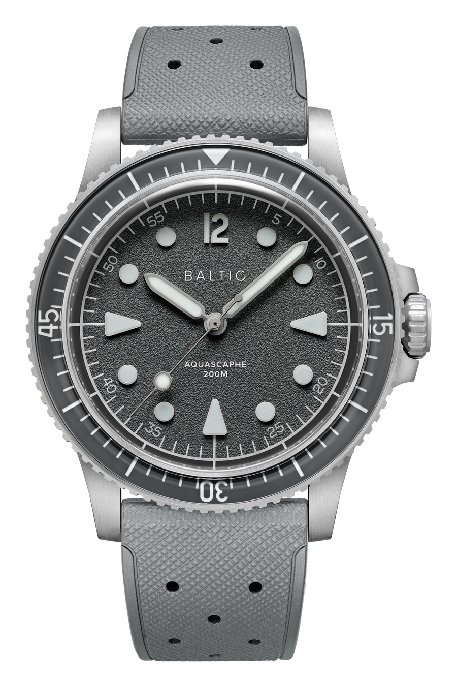
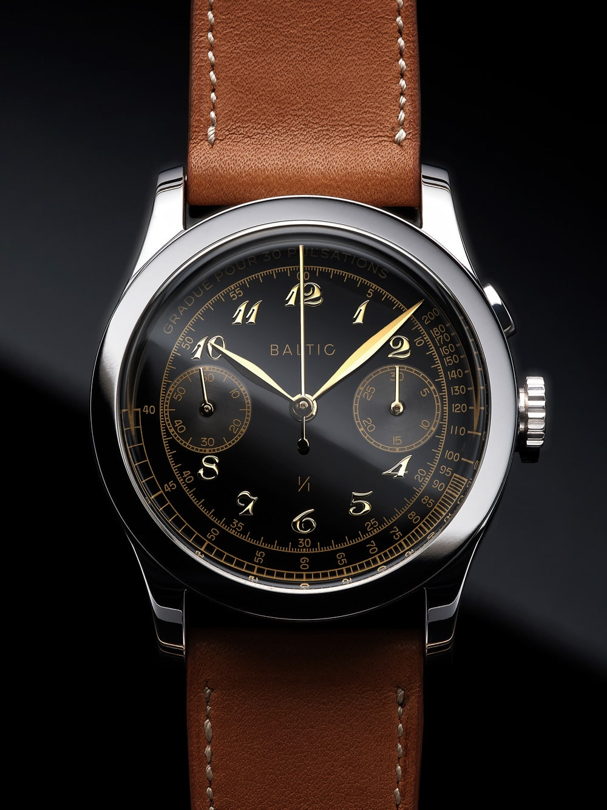
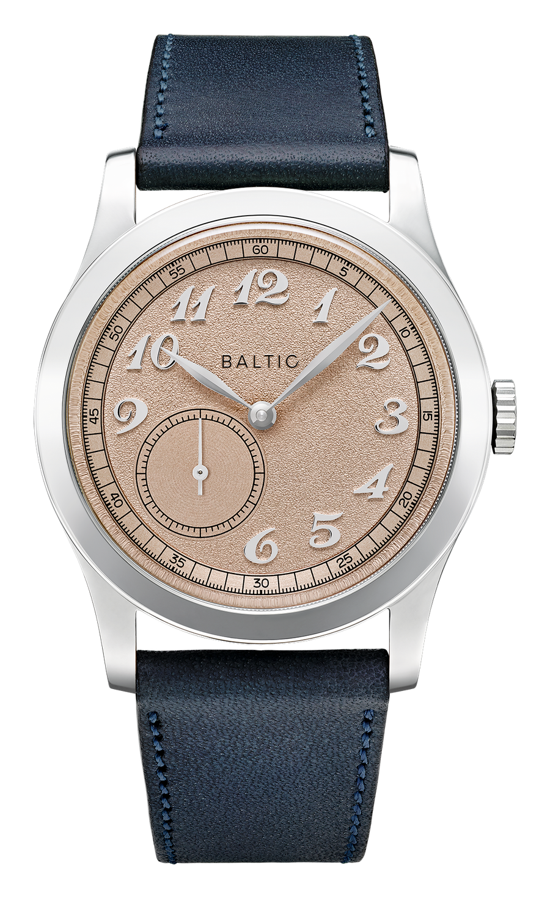
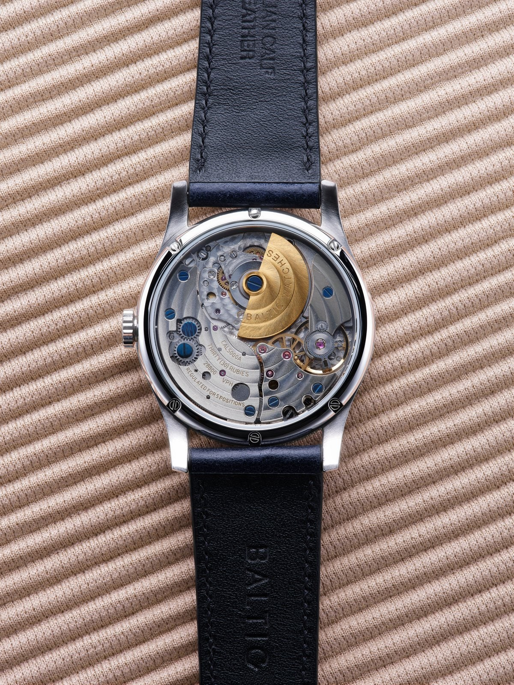

Etienne Malec tizenhat éves volt, amikor kinyitott egy bőröndöt, amely nagyjából tíz éve állt érintetlenül. Körülbelül száz óra volt benne. Régi katonai kronográfok, Breitling Navitimerek, egy Zenith El Primero, egy Omega Speedmaster és még jó néhány darab, amelyet az édesapja gyűjtött össze.

Az apját alig ismerte. Fotós volt, rajongott az autókért és az órákért, de Etienne ötéves korában meghalt. A bőrönd mellett viszont hátrahagyott egy naplót is, fényképekkel és feljegyzésekkel minden óráról, amely valaha megfordult nála. Egy kamasz ebből kezdte megismerni az apját.

Több mint tíz évvel később ugyanezekből az órákból és ugyanebből a naplóból született meg a Baltic.

*Etienne Malec édesapjának óranaplója, mellette a LIP Genève kronográf. Fotó: [Baltic](https://baltic-watches.com/en/about-us).*

## A gyűjtemény, amely kapcsolat lett

Malec nem óráscsaládból jött a hagyományos értelemben. Nem örökölt műhelyt, szerszámokat vagy egy svájci cégnevet. Tárgyakat és történeteket örökölt.

Az apja gyűjteménye főleg az 1940-es, 1950-es és 1960-as évek katonai óráiból és kronográfjaiból állt. Etienne darabonként kezdte megfejteni őket. Fórumokat olvasott, találkozókra járt, párizsi gyűjtőkkel ismerkedett, és közben maga is fényképezni kezdett. Az első komoly órája, amelyet viselt, az apja egyik LIP Genève kronográfja volt, Venus 178-as szerkezettel.

*Etienne Malec, a Baltic alapítója. Fotó: [Baltic Watches, The Smalltalk](https://www.the-smalltalk.com/etienne-malec-baltic-watches/).*

A Baltic név sem egy hangzatos földrajzi utalás kedvéért került a számlapra. Az apai család Észak-Lengyelországból, a Balti-tenger környékéről származott. Malec így egyszerre utalt a családi gyökerekre és arra az emberre, akinek a gyűjteménye elindította az egészet.

Ez fontos különbség. Sok microbrand úgy kezdődik, hogy az alapító meglát egy üres helyet a piacon. A Baltic úgy kezdődött, hogy valaki megpróbált kapcsolatot teremteni egy emberrel, akit túl korán veszített el.

## Két óra és egy nagyon nagy első nap

Malec előbb egy Rezin nevű, fából és természetes anyagokból készült szemüvegeket gyártó vállalkozást indított két társával. Ott tanulta meg, hogyan lesz egy tervből ténylegesen legyártható termék. A Baltic előkészítése körülbelül két évig tartott. A márka gondolata 2016-ban állt össze, a nyilvános indulás pedig 2017. április 12-én jött el a Kickstarteren.

Két órát mutattak be. A HMS 001 egy egyszerű, hárommutatós automata volt Miyota 821A szerkezettel. A Bicompax 001 egy kézi felhúzású, két segédszámlapos kronográf, a kínai Sea-Gull ST19-cel. Mindkettő 38 milliméteres, lépcsőzetes tokot és domború hesalit üveget kapott, az arányokat pedig az 1940-es évek kronográfjai, köztük a Longines 13ZN tokjai ihlették.

*A Bicompax 001, az első Kickstarter-kampány két modelljének egyike. Fotó: [Baltic](https://baltic-watches.com/en/archives/bicompax-001), AI-segítséggel módosítva.*

A cél 65 000 euró volt. Harmincöt nap alatt 1044 támogató 514 806 eurót adott össze. Az első napon körülbelül 300 000 euró érkezett. Ez akkor a legsikeresebb francia órás közösségi finanszírozások közé tartozott.

Az igazán fontos szám mégsem ez, hanem a december. A csapatnak addig egyetlen sorozatgyártott órája sem volt, mégis 2017 decemberében, az ígért időben elkezdték leszállítani az első darabokat. Kickstarteren a látványos kampánynál jóval ritkább teljesítmény, hogy a doboz végül akkor érkezik meg, amikorra ígérték.

## A márka, amely nem akart Kickstarter maradni

Egy sikeres kampány még nem márka. Lehet egyetlen jól eltalált termék, amely után elfogy a figyelem és a pénz. Malec később azt mondta, valójában a Kickstarter utáni időszaktól félt a legjobban.

Az első válasz egy kétszáz darabos panda kronográf volt 2018 júniusában. Egy óra alatt elfogyott. A komolyabb próba viszont az Aquascaphe lett, amelyet ugyanabban az évben kezdtek előrendelni, már a Baltic saját oldalán. Tudatosan nem tértek vissza a Kickstarterre. Nem akarták, hogy a közösségi finanszírozás legyen a márka állandó jelzője.

Az Aquascaphe búváróra lett a Baltic első valódi alapterméke. Nem egyszeri limitált kiadás, hanem olyan modell, amelyre kollekciót lehet építeni. Jött belőle bronz, GMT, titán és kétkoronás változat. 2026 nyarán pedig megérkezett az Aquascaphe MK2, hét év tapasztalatával átdolgozva. Két méretben készül, 37 és 39,5 milliméterben, Miyota 9039 automata szerkezettel, zafírüveggel, zafír lünettabetéttel és 200 méteres vízállósággal.

*A 2026-os Aquascaphe MK2 szürke változata. Fotó: [Baltic](https://baltic-watches.com/en/products/aquascaphe-mk2-grey).*

A Baltic ezzel jutott túl azon a ponton, ahol egy sikeres kampányból hosszabb életű óracég lehet.

## Mit jelent itt az, hogy francia

Ezt érdemes pontosan elmondani, mert a számlapon szereplő eredet az óraipar egyik legködösebb része.

A Baltic óráit Franciaországban tervezik. Az alkatrészek jelentős része Hongkongból és más ázsiai beszállítóktól érkezik, a szerkezet pedig modelltől függően lehet japán, kínai vagy svájci. A végső összeszerelés, szabályozás és minőségellenőrzés Besançonban történik. A márka soha nem állította, hogy házon belül gyárt mindent.

Az első HMS Miyotát, a Bicompax Sea-Gullt kapott. Az Aquascaphe legtöbb változatában szintén Miyota dolgozik, a GMT-ben svájci Soprod, a magasabb árú kronográfokban pedig Sellita. Ez nem romantikus manufaktúratörténet, hanem globális beszállítói hálózat.

Malec ebben szokatlanul nyílt volt. Azt mondta, megvizsgálták a teljes svájci gyártást, de az árak miatt elvetették, ráadásul sok svájci márka alkatrészei ugyanúgy Ázsiából érkeznek. A Baltic nem azzal próbál többet mutatni annál, ami, hogy elrejti a kínai tokot vagy szerkezetet. Inkább azt mondja meg, hol készült, majd Franciaországban összerakja és ellenőrzi.

Ettől még nem lesz francia manufaktúra. Viszont tisztább képet ad arról, miért lehet mechanikus órát néhány száz euróért kínálni.

## A kis rotor, amely felrakta őket a nagyok közé

2021-ben a Baltic két olyan órát mutatott, amely megváltoztatta a helyét a microbrandek között.

Az egyik egyetlen példányban készült az Only Watch jótékonysági aukcióra. Egy 36 milliméteres, egygombos pulzusmérő kronográf volt, felújított, 1940-es évekbeli Venus 150 szerkezettel. A 12 000 és 18 000 svájci frank közé becsült órát végül 50 000 frankért ütötték le. A Baltic négy évvel a Kickstarter után ugyanabban az aukciós katalógusban szerepelt, mint a Patek Philippe, az F.P. Journe és az Audemars Piguet.

*A Baltic egyetlen példányban készült Only Watch 2021 kronográfja. Fotó: [Baltic](https://baltic-watches.com/en/archives/onlywatch-2021).*

A másik az MR01 volt. Egy 36 milliméteres öltönyóra nagy Breguet-számokkal, levélmutatókkal és hét és nyolc óra közé csúsztatott kis másodperccel. Hátul pedig ott volt az, amit ebben az árban szinte senki nem kínált: egy automata mikrorotoros szerkezet.

*A lazacszínű MR01 a félrehúzott kis másodperccel. Fotó: [Baltic](https://baltic-watches.com/en/products/mr-classic-salmon).*

A mikrorotor nem a szerkezet fölött forog, hanem belesüllyed annak síkjába. Ettől az óra vékonyabb lehet, és a hátlapon szinte az egész fogaskeréksor látható marad. Az MR-ben dolgozó Hangzhou CAL5000A kínai, iparilag díszített kaliber, körülbelül 42 órás járástartalékkal. Nem haute horlogerie, de lehetővé tette, hogy egy addig ötszámjegyű órákhoz társított látvány hatszáz euró körüli szinten megjelenjen.

*A Hangzhou CAL5000A mikrorotoros szerkezet az MR hátlapja felől. Fotó: [Baltic](https://baltic-watches.com/en/products/mr-classic-salmon).*

Az MR nem másol le egyetlen konkrét Calatravát. Az arányok ismerősek, de a túlméretezett számok és a félrehúzott kis másodperc adnak neki saját arcot. Ez az a határ, ahol a Baltic a vintage idézésből valódi formanyelvbe lépett át.

## Ahol látszik az ár

Az MR hátlapját jobb karnyújtásnyi távolságból nézni, mint órásnagyítóval. A hidak mintázata látványos, de gépi és felületi. Több tesztelő kifogásolta a merev, nehezen megfogható koronát, a hallhatóan zörgő mikrorotort és a tok egyszerűbb kidolgozását. A hesalit üveg karcolódik, a 30 méteres vízállóság pedig azt jelenti, hogy ez tényleg öltönyóra, nem mindenes.

A szerkezet hosszú távú szervizelhetősége is jogos kérdés. Egy Miyota 9039-et sok órás ismer, a ritkább Hangzhou mikrorotorhoz nehezebb lehet alkatrészt és vállalkozó műhelyt találni. Ha komoly javítás kell, könnyen gazdaságosabb a teljes kaliber cseréje.

Ez nem teszi rossz órává az MR-t. Csak helyreteszi az ígéretet. A Baltic nem hatszáz euróért ad tízezer eurós kidolgozást. Hatszáz euróért ad egy nagyon jól megrajzolt órát, amely messziről felidézi a magas órásmesterség arányait, közelről viszont őszintén megmutatja az árát.

Ugyanez a márka egészére is igaz. A Baltic legerősebb képessége nem a szerkezetgyártás és nem a kézi finiselés. Az arányérzék. Tudják, mekkora legyen egy vintage ihletésű tok, hol fusson a percskála, mennyit torzítson a domború üveg, és mikor kell abbahagyni a díszítést.

## Ami a bőröndből megmaradt

A Baltic ma már nem két Kickstarter-óra. Tizenkét kollekciót kínál, az egyszerű HMS-től az Aquascaphe búvárórákon és a Hermétique terepórán át az MR, a Prismic, a világóra és a Scalegraph kronográf jóval drágább változataiig. Párizs mellett Londonban és New Yorkban is van bemutatóterme.

Közben a kiindulópont nem változott. Régi órák arányait veszik elő, de úgy építik újra őket, hogy ma is hordhatók és elérhetők legyenek. Néha túl közel kerülnek az előképekhez. Máskor, mint az MR félrehúzott kis másodpercénél vagy a Hermétique tokba simuló koronájánál, már messziről felismerhetően sajátot rajzolnak.

Etienne Malec apja azért vezetett naplót, hogy nyoma maradjon minden órának, amely átment a kezén. A fia végül nem egyszerűen megőrizte ezt a naplót. Folytatni kezdte, csak már nem a régi órák adásvételével, hanem újakkal, amelyeket mások fognak viselni és továbbadni.

A Baltic története ezért nem arról szól, hogyan lehet jól lemásolni a múltat. Arról szól, hogyan lehet az örökölt tárgyakból új örökséget készíteni.
