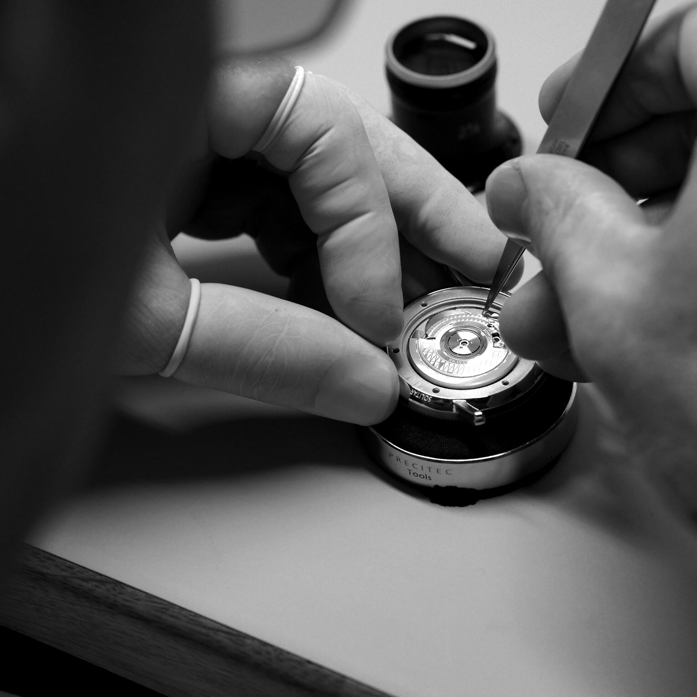
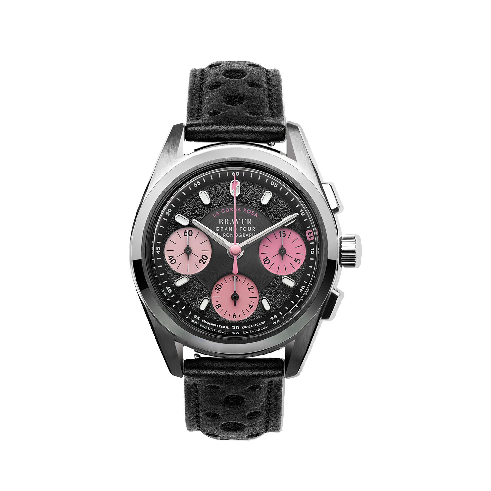
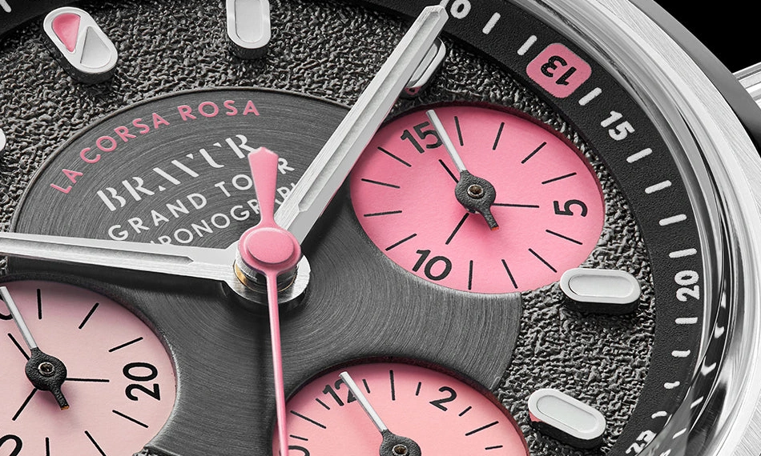
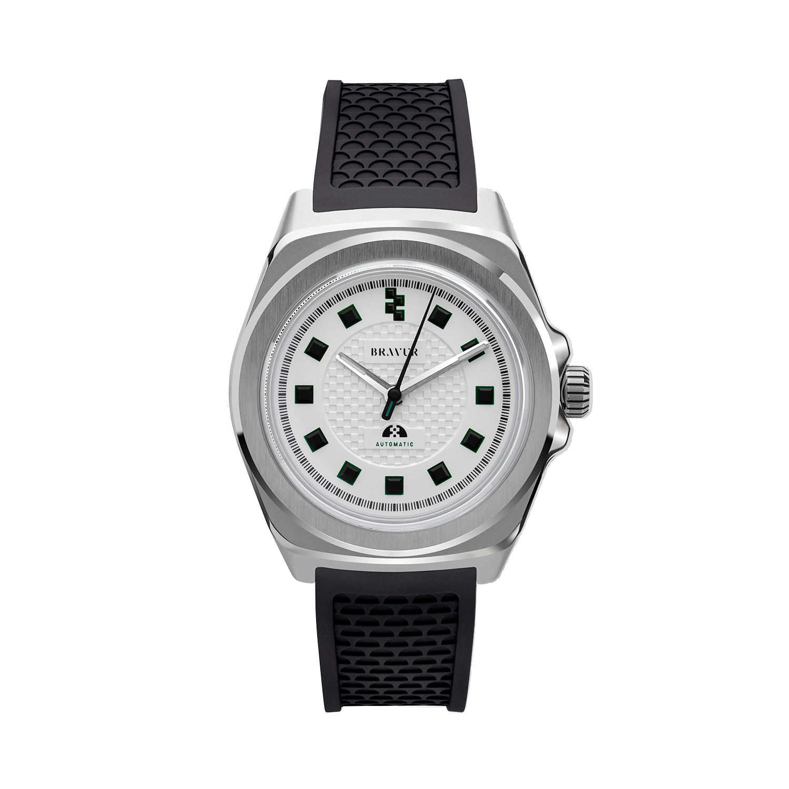

A tizenhármas rossz irányba néz.

A Bravur Grand Tour IV számlapján, valamivel a hármas órajel előtt, egy apró rózsaszín mezőben fejjel lefelé áll a szám. Nem gyártási hiba. A márka a kerékpáros babonára utal vele: a balszerencsésnek tartott rajtszámot egyes versenyzők megfordítva tűzik fel.

Különös dolog egy precíziós tárgyra felrajzolni valamit, ami éppen nem a pontosságról szól. Sem a rugó, sem a fogaskerekek nem tudnak arról, hogy a tizenhármas szerencsétlen lenne. Az óra mégis ettől az apró szabálytalanságtól kezd érdekes lenni.

A svéd Bravur nem azt ígéri, hogy egy mechanikus kronográffal jobb kerékpáros leszel. Inkább azt próbálja megmutatni, mennyi minden fér bele egy sportba az eredményen kívül. Mezek, színek, apró szokások. Olyasmi, amit a stopper nem mér, egy számlap viszont el tud mesélni.

## Mielőtt megérkezett a mezőny

A Bravur 2011-ben indult két svéd ipari formatervező vállalkozásaként. A márka 2013-as bemutatkozó közleménye még elsősorban esztétikáról, városi életről és felismerhető tárgyakról beszélt. Az alapítók olyan órát kerestek maguknak, amelyhez a meglévő márkák kommunikációján keresztül nem találták meg az utat. A sportautók, repülőgépek és erődemonstrációk helyett másfajta személyességet akartak.

Ez azért fontos, mert a mai kerékpáros Bravurt könnyű lenne visszafelé is kizárólag sportmárkának látni. Az induláskor felvetett kérdés tágabb volt: miről ismersz fel egy órát, ha letakarod a nevét?

A Scandinavia jó példa ennek a csendesebb oldalára. Ívelt számlap, beljebb húzott percskála, hat óránál elhelyezett dátum. A 39 milliméteres tokban Sellita SW300-1 dolgozik. A kompozíciót azonban nem a szerkezet típusa teszi érdekessé, hanem a szél és a közép viszonya: a jelzések nem egyetlen síkba lapulnak, a szemnek van hová továbbhaladnia.

Az ilyen órákon a visszafogottság nem feltétlenül a részletek hiánya. Inkább az, hogy a részletek nem egyszerre kérnek figyelmet. Egy hangsúlyos percgyűrű vagy egy jól eltalált mutatóforma kevesebb zajjal tud karaktert adni, mint egy újabb felirat.

## Két kerékpáros, egy műhely

Magnus és Johan saját történetében a kerékpár nem utólag felkeresett inspirációforrás. A mai bemutatkozásuk szerint az 1990-es években még egymás versenytársai voltak, barátságuk és a sport iránti érdeklődésük azóta is megmaradt. A közös formatervezői háttérhez tehát egy közös vizuális emlékezet is társult.

A mai órák a dél-svédországi Båstad műhelyében készülnek el, rendelésre, kis mennyiségben. Itt történik az összeszerelés és az ellenőrzés; a szerkezetek svájci eredetűek. A svéd tervezés és műhelymunka nem jelent saját fejlesztésű svéd kalibert.

Ez nem olyan kitétel, amellyel le kellene értékelni a márkát. Egyszerűen más mesterségről beszélünk. Egy óravállalkozás dönthet úgy, hogy nem új gátszerkezetben keresi a saját hangját, hanem a tok, a számlap és a használati részletek összehangolásában. Ettől még lehet önálló a tárgy. Csak nem ott kell keresni az önállóságát, ahol egy manufaktúrakaliberét keresnénk.

*Műhelymunka a Bravur gyártói felvételén. A kép az összeszerelést szemlélteti, nem a Grand Tour IV konkrét szerkezetét. Fotó: Bravur.*

## A rózsaszín nem díszítés

A Grand Tour kollekciónál a kerékpározás már nem háttértörténet, hanem a tervezés szervezőelve. A Grand Tour IV acélszürke-fekete számlapján három rózsaszín segédszámlap ül. A felület érdes, az aszfaltot idézi; a süllyesztett körök ennél simábbnak, különállóbbnak hatnak.

A rózsaszínhez itt nem kell hangulattáblát kitalálni. A Giro d’Italia összetett versenyének vezetője 1931 óta viseli a rózsaszín trikót. A színt a versenyt létrehozó La Gazzetta dello Sport papírja adta. Egy nyomdai adottság előbb versenyjelkép lett, majd olyan vizuális rövidítés, amelyhez már a verseny teljes nevét sem kell odaírni.

Az órán ez a szín egyszerre hordoz történetet és választ szét funkciókat. A három világos kör gyorsan kirajzolódik a sötét alapon. A számlap nézhető marad akkor is, ha a tulajdonosa soha nem követett végig egy olasz körversenyt. Ha viszont követett, ugyanaz a rózsaszín már többet jelent.

Ez a különbség egy ráhelyezett embléma és egy végiggondolt téma között. Az emblémát le lehet venni úgy, hogy alatta ugyanaz az óra marad. Itt a színek és a felületek elvétele után a kompozíció lényegét kellene újratervezni.

*Grand Tour IV, a La Corsa Rosa színvilágával. Eredeti gyártói termékkép: Bravur. Háttér és vetett árnyék eltávolítása: Lume; a számlap nincs újrarajzolva.*

## Mit mér a három kis kör?

Egy kronográfon nem minden másodpercmutató ugyanazt csinálja. A Grand Tour központi, hosszú mutatója a stopperé. Ha nem mérünk időt, állhat a nullán úgy, hogy maga az óra közben rendesen jár. A folyamatos másodpercet a kilenc óránál lévő kis számlap mutatja.

A jobb oldali számlap tizenöt perc alatt tesz meg egy kört, az alsó pedig tizenkét órát számol. A felső nyomógomb indít és megállít; az alsóval a megállított mérést lehet nullázni. Ezt a szereposztást a gyári kézikönyv is külön végigveszi.

A tizenöt perces skála jó gondolat egy rövidebb időtartamhoz. Ugyanakkora körön a negyedórás beosztásnak több hely jut percenként, mint egy harmincpercesnek. Egy tízperces szakasz így nem ugyanazt a szűk szeletet foglalja el. Nem lesz tőle pontosabb a mérés, de másképp lehet leolvasni.

Mindez persze nem teszi a Grand Tourt edzéskomputerré. A mutató nem látja a teljesítményedet, nem jegyzi meg a múlt heti kört, és nem rajzol útvonalat. Egy indulás és egy megállás közötti időt mutat. Aki ezt használja, egy jól körülhatárolt, kézzel indított műveletet választ, nem egy adatgyűjtő rendszert.

## Kicsi átmérő, nem vékony óra

A Grand Tour átmérője 38,2 milliméter, a fülek két vége közötti távolság 46,3 milliméter. Ezek alapján könnyű elképzelni egy visszafogott, szinte elegáns kronográfot. A gyári méretrajz harmadik adata viszont 14,4 milliméteres vastagságot mutat.

Ez nem vékony óra.

Az átmérő azt írja le, mekkora kört látunk felülről; a vastagság azt, mennyire emelkedik ki a tárgy a csuklóból. A kettőt nem érdemes összemosni a „kompakt” szóval. Egy ingmandzsetta alatt vagy kesztyű szélén a magasság éppúgy számít, mint az, hogy a tok túlnyúlik-e oldalra.

A SW511b automata kronográfszerkezet mellé domború zafírüveg kerül. A gyártó legfeljebb 62 óra járástartalékot ad meg. Vásárlás előtt azonban a számoknál hasznosabb volna egy oldalnézet és egy próba: a tok és a szíj találkozása, a súly eloszlása, a korona helye nem fér bele egyetlen átmérőadatba.

Ez a cikk forrásokra és képi elemzésre épül, nem saját csuklós tesztre. A viselési kényelmet ezért nem minősítjük úgy, mintha napokat töltöttünk volna az órával.

## A kis hiba, amely nem hiba

Közelről a fordított tizenhármas újra magára vonja a figyelmet. A többi jel a leolvasást szolgálja. Ez az egy inkább megakasztja azt: arra késztet, hogy egy pillanatra ne az időt keresd, hanem a szám jelentését.

Egy ilyen részlet csak akkor működik jól, ha nem neki kell egyedül eladnia az órát. Ha a tok arányai, a mutatók vagy a számlap kontrasztjai nem állnak össze, a bennfentes utalásból könnyen vásári ötlet lesz. Itt azért érdekes, mert apró marad. A rózsaszín köröket hamarabb látjuk, a számlap érdes peremét valamivel később, a fordított számot talán csak harmadszorra.

Ez a sorrend számít. Nem mindent az első pillantásra kapunk meg. A tárgy egy rövid tájékozódás után még tartogat valamit, de nem követel hozzá magyarázó táblát.

*A fordított 13 és a tizenöt perces számláló. Fotó: Bravur; az eredeti gyártói makró számlaprészletre szűkített kivágása.*

## Mi marad, ha elvesszük a stoppert?

A Team Heritage kollekció más kérdést tesz fel. Megmarad-e a kerékpáros karakter akkor is, ha nincs három segédszámlap, két nyomógomb és időmérő komplikáció? A sorozat az 1950-es évektől az 1980-as évekig terjedő korszak csapatmezeinek színeiből és mintáiból dolgozik.

A PEU a Peugeot fekete-fehér kockás világát idézi. Hárommutatós, dátum nélküli óra, 37 milliméteres tokban, Sellita SW200 automatával. A fekete indexeket finom zöld keret emeli ki; középen egy visszafogottabb kockás textúra ismétli meg a mintát.

Ezen a változaton jobban látszik, mit ér maga a formai gondolat. Nincs kronográf, amely eleve izgalmassá tenné a számlapot. Ugyanazokból az egyszerű elemekből kell ritmust teremteni: egy sötét jel, mellette üres tér, majd újabb sötét jel. A középső mező kisebb kockái és az órák nagyobb blokkjai eltérő léptékben mondják el ugyanazt.

A PEU nekem ebből a szempontból tisztább tervezői állításnak tűnik. A Grand Touron a funkciók sűrűsége is segít; itt a számlapnak kevesebb eszközből kell felismerhetővé válnia. Ez formai olvasat, nem ítélet a két óra kidolgozási minőségéről.

*Team Heritage PEU. Eredeti gyártói termékkép: Bravur. Háttér és vetett árnyék eltávolítása: Lume; az óra eredeti képpontjai megmaradtak.*

## Nem a legolcsóbb út a Sellitához

A 2026. október 4-én ellenőrzött hivatalos, dollárban megjelenő kínálatban a Grand Tour IV 2550 dollártól, a Team Heritage PEU 1195 dolláron szerepelt. Ezek tájékozódási pontok, nem magyar végösszegek: a kivitel, a választott piac és a pénztári feltételek alapján kell ellenőrizni az aktuális árat.

A Bravurt rossz irányból közelítjük meg, ha csak azt kérdezzük, hol kaphatjuk meg ugyanezt a szerkezetet kevesebb pénzért. Ez fontos vásárlói kérdés, de önmagában nem mondja el, miért létezik ez a márka. Ugyanígy hibás volna a másik véglet: a személyes történetből automatikusan jobb minőségre következtetni.

A tervezésért fizetni nem értelmetlen. Viszont jó tudni, hogy azt vesszük meg. A kerékpáros utalások nem adnak hozzá új mérési képességet a mechanikához, és a kis műhely önmagában nem bizonyít gondosabb kidolgozást egy nagyobb gyártónál. A Bravur értékajánlatának jelentős része egy adott vizuális világ következetes végiggondolása.

A mindennapi oldalát sem érdemes romantizálni. A gyári útmutató külön felhívja a figyelmet arra, hogy a napi viselés nem feltétlenül tölti fel teljesen a rugót. A névleges járástartalékot tehát nem célszerű minden hétvégére biztos ígéretként kezelni. A mechanikus óra karbantartást kérő tárgy marad akkor is, ha a számlapján verseny folyik.

## Az út akkor is ott marad

Egy jó témájú óra nem követeli meg, hogy belépjünk a témája klubjába. Lehet, hogy valakinek a Grand Tour csak jól eltalált rózsaszín egy sötét számlapon. Másnak egy teljes sportág jut róla eszébe. A kettő nem zárja ki egymást.

A Bravur számomra ott válik érdekessé, ahol nem illusztrálja szó szerint a kerékpárt. Nem rak kereket a mutató végére. Inkább átvesz valamit a sport vizuális rendjéből, majd megpróbálja óraként működtetni. A mezt jelből számlappá, a célegyenest ritmussá, a babonát apró formai eltéréssé alakítja.

A tizenhármas ettől még fejjel lefelé marad.

És az óra ettől még pontosan ugyanúgy jár. Csak már van valami, amiért az idő leolvasása után is tovább nézzük.
