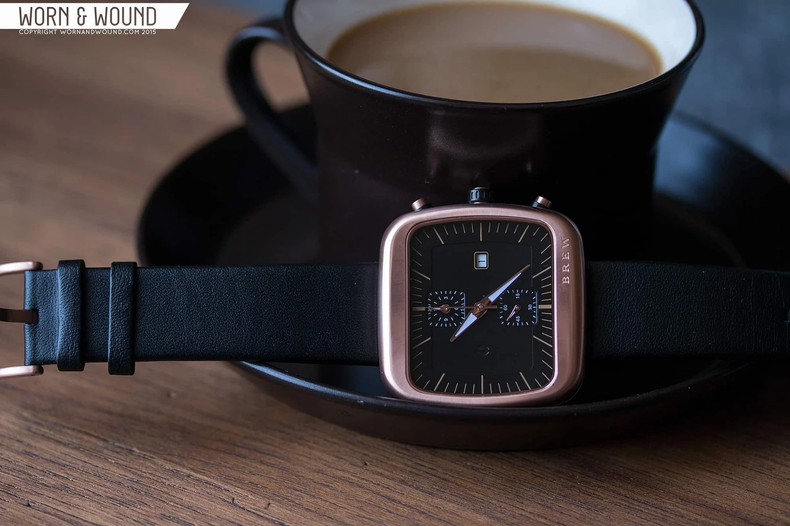
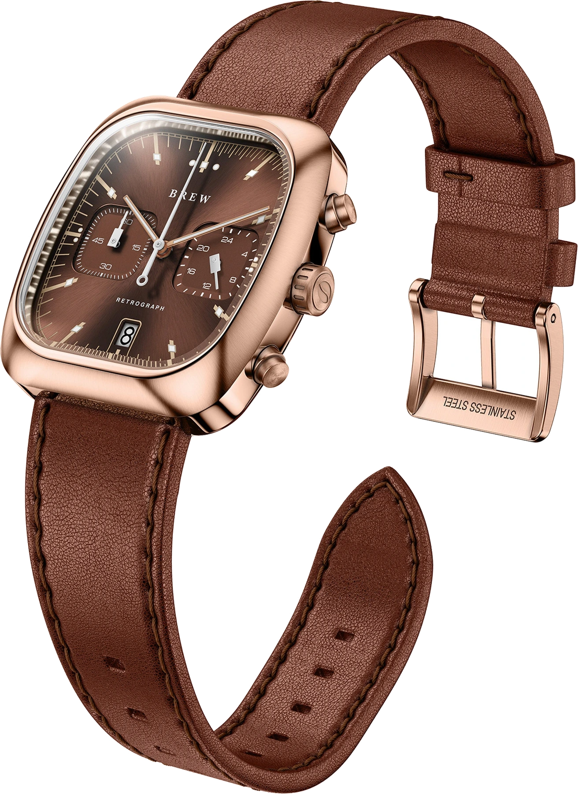
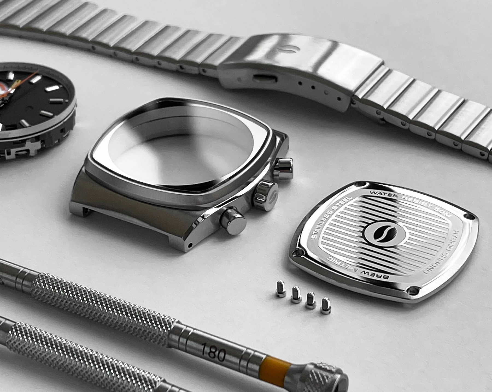
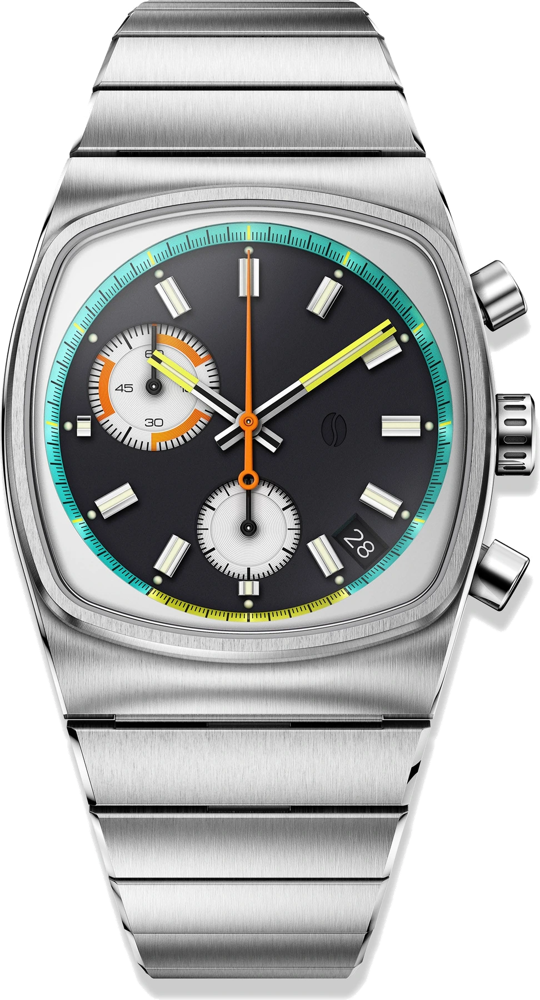
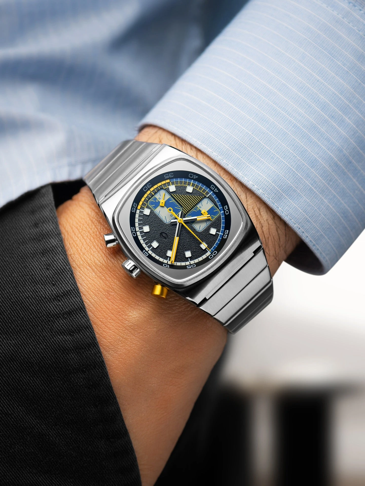

Egy eszpresszó akkor kezd igazán érdekessé válni, amikor már huszonöt másodperce folyik. Harminc körül rendszerint elkészül. Harmincöt után a barista többnyire megállítja a vizet.

Tíz másodperc. Ennyi helyet jelölt ki Jonathan Ferrer az egyik kronográfja skáláján, türkizzel és sárgával. Az óra ettől még nem főz kávét, nem méri a víz hőmérsékletét, és azt sem tudja, hány gramm őrlemény került a karba. Csak megmutatja azt a rövid szakaszt, amikor érdemes a csészére figyelni.

Erre a tíz másodpercre épült fel a Brew.

A márkát könnyű lenne egyetlen ötlettel elintézni. Kávérajongó tervező készít kávés órákat. A történet azonban éppen azért érdekes, mert sokáig nem működött ilyen tisztán. Az első Brew inkább egy kávézó hangulatát próbálta acélba és rózsaarany színű bevonatba sűríteni. A használható kapcsolat csak három évvel később jelent meg. Mire pedig megszületett a Metric, a legtöbb ember már nem a kávé miatt akarta.

## Egy konyhai időzítő New Yorkban

Jonathan Ferrer 2014-ben végzett ipari formatervezőként a New Jersey Institute of Technologyn. Az órák világa nem volt teljesen idegen számára. Édesapja a Tiffanynak tervezett ékszereket, nagyapja a Cartier-nak dolgozott, ő maga pedig a Movadónál volt gyakornok. Később olyan cégek számára rajzolt licencelt és saját márkajelzés nélkül értékesített órákat, mint a Crayola, a Coleman vagy a Jessica Simpson.

Megtanulta, hogyan lesz egy vázlatból gyártható tárgy. A saját neve azonban nem került a számlapokra.

2015-ben egy New York-i kávézóban dolgozott, amikor észrevette, hogy a barista egyszerű konyhai időzítővel méri az eszpresszót. Nem egy nagy órás komplikáció hiányát látta meg. Inkább azt, hogy egy hétköznapi mozdulatnak lehetne jobb tárgya. A kávézó közben munkahely és menedék is volt számára. Le lehetett ülni, rajzolni, nézni az embereket, majd néhány percre tényleg nem sietni sehová.

Innen jött a Brew neve és a kávészünet gondolata. Nem a koffein volt a lényeg. A szünet volt az.

## Az első óra még csak körülírta a kávét

Az első kollekció, a Special Blend 2015. március 10-én került fel a Kickstarterre. A kampány 35 000 dollárt kért. Negyvenöt nap alatt 142 támogató 39 837 dollárt adott össze.

Ez siker volt, de nem az a fajta robbanás, amely egyetlen nap alatt kész márkát csinál. Ferrer New York-i lakásából intézte a rendeléseket, a csomagolásban pedig az édesanyja segített. Az első sorozatnál még mindent közelről kellett megtanulni, a gyártástól az ügyfélszolgálatig.

*A 44 milliméteres Special Blend két korai változata. Fotó: [Worn & Wound](https://wornandwound.com/introducing-brew-watch-co/).*

A Special Blend 44 milliméter széles, erősen lekerekített, négyzetes tokot kapott. A tokfülek eltűntek a forma alól, ezért az óra kisebbnek hatott a számnál, de mai szemmel így is nagy tárgy. A koronán és a tok oldalán futó rovátkák az ipari eszpresszógépek szellőzőit idézték. A krémszín, a fekete, a csiszolt acél és a rézhez közeli árnyalat a kávézók meleg belső teréből érkezett.

Belül Ronda 3520.D kvarckronográf dolgozott, fölötte szabálytalan formájú zafírüveg. A Kickstarter ára 275 dollár volt.

Az ötlet látszott, de magyarázni kellett. Ha valaki nem olvasta el a kampány szövegét, egy barátságos, szokatlan négyzetes órát látott. Nem derült ki belőle, miért Brew, és mit kezdjen vele a kávé mellett. A szellőzőrács és a barna szín hangulatot adott, funkciót nem.

Ez a különbség később döntő lett.

## A Retrograph megtalálta a hiányzó tíz másodpercet

2018-ban jelent meg a Retrograph. Ferrer megtartotta a lekerekített négyzetet, de kisebbre és feszesebbre húzta. A tok 38 milliméter széles és 41,5 milliméter hosszú lett. A két segédszámlap, a hat óránál álló dátum és a vékony indexek már az 1970-es évek műszereit idézték.

Az igazán fontos rész mégsem a tok volt. A számlap külső skáláján huszonöt és harmincöt másodperc között eltérő színű jelölések jelentek meg.

*A Retrograph Espresso. A 25 és 35 másodperc közötti szakaszt a számlap peremén jelölték ki. Eredeti gyártói fotó, eltávolított háttérrel: [Brew Watch Co.](https://www.brew-watches.com/products/retrograph-brew-rosegold-espresso-chocolate).*

Egy eszpresszó elkészítésénél az idő csak egy változó a sok közül. Számít az őrlés, az adag, a tömörítés, a víz és a gép is. A színezett tartomány ezért nem ígér tökéletes kávét. Arra viszont jó, hogy egyetlen pillantással lásd, mikor jár a folyamat az általánosan használt tartományban.

Ferrer itt értette meg, hogyan lehet a történetet úgy elrejteni egy órában, hogy ne váljon jelmez kellékévé. Nincs csésze a számlapon. Nincs gőzölgő logó. Aki nem ismeri a magyarázatot, annak a színes szakasz egyszerű grafikai részlet. Aki ismeri, annak működő eszköz.

A jelenlegi Retrograph Espresso 375 dollárba kerül. Zafírüveget, 50 méteres vízállóságot és hibrid mecaquartz kronográfot kap. A kávés időzítés mellett hatvan percig mér, tehát ugyanúgy használható parkolóórához, főzéshez vagy bármihez, amihez az ember még elővesz egy stoppert.

Nem az eszpresszó tette jobbá az órát. Az tette jobbá, hogy a kávés történet végre valós feladatot kapott.

## A négyzet, amely saját névjeggyé vált

A Brew első órája is négyzetes volt, de a márka formanyelve a Retrographnál állt össze. Ferrer szándékosan nyúlt az 1970 körüli párnatokokhoz. A kerek órák piacán a négyzet nehezebben eladható, viszont egyetlen távoli pillantásból felismerhető.

Ez fontos egy microbrandnél. Szerkezetet lehet katalógusból venni, tokot le lehet gyártatni, színeket pedig bárki választhat. Saját arányt jóval nehezebb találni. Olyat, amely öt év múlva is ismerős marad, de nem egy nagy márka órájának olcsóbb másolata.

A Brew nem szakadt el a korszak előképeitől. A tévéképernyő formájú tokok, az integrált fémszíjak, a harsány jelzőszínek és a műszerfalra emlékeztető tipográfia mind ismerősek. Ferrer érdeme inkább az, ahogyan ezeket összerakta. Egy Brew rendszerint régi tárgynak tűnik, de nehéz megmondani, pontosan melyik régi órát másolja.

2021-ben ebből a nyelvből született meg a Metric.

## A Metric, amely már kávé nélkül is Brew

A Metric tokja 36 milliméter széles, 41,5 milliméter hosszú és 10,75 milliméter vastag. A fémszíj közvetlenül folytatja a tokot, a kerek számlapot pedig egy lapos, tévé alakú keret fogja körbe. A segédszámlapok nem tükrözik egymást. Az egyik tíz óránál ül, a másik hatnál, a dátum pedig négy és öt óra közé csúszott.

Papíron ez könnyen széteshetne. A fekete számlapon türkiz, narancs, sárga, fehér és zöld részletek jelennek meg. A mutatók sem egyformák, a segédszámlapok mérete eltér, a dátum pedig éppen ott van, ahol az órarajongók egy része a legkevésbé szereti.

Mégis működik.

*A Metric tokja, hátlapja, fémszíja és számlapi egysége összeszerelés előtt. Fotó: [Brew Watch Co.](https://www.brew-watches.com/pages/about-us).*

Azért működik, mert a szabálytalanság nem véletlennek hat. A tok nyugodt, a számlap mozgalmas. A csiszolt felületek ipariak, a színek játékosak. A Brew logója alig látszik három óránál, így a név nem versenyez a skálákkal.

A 25 és 35 másodperc közötti tartomány itt is megmaradt. A Metricet azonban már akkor is fel lehet ismerni, ha a tulajdonosa soha életében nem készített eszpresszót. Ez az a pont, ahol a történetből formanyelv lett.

*A jelenlegi Metric Retro 36 milliméteres tokban. Eredeti gyártói fotó, eltávolított háttérrel: [Brew Watch Co.](https://www.brew-watches.com/watches/brew-metric-retro-black).*

## Miért van benne elem

Az órakedvelők egy része már a „kvarc” szónál elveszíti az érdeklődését. A Metricben dolgozó Seiko VK68 azonban nem egyszerűen olcsó helyettesítője egy mechanikus szerkezetnek. A normál időmérést kvarc szabályozza, a kronográf indítását, megállítását és nullázását mechanikus modul kezeli.

Ezért a stopper központi mutatója nem másodpercenként ugrik egyet. Finomabb lépésekben halad, a nyomógomb pedig határozottan kattan. Nullázáskor a mutató azonnal visszacsap tizenkettőre, nem járja körbe a számlapot.

A megoldás pontosabb és vékonyabb lehet egy teljesen mechanikus kronográfnál, kevesebbe kerül, és egyszerűbb szervizelni. Cserébe a folyamatos másodperc egy kis segédszámlapon lépked, a hátlap alatt pedig nincs fogaskerekekkel teli látvány.

A Brew esetében ez őszinte csere. A márka fő teljesítménye nem egy saját kaliber, hanem a tok és a számlap. Ha egy automata kronográf miatt az óra vastagabb és többször drágább lenne, éppen azt veszítené el, amitől szerethető. A jelenlegi Metric Retro 475 dolláros ára már nem aprópénz, de még mindig messze van a mechanikus kronográfok világától.

*A Metric 36 milliméteres tokja csuklón. Fotó: [Brew Watch Co.](https://www.brew-watches.com/watches/brew-metric-retro-black).*

## Ahol elfogy a történet és marad az óra

A jó háttértörténet veszélyes. Könnyen elhiteti, hogy egy tárgy jobb annál, amilyen.

A Metric sem hibátlan. A számlap zsúfolt lehet, különösen annak, aki első pillantásra szeretné leolvasni a kronográf minden adatát. A négy és öt óra közötti dátumablak megtöri a rendet. Független tesztek apró egyenetlenséget találtak a csiszolt lünettán, a fémszíj pedig levéve kissé zörög, és a szemei között látható a középső összekötés.

Csuklón ugyanakkor vékony, kényelmes és kiegyensúlyozott. A 36 milliméteres szélesség nem mondja el, mennyi felületet ad a négyzetes tok, mégsem akar nagynak látszani. A zafírüveg és az 50 méteres vízállóság hétköznapi használatra elég. A nyomógombok élménye pedig közelebb van egy mechanikus stopperhez, mint amit az elemes működés alapján várnánk.

Itt ér véget a kávés történet. Ha valakinek nem tetszik a tok, a tíz másodperces skála nem fogja meggyőzni. Ha viszont tetszik, akkor a háttér már csak hozzáad valamit. Nem mentség, hanem plusz réteg.

## Egy szünet, amelyet észre lehet venni

A Brew ma már nem az a lakásból működő Kickstarter-projekt, amelyhez Ferrer édesanyja hajtogatta a dobozokat. A Metricből automata, digitális és több kronográfos változat készült, a Retrograph is megmaradt a kínálatban. A márka mégis ugyanazt az egyensúlyt keresi. Legyen ismerős, de ne névtelen. Legyen játékos, de ne váljon vicctárggyá. A kávé legyen benne, de ne kerüljön csésze a számlapra.

Az első Special Blend ezt még csak sejtette. A Retrograph megtalálta hozzá a funkciót. A Metric pedig bebizonyította, hogy a forma már önmagában is elég erős.

Ferrer végül nem egy kávés órát tervezett. Kijelölt tíz másodpercet, amely fölött mások egyszerűen átsiklottak, majd adott neki egy színt, egy tokot és egy nyomógombot.

Az idő ugyanúgy eltelt volna nélküle is. A Brew csak elérte, hogy észrevegyük.
