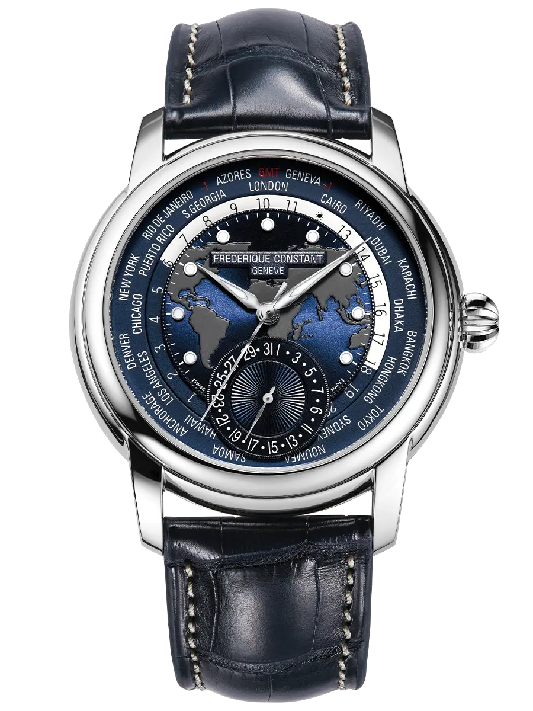
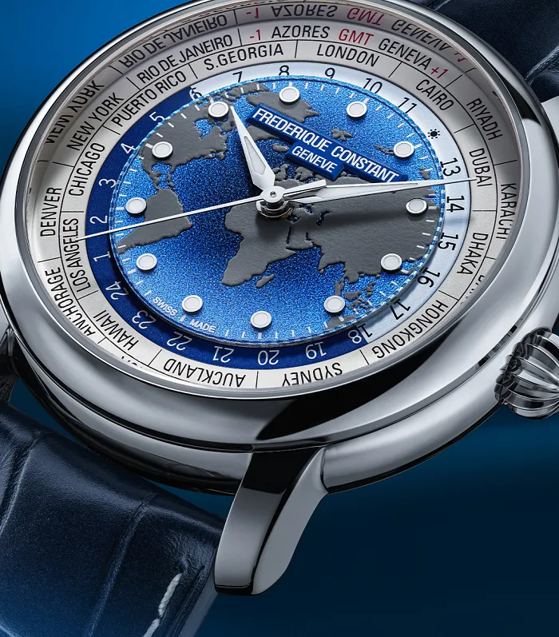

Ebben a rovatban általában nagy házakról és legendás referenciákról írok. Most viszont egy olyan óráról lesz szó, amelyik semmilyen listán nem szerepel a legjobbak között, és amelyikhez mégis újra meg újra visszatérek.

Ez a Frederique Constant Classic Worldtimer. Nincs meg nekem, és mindössze egyszer volt szerencsém szemügyre venni, egy repülőtéri vitrinben. Ettől függetlenül kevés óra van, amiről ennyit olvastam volna. Ha csak az adatlapját nézed, nem fogod érteni, miért. Ha viszont megnézed, hogyan született meg a márka, és mit oldott meg ez az óra, akkor talán igen.

*A Classic Worldtimer Manufacture, a világtérképpel a számlap közepén. Fotó: Frederique Constant (frederiqueconstant.com).*

## Két holland, egy síszünet, és a legrosszabb pillanat

A márka háttértörténete pont az a fajta, amiért ezt a rovatot csinálom.

Peter Stas és Aletta Bax holland házaspár. Egyikük sem órásmester, sőt: Peter közgazdaságtant tanult Rotterdamban és a Philipsnél dolgozott, Aletta pedig Leidenben végzett. Egy síszünet alatt jutottak arra a következtetésre, ami a márka egész létezését magyarázza. Azt vették észre, hogy a szép svájci órák megfizethetetlenek a fiataloknak és a lelkes gyűjtőknek, a megfizethető órák viszont ránézésre sem szépek. Valami hiányzik a kettő közül.

A vállalkozásukat 1988-ban indították el, ami az egyik legrosszabb pillanat volt erre. A kvarcválság még javában rombolta a svájci óraipart, a mechanikus óra pedig még csak nem is kezdett visszatérni a divatba. Két holland, akiknek semmi közük az iparághoz, épp akkor döntött úgy, hogy svájci mechanikus órákat fog gyártani.

A név viszont a legszebb része a történetnek. A Frederique Constant a dédszüleik keresztneveiből áll össze: Frederique Schreiner és Constant Stas. Ezek egyben a saját középső neveik is, mert Aletta teljes neve Aletta Francoise Frederique Bax, Peteré pedig Peter Constant Stas. És van egy váratlan csavar: Constant Stas 1904-ben alapított egy céget, amely nyomtatott óraszámlapokat készített. Vagyis a család véletlenül tényleg kötődött az órákhoz, négy generációval korábban.

## Amit felépítettek belőle

Az első kollekció 1992-ben jelent meg, hat modellel, vásárolt svájci szerkezetekkel, amelyeket egy genfi órásmester rakott össze. A márka aztán lépésről lépésre haladt fölfelé.

Az áttörés 1994-ben jött a Heart Beat modellel, amelynél a számlapon nyitottak egy ablakot, hogy látszódjon a billegő. Ez ma már bevett dizájnelem az egész iparágban, de akkor nem volt az. Aztán 2004-ben jött az első saját, házon belüli kaliber, 2007-ben a szilícium alkatrészek, 2008-ban egy elérhető árú tourbillon, 2012-ben pedig a Worldtimer.

A márka mostanra a genfi Plan-les-Ouates-ban működik, a japán Citizen csoport része 2016 óta, és több mint harminc saját kalibere van. Egy holland házaspár ötletéből, amit egy síszünet alatt találtak ki.

## Az óra, ami engem érdekel

És most jöjjön az, ami miatt ez a darab megragadt bennem.

A Classic Worldtimer Manufacture huszonnégy időzónát mutat egyszerre. A számlap közepén egy vésett világtérkép, körülötte egy huszonnégy órás korong, azon kívül pedig huszonnégy város neve. Ha a saját városodat a tizenkettes pozícióba forgatod, akkor onnantól a számlap egyszerre mutatja, mennyi az idő a bolygó minden zónájában.

Külön nappal és éjszaka jelző nincs rajta, mert nem is kell: a huszonnégy órás korong egyik fele világos, a másik sötétkék. Ahol a városnév a világos részre esik, ott nappal van, ahol a kékre, ott éjszaka. Egyetlen pillantás.

*A huszonnégy városnév, a nappal és éjszaka korong és a vésett világtérkép. Fotó: Frederique Constant (frederiqueconstant.com).*

A valódi mérnöki teljesítmény viszont nem is a számlapon van, hanem abban, ahogy állítod. A világórák jellemzően rejtett nyomógombokkal vagy külön korrektorokkal működnek, amikhez sokszor egy kis pöcök is kell. Az FC-718-as kaliber ezzel szemben mindent egyetlen koronáról kezel: felhúzás, dátum, a városkorong és az idő is. Három koronaállás van, és a második pozícióban felfelé forgatva a dátumot állítod, lefelé forgatva a városkorongot. Az időállításnál pedig a huszonnégy órás korong magától a helyére áll.

Ez pontosan az a fajta megoldás, amit szeretek: nem látványos, nem lehet vele dicsekedni egy asztalnál, viszont minden egyes alkalommal, amikor használod, érzed, hogy valaki gondolkodott rajta.

## Ahol tényleg nem a legjobb

Legyek őszinte, mert enélkül nem érne semmit ez az írás.

Az FC-718-as harmincnyolc órás járástartalékkal és 28 800-as ütemmel dolgozik. A járástartalék mai mércével szerény: ha pénteken este leveszed, hétfő reggelre biztosan áll. Vannak ebben az árban órák, amelyek nyolcvan órát is bírnak.

A díszítés viszont meglepően szép: perlázs, körkörös genfi csíkozás, kékített csavarok, polírozott élek és egy áttört aranyszínű rotor. Iparilag kivitelezett, tehát nem kézi anglázs, de a látvány a hátlapon keresztül tényleg megéri, hogy megfordítsd.

És a nagy kérdés, amit ilyenkor mindenki feltesz: kell-e nekem huszonnégy időzóna. Őszintén? A legtöbbünknek nem. Ez a komplikáció eredetileg azoknak készült, akik tényleg zónákon át dolgoznak. A gyakorlatban ez egy olyan óra, amelyiknek a hasznossága ritkán aktiválódik, viszont a számlap minden egyes pillantásnál emlékeztet arra, hogy a Föld forog.

## Miért maradt meg bennem

Amit én ebben az órában szeretek, az a szemlélet mögötte. A Frederique Constant története arról szól, hogy két ember, akiknek semmi közük nem volt az iparhoz, a legrosszabb pillanatban úgy döntött, hogy megcsinálja azt, ami hiányzik: rendes svájci mechanikát olyan áron, amit egy hétköznapi ember is ki tud fizetni. És a Worldtimer pont ennek a gondolatnak a legtisztább megtestesülése. Egy komplikáció, ami korábban csak a Patek és a Vacheron világában létezett, itt kapott egy házon belüli szerkezetet és egy olyan kezelést, ami tényleg egyszerű.

Nem ez a legjobb óra. Semmilyen szempontból nem nyer versenyt. Csak épp azóta is eszembe jut, valahányszor szóba kerül, hogy valaki fogta magát, és megcsinálta.

A tárgy, nem a hype. Néha egészen szó szerint.
