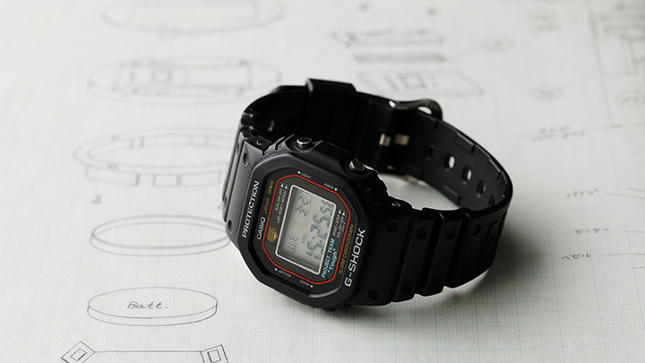
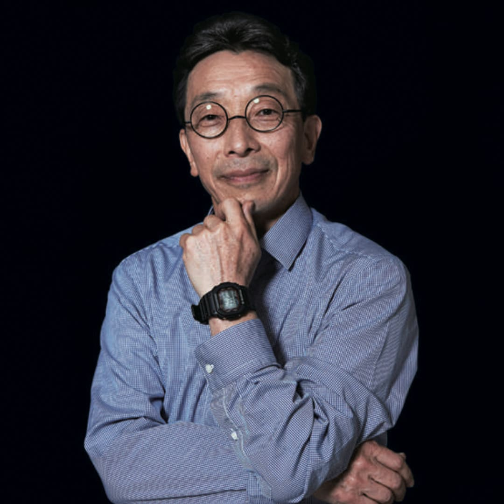
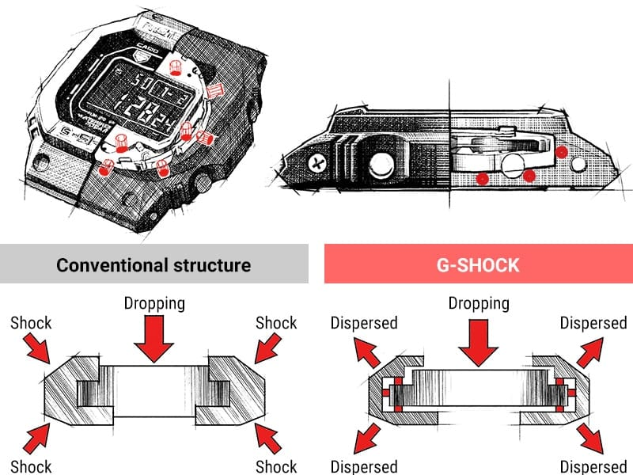
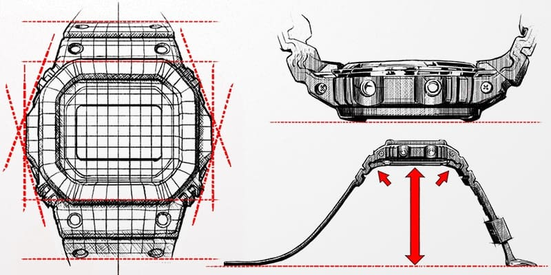
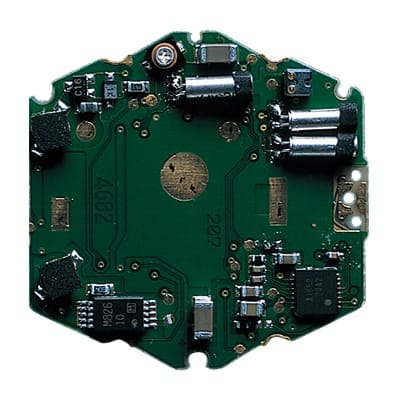
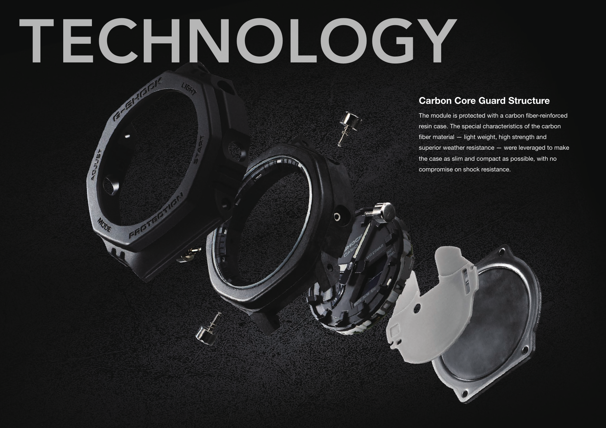

Egy G-Shockra könnyű úgy nézni, mint egy közönséges kvarcórára, amely köré valaki túl sok gumit épített. Nagy a tok, kiáll a lünetta, vastag a szíj. Ha leesik, a puha külső majd felfogja az ütést. Ennyi volna az egész.

Csakhogy Kikuo Ibe első próbálkozása pontosan ez volt, és nem működött.

Egyre több rugalmas anyagot tett az óra köré, a prototípus egy idő után már akkora lett, mint egy softball-labda, a belseje mégis eltört. A G-Shock nem akkor született meg, amikor elég vastag lett a burkolata. Akkor született meg, amikor Ibe rájött, hogy nem az ütést kell egyetlen réteggel megállítani, hanem el kell vezetni, szét kell osztani, és közben a szerkezetet el kell választani a toktól.

Ez a cikk arról szól, mi történik a G-Shock belsejében abban a néhány ezredmásodpercben, amikor földet ér.

*A klasszikus négyzetes G-Shock-forma egy korai műszaki rajz fölött. Fotó: [Casio](https://world.casio.com/development/).*

## Egy összetört óra, kétféle történet

A Casio saját visszaemlékezései nem teljesen egységesek a kezdő pillanatról. Az egyik hivatalos változat szerint Ibe a munkahelyén ejtette le és törte össze az óráját. Egy másik szerint az édesapjától kapott mechanikus óra esett szét. A részlet változik, a következmény nem: Ibe 1981-ben beadott egy belső javaslatot, amely lényegében egyetlen mondatból állt. Olyan órát akart készíteni, amely akkor sem törik el, ha leejtik.

Ez akkor nem hangzott magától értetődőnek. Az óraipar éppen a vékonyabb, könnyebb és kisebb szerkezetek felé haladt. Ibe ezzel szemben egy olyan tárgyat javasolt, amelynek a tartósság lesz az elsődleges értéke, még akkor is, ha emiatt nagyobb és furcsább lesz.

A Casio létrehozta a háromfős Project Team Tough csoportot. Két év alatt több mint kétszáz prototípust építettek. Ibe a tokokat a tokiói kutatóközpont harmadik emeleti mosdójának ablakából ejtette a járdára, majd megnézte, mi tört el, és újrakezdte.

Az első feltételezés az volt, hogy a puha külső majd mindent megold. Nem oldott meg mindent. A gumi csökkentette az ütést, de a tok lassulása továbbra is átjutott a modulra. A kijelző, a forrasztások vagy a kvarckristály ugyanabban a pillanatban kapta meg a terhelést, csak egy kissé vastagabb csomagoláson keresztül.

*Kikuo Ibe, a G-Shock megalkotója, csuklóján az eredeti formát követő négyzetes modellel. Fotó: [Casio](https://gshock.casio.com/fr/products/40-years/dream-project-g-d001/).*

## Nem az esés a veszélyes, hanem a megállás

Egy leejtett óra zuhanás közben folyamatosan gyorsul. A probléma akkor kezdődik, amikor eléri a betont, és a sebessége nagyon rövid idő alatt nullára csökken.

Ugyanazt a sebességváltozást kétféleképpen is át lehet élni. Ha a megállás szinte azonnali, a gyorsulás és a csúcsterhelés nagy. Ha a tárgy egy kicsivel hosszabb úton, egy kicsivel több idő alatt áll meg, a terhelés kisebb lehet. Ezért működik az autó gyűrődőzónája, a cipő talpa és a csomagolóhab. Nem eltüntetik az energiát, hanem időt és utat adnak az elnyeléséhez.

A G-Shock ugyanezt több egymás mögötti lépésben csinálja.

Először a kiálló lünetta vagy a külső burkolat ér földet. Ez deformálódik, és elvesz valamennyit a becsapódás éléből. Utána a tok szerkezete osztja el a terhelést. Végül a belső modul nem követi teljesen mereven a külső tok hirtelen megállását, mert csak kevés ponton van megtámasztva, körülötte pedig marad egy kis hely.

Nem lebeg szabadon, és nem rugókon hintázik. A „lebegő modul” jó kép, de nem szó szerinti leírás. A lényeg az, hogy a tok és az elektronika ne egyetlen merev testként kapja meg ugyanazt a csapást.

<iframe src="/widgets/g-shock.html" title="Interaktív G-Shock ütésállósági modell" width="100%" height="900" style="border:0; border-radius:6px;" loading="lazy"></iframe>

Az interaktív modellben ugyanazt az esést kétféle belső rögzítéssel próbálhatod ki. A mereven rögzített modul szinte együtt áll meg a tokkal. A párnázott, üreges elrendezésben a külső tok már földet ért, amikor a belső egység még néhány pillanatig tovább mozog. Ez nem laboratóriumi számítás, hanem a terhelés útját bemutató sematikus modell.

## A labda, amelyben nem törik össze a belseje

Ibe áttörése egy szabadnapon jött. A Casio története szerint gyerekeket nézett, akik gumilabdával játszottak egy parkban. A labda nekicsapódott a földnek, összenyomódott, majd visszapattant, miközben a közepe nem találkozott közvetlenül a betonnal.

Innen származott az üreges tok ötlete. A modult nem kellett minden oldalán szorosan a házhoz fogni. Elég volt néhány ponton megtámasztani, és helyet hagyni körülötte. A külső rész így deformálódhatott és mozdulhatott anélkül, hogy minden elmozdulást azonnal átadott volna a belső egységnek.

Ez lett az első DW-5000C központi megoldása. A Casio öt védelmi rétegről beszélt: a kiálló uretán részekről, a megerősített tokról, a csillapító anyagokról, az üreges belső szerkezetről és magának a modulnak a védelméről. Egyik réteg sem teszi önmagában törhetetlenné az órát. Együtt viszont nem engedik, hogy a becsapódás egyetlen, rövid és éles terhelési csúcsként érje az elektronikát.

*A hagyományos, merev rögzítés és a G-Shock üreges tokjának összehasonlítása: az ütés a modul helyett több irányba oszlik el. Ábra: [Casio](https://gshock.casio.com/za/technology/shock/).*

## A tok formája nem dísz

A klasszikus négyszögletes G-Shock minden kiálló része munkát végez.

A lünetta magasabb az üvegnél, ezért sík felületre esve jellemzően nem az üveg kapja az első ütést. A gombok süllyesztve ülnek a védőformák között, így kisebb az esélye, hogy közvetlenül a modulba nyomódnak. A tok hátát pedig a mereven ívelt szíjkapcsolat tartja távol a talajtól. Ha az óra a hátára esik, előbb a szíj íve érkezhet meg, és maga is rugózó elemként viselkedik.

Ezért félrevezető úgy beszélni a G-Shock külsejéről, mintha csak egy stílus volna. A forma nagy része egy esési helyzetekből kialakult térkép. Azért olyan, amilyen, mert az óra nem tudja előre, melyik élével fog földet érni.

*A kiemelkedő lünetta, a védett gombok és a mereven ívelt szíj a tok különböző érkezési pontjait tartják távol a talajtól. Ábra: [Casio](https://gshock.casio.com/za/technology/shock/).*

## A kvarcóra is tud érzékeny lenni

A mechanikus órában csapok, kerekek és finom tengelyek sérülhetnek. Ettől még egy digitális kvarcmodul sem sebezhetetlen.

A kvarckristály nagy frekvencián rezeg, az áramkörök között elektromos kapcsolatok futnak, az LCD pedig rétegekből áll. Erős, rövid ütésnél nem feltétlenül látványos törés történik. Elég egy pillanatnyi érintkezési hiba, egy deformálódó tartóelem vagy egy megrepedő forrasztás.

Ezért a Casio a teljes modul csillapítása mellett a fontos alkatrészeket külön is párnázza. A kvarcoszcillátor és más kritikus pontok körül olyan anyag van, amely az ütés pillanatában deformálódik, és csökkenti a kontaktushiba vagy a működési zavar esélyét.

Vagyis a külső tok nem egyszerűen a kijelzőt védi. Egyre kisebb léptékben ismétli ugyanazt az elvet: külső burkolat, belső tér, párnázott modul, külön védett alkatrész.

*A modul kritikus alkatrészei külön csillapítást kapnak, így egy rövid deformáció kevésbé okozhat érintkezési hibát. Ábra: [Casio](https://gshock.casio.com/za/technology/shock/).*

## A három tízes, amelyből végül húsz bar lett

Az eredeti célrendszert Triple 10 néven szokták összefoglalni. Tízméteres esés túlélése, legalább tíz bar vízállóság és tízéves elemélettartam volt az elvárás.

A DW-5000C 1983 áprilisában ennél többet adott a vízállóság oldalán: kétszáz méteres, vagyis húsz bar névleges értékkel jelent meg. Fontos, hogy ez nem ugyanaz, mint azt állítani, hogy minden G-Shock pontosan ugyanazt a tízméteres esést bármilyen felületre, bármilyen szögben, korlátlan alkalommal sérülés nélkül túléli. A „shock resistant” egy tervezett és tesztelt ellenállás, nem a fizika felfüggesztése.

A név sem az elpusztíthatatlanság ígérete. A G a gravitációra utal, a shock pedig arra a hirtelen gyorsulásváltozásra, amelyet a szerkezetnek kezelnie kell.

## Ugyanez az elv, más anyagokkal

Az 1983-as megoldás nem maradt változatlan, de az alapgondolat megmaradt.

A Triple G Resist 2012-től már háromféle terhelést kezel külön: az ütést, a tartós centrifugális erőt és a rezgést. Ehhez egyes modellekben Alpha Gel nevű szilikonalapú csillapítóanyag is került a tokba.

A fémtokos G-Shock nagyobb feladatot jelentett, mert a fém kevésbé hajlandó elnyelni az ütést, mint az uretán. A modern teljesen fém szerkezetekben ezért finom gyantabetétek ülnek a külső lünettatok és a belső tok között. A kis kiemelkedések összenyomódnak, majd ellenerejükkel tompítják a csapást.

A 2019-ben megjelent Carbon Core Guard más úton jut ugyanoda. A szénszállal erősített gyantatok egyszerre könnyű és merev, ezért kisebb tömeget kell hirtelen megállítani, miközben a belső modul körül erős vázat ad. Ettől lehetett például a GA-2100 jóval karcsúbb a klasszikus G-Shock-formánál anélkül, hogy lemondott volna az ütésállóságról.

Az anyag változik, az elv nem: a külső világ és az időt mérő modul között soha nincs egyetlen egyenes út az ütés számára.

*A GA-2100 Carbon Core Guard szerkezete: a szénszállal erősített gyantatok kisebb tömeggel ad merev vázat a modul köré. Kép: [Casio, GA-2100 katalógus](https://gshock.casio.com/content/dam/casio/global/watch/g_shock/catalog/ENG_GA-2100_catalog.pdf).*

## Nem gumitégla, hanem csomagolástechnika

A G-Shock legfontosabb találmánya nem a digitális kijelző, nem egy különleges kvarckaliber, és még csak nem is az uretán lünetta. A csomagolás.

Ibe úgy kezelte az órát, mintha egy érzékeny tárgyat kellene feladnia egy nagyon dühös futárszolgálattal. Nem elég vastagabb dobozt választott. Távolságot hagyott a tárgy körül, kijelölte, hol érhet hozzá a csomagolás, több anyagra osztotta a terhelést, és külön védte azt, ami a legkönnyebben hibásodik meg.

Ezért néz ki a G-Shock úgy, ahogy. A külső forma nem eltakarja a technológiát. Maga a forma a technológia látható része.
