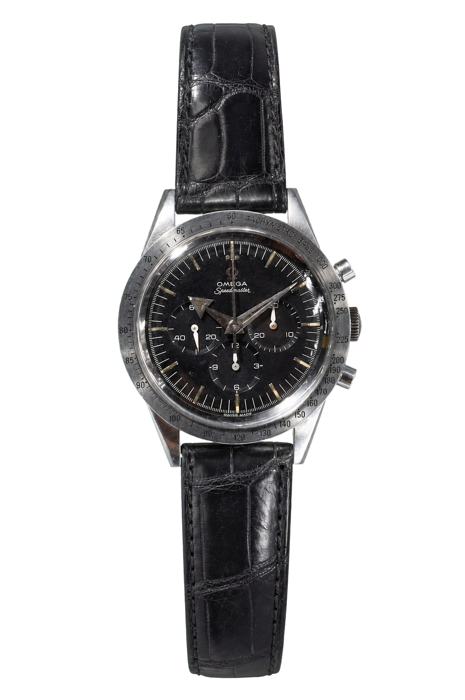
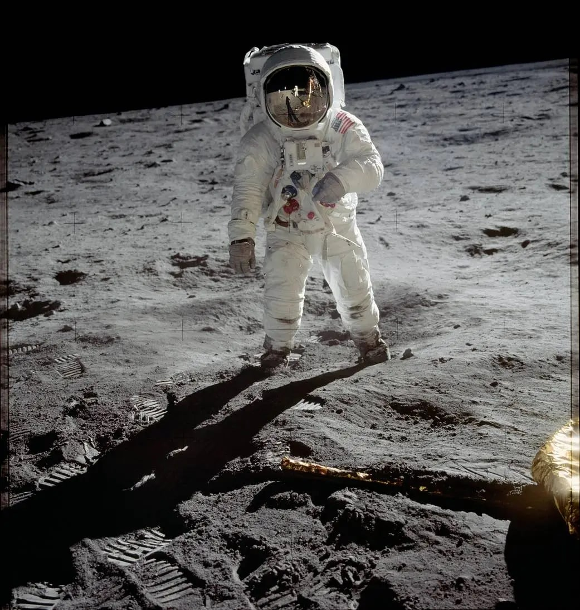
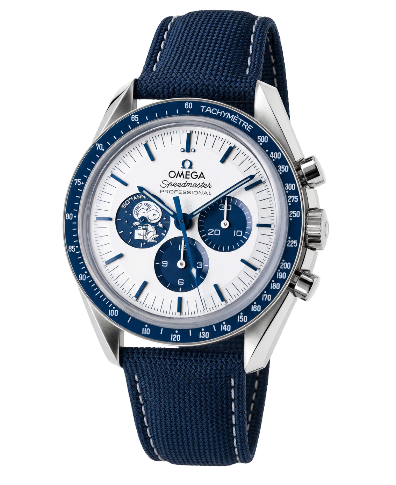
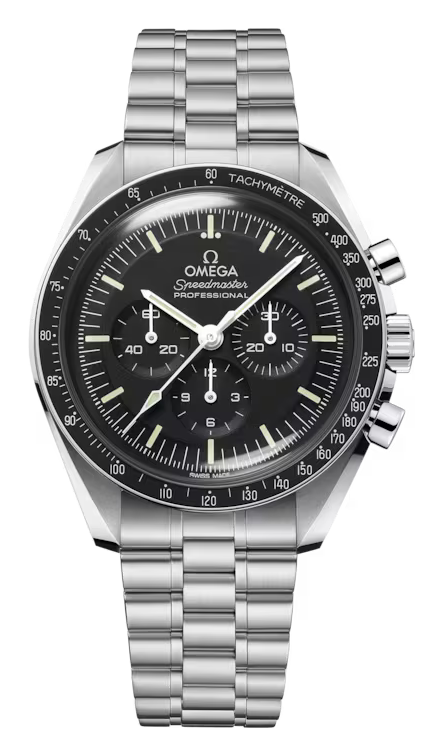
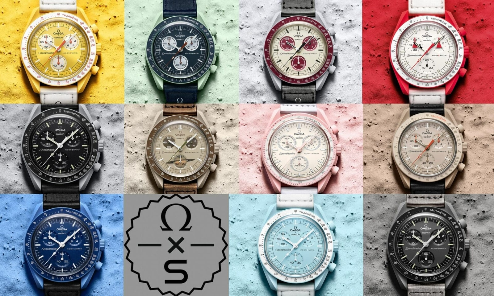

A világ leghíresebb űrórája sosem készült az űrbe. 1957-ben, amikor az Omega bemutatta a Speedmastert, versenykronográf volt, autóversenyzőknek szánva. A NASA nem rendelte meg, hanem egyszerűen megvette a boltban, és kíméletlen teszttel választotta ki. És ha már a legendáknál tartunk: az első óra a Holdon nem is Neil Armstrongé volt. Kezdjük az elejéről.

*Az első Speedmaster, a CK2915 (1957), broad arrow mutatókkal. Forrásfotó: Fratello Watches (fratellowatches.com); háttérleválasztás és képkiegészítés: Lume, AI-segítséggel.*

## Egy versenyóra 1957-ből

A Speedmaster 1957-ben született, egy háromtagú Omega-sorozat részeként (a Seamaster 300 és a Railmaster mellett). Versenykronográfnak tervezték, és a neve is innen jön. A korszakban a tachiméterskála a számlapon szokott lenni; az Omega ezt áttette a lünettára, így a számlap tisztább és olvashatóbb maradt. Ez volt az első kronográf, amelynél a tachiméter a peremen fut.

A mutatók a jellegzetes broad arrow formájúak voltak, a szerkezet pedig a legendás 321-es kaliber: egy kézi felhúzású, oszlopkerekes kronográf a Lemania 2310-esre építve, amelynek gyökerei egészen 1942-ig nyúlnak vissza. Ha az oszlopkerékről szóló írásomat olvastad, ez ismerős lehet.

## A NASA nem tervezte, hanem kiválasztotta

Néhány évvel később a NASA olyan kronográfot keresett, ami kibírja az űrt. Nem terveztetett egyet, hanem tíz gyártót keresett meg ajánlatért, és hogy elkerülje az elfogultságot, a mintadarabokat névtelenül, egy houstoni ékszerésznél vásárolta meg. Négyen válaszoltak: a Rolex, a Longines-Wittnauer, a Hamilton és az Omega. A Hamiltont rögtön kizárták, mert zsebórát küldött csuklóóra helyett. Maradt három: a Rolex 6238-as és a Longines-Wittnauer 235T-je (mindkettő Valjoux 72-vel), meg az Omega Speedmaster 105.003-asa a Lemania-alapú 321-esével.

Ezután jött a kínzás. Sütötték, fagyasztották, vákuumba tették, rázták, ütötték, párásították őket. A Rolex a hőben leállt, a mutatói elgörbültek; a Longines-Wittnauer üvege megrepedt. Egyetlen óra maradt talpon: az Omega Speedmaster (a lume-ja kicsit megégett, rázáskor sietett, de sosem állt meg). 1965. március 1-jén a NASA hivatalosan „minden emberes űrmisszióra alkalmasnak" nyilvánította.

Az Omega állítólag egy fotóból tudta meg a hírt: Ed White az első amerikai űrsétáján (1965, Gemini 4) egy Speedmastert viselt a szkafander ujja fölött. A számlapra röviddel ezután került rá a „Professional" felirat. A lényeg: nem az űrre találták ki, hanem érdemből választották ki.

## Apollo 11, és az óra, amelyik a Holdon maradt

És itt a legszebb „legenda mögötti tény". 1969. július 20-án Neil Armstrong és Buzz Aldrin leszállt a Holdra, mindketten a 105.012-es referenciájú Speedmasterrel. Csakhogy a leszállóegység elektronikus időmérője elromlott, ezért Armstrong a saját óráját bent hagyta az Eagle fedélzetén, tartalék időmérőnek. Így amikor kiléptek a felszínre, a Speedmaster Aldrin csuklóján (egy hosszú tépőzáras szíjon, a szkafander fölött) lett az első óra, amit a Holdon viseltek. Nem Armstrongé, hanem Aldriné.

*Buzz Aldrin a Holdon, a Speedmasterrel a szkafander fölött (Apollo 11, 1969). Fotó: NASA (nasa.gov), közkincs.*

## Apollo 13, a valódi csúcspont

A Speedmaster legfontosabb pillanata mégsem a leszállás, hanem egy mentés. 1970-ben, az Apollo 13 küldetésen felrobbant egy oxigéntartály, a legénységnek le kellett kapcsolnia a parancsnoki modult, és a digitális küldetésóra kialudt. A visszatéréshez pontosan korrigálni kellett a pályát: túl meredeken beérve elégtek volna, túl laposan visszapattantak volna az űrbe.

Egy manuális, 14 másodperces hajtóműégetéssel állították helyre a pályát, és az időt Jack Swigert Speedmasterén mérték. A mechanikus óra ott dolgozott, ahol az elektronika elnémult. Az Omega ezért kapta 1970-ben a NASA Silver Snoopy-díját, a repülésbiztonsághoz való hozzájárulás egyik legmagasabb elismerését.

Ez a díj később az órákban is visszaköszönt. Az Omega több „Silver Snoopy Award" különkiadást is készített: 2003-ban egy 5441 darabos szériát (a szám az Apollo 13 űrben töltött idejére utal), 2015-ben egy fehér számlapos, 1970 darabos változatot „mit tennél 14 másodperc alatt?" felirattal, majd 2020-ban az ötvenedik évfordulóra egy olyat, amelynek a zafírhátlapján egy animált Snoopy kerüli meg a Holdat, valahányszor elindítod a kronográfot.

*A 2020-as „Silver Snoopy Award", animált hátlappal. Forrásfotó: Chrono24 (chrono24.com); háttérleválasztás és képkiegészítés: Lume, AI-segítséggel.*

## Az óra, ami alig változott

A 321-es kalibert 1968 körül a 861-es váltotta: lényegében ugyanaz a szerkezet, egyszerűsítve a gyártáshoz, és az oszlopkereket egy kapcsolóbütyök váltotta (pontosan az az átállás, amiről a Szerkezet-rovatban írtam). Azóta a 861 az 1861-en át a mai 3861-ig fejlődött, de a Moonwatch lényege alig változott: kézi felhúzás, hesalit (plexi) üveg, ugyanaz a számlap. Máig ez az egyetlen óra, amit a NASA az űrsétákra minősít.

*A mai Moonwatch Professional, alig változott formában. Fotó: Omega (omegawatches.com)*

## Amikor a Speedmaster műanyag lett

2022 márciusában az Omega és a Swatch közösen kiadta a Bioceramic MoonSwatchot: a Moonwatch formáját egy körülbelül 260 dolláros, műanyag-kerámia tokú kvarcórába öntve, tizenegy, a Naprendszer égitestjeiről elnevezett színben. Csak fizikai Swatch-boltokban lehetett kapni, és a nyitáskor világszerte sorok, tömegek és felárral továbbadott darabok lettek belőle. Kulturális jelenség lett, jóval az órás körökön túl is.

*A 2022-es Bioceramic MoonSwatch, az Omega és a Swatch közös darabja. Fotó: Time+Tide (timeandtidewatches.com)*

Hogy ez jó vagy rossz, arról máig vitáznak, és a maga módján mindkét oldalnak van igaza.

Az egyik nézőpont szerint ez demokratizálás: aki nem tud több ezer dollárt kiadni egy Speedmasterre, most viselheti ugyanannak az ikonikus formának egy darabját, és a hatalmas figyelem sok új, fiatal embert hozott az órák világába. Ebből a szemszögből a MoonSwatch inkább kitárta a kaput, mint hogy leértékelt volna bármit.

A másik nézőpont szerint ez hígítás: egy legendás dizájn egy olcsó, műanyag kvarcórán megjelenve elkophatja az Omega és a Speedmaster presztízsét, a 2,5 év alatt kiadott több tucat variáció pedig a „kifáradás" érzését keltheti. Aki így látja, annak a valódi Moonwatch értéke részben épp a ritkaságából és a komolyságából fakad, amit a tömeges műanyag változat kikezdhet.

A valóság valószínűleg valahol a kettő között van, és az idő fogja megmondani, melyik hatás lesz tartósabb. Nekem itt nem is dolgom eldönteni: a lényeg, hogy ez is a Speedmaster történetének része lett.

Ezért él a Speedmaster ebben a rovatban. Nem a marketing tette legendává, hanem az, hogy működött, amikor számított. A tárgy, nem a hype. Egy versenyóra 1957-ből, amelyik azért jutott a Holdra, mert egyszerűen ő volt a legjobb szerszám.
