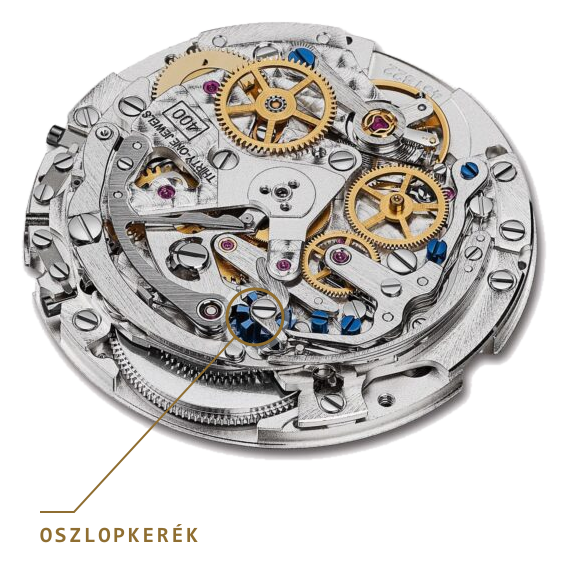

A kronográf egy stopper, amit beleépítettek egy órába. Kívülről nem is lehetne egyszerűbb: megnyomsz egy gombot, és elindul a másodpercmutató; újra megnyomod, és megáll; a másik gombbal pedig nullázod. Belül viszont ez az egész az óragyártás egyik legösszetettebb mechanizmusa. Minden egyes gombnyomásnak egy pontos koreográfiát kell elindítania, méghozzá mindig a helyes sorrendben. Valaminek le kell vezényelnie az egészet. A legszebb kronográfokban ez a valami egy aprócska, várfokra emlékeztető kerék: az oszlopkerék.

## A feladat, amit egy gombnyomás megold

Gondoljuk végig, mit kell egyetlen gombnyomásnak elintéznie. Indításkor össze kell kapcsolni az időmérő fogaskerekét a járó szerkezettel, és el kell engedni a mutatót. Megállításkor szét kell választani a kettőt, és le kell fékezni a mutatót, hogy pontosan ott álljon meg, ahol kell. Nullázáskor pedig egy kalapácsnak rá kell csapnia a szív alakú bütykökre, hogy a mutatók egy pillanat alatt visszaugorjanak a startvonalra. És van egy láthatatlan szabály is: futás közben tilos nullázni, különben tönkremegy a szerkezet.

Ez tehát egy sorrend- és kapcsolási feladat. Két bevált megoldás létezik rá: az oszlopkerék és a bütyök (angolul cam).

## Egy forgókapcsoló a számlap alatt

Az oszlopkerék úgy néz ki, mint egy pici várfok vagy egy sakkbástya: a tetején függőleges oszlopok állnak, az alján pedig finom fogazat fut körbe. Ez a fogazat lépteti a kereket: minden gombnyomás pontosan egy lépéssel fordítja el.

<iframe src="/widgets/oszlopkerek.html" title="Interaktív oszlopkerék-modell" width="100%" height="760" loading="lazy"></iframe>

*Interaktív modell: indítsd el a Start / Stop gombbal, és nézd, ahogy a csőr rááll egy pillérre vagy leesik a résbe. A fejléc „Lámpa le" gombja erre a modellre is hat — érdemes kipróbálni, mert a pillérek olyankor derengeni kezdenek.*

Az oszlopokra több kar támaszkodik, és itt van az egész trükk. Ha egy kar csőre egy oszlop tetején ül, akkor a kar hátra van szorítva, vagyis kikapcsolt állapotban van. Ha viszont a kar csőre beleesik két oszlop közé, a résbe, akkor a kar szabaddá válik, és elvégzi a dolgát. Az elforduló kerék tehát olyan, mint egy forgókapcsoló: minden állásában más-más kombinációba állítja be az összes kart egyszerre.

Nézzük végig egy körben. Indítasz: a kerék fordul egyet, a kapcsolókar beleesik egy résbe, a tengelykapcsoló összezár, és a mutató elindul. Megállítasz: egy újabb fordulat felemeli a kart egy oszlop tetejére, a kapcsolat megszakad, egy fék pedig megtartja a mutatót. Nullázol (amit a szerkezet csak megállított állapotban enged): a kalapácsok rácsapnak a szív alakú bütykökre, és a mutatók visszaperdülnek a nullára. Minden nyomás egyetlen, tiszta, határozott lépés.

## A bütyök, és a legfontosabb tévhit

Ugyanezt a munkát elvégzi a bütykös rendszer is, csak oszlopkerék helyett egy formára szabott bütyök és rugós karok kapcsolgatják a funkciókat. Ez sokkal olcsóbb és egyszerűbb: a karokat lapos acélból ki lehet stancolni, nem kell egyetlen darab edzett acélból precízen kimunkálni. A világ legelterjedtebb kronográf-szerkezete, a Valjoux/ETA 7750 is bütykös, és köztudottan strapabíró, megbízható igásló.

És most jön a legfontosabb tévhit-oszlatás. Az oszlopkerék nem méri pontosabban az időt. A pontosságot a billegő és a gátlómű adja, nem az, hogy hogyan kapcsolod be a kronográfot. A kettő ugyanazt a munkát végzi. A különbség a kézművességben és az érzetben van. Az oszlopkerék egyetlen darab edzett acélból készül, az oszlopoknak tökéletesen egyforma magasságúnak, távolságúnak és felületűnek kell lenniük, és ez rettenetesen nehéz megmunkálás. Cserébe a gomb tisztább, könnyedebb, határozottabb kattanással jár. A tapasztalt gyűjtők pusztán a gomb érzéséből megismerik. Ahogy mondani szokták: az oszlopkerék varázsa valójában a mögötte lévő tudásban és türelemben rejlik.

## Amit a legtöbben rossz alkatrésznek tulajdonítanak

Van itt még egy makacs félreértés, amit érdemes tisztázni. Sokan azt mondják, hogy a bütykös kronográfnál a másodpercmutató „ugrik" egyet induláskor, és ezt a bütyöknek tulajdonítják. Valójában ez nem a bütyök hibája, hanem a tengelykapcsolóé, ami egy külön alkatrész.

Kétféle tengelykapcsoló van: vízszintes és függőleges. A vízszintesnél két fogaskerék ér hozzá egymáshoz induláskor, és a fogak egy pillanatra összekaphatnak, innen a kis ugrás. A függőleges ezt súrlódással, felülről oldja meg, sokkal simábban. Mivel a bütykös szerkezetek jellemzően vízszintes, az oszlopkerekesek pedig gyakran függőleges kapcsolóval járnak, könnyű összemosni a kettőt. Pedig más a dolguk: az oszlopkerék (vagy a bütyök) azt dönti el, mikor mi történjen; a tengelykapcsoló pedig azt intézi, hogyan kapcsolódik össze a két szerkezet.

## Hol találkozol vele, és miért érdemes tudni róla

Oszlopkereket a klasszikus, magasabb kategóriás kronográfokban találsz: ilyen a Rolex Daytona 4130-as kalibere, a Zenith El Primero (nála a rotor „Manufacture" felirata fölött látszik az oszlopkerék), vagy a Patek Philippe kronográfjai.

*A Zenith El Primero 400-as kalibere. A pillérek gyűrűjére jobbról fekszik rá a kapcsolókar csőre. A kiemelés a szerkesztőségé. Fotó: Monochrome Watches (monochrome-watches.com)*

És egy szép történelmi lecke arról, hogy a bütyök nem „rosszabb": az Omega Speedmastert a NASA 1965-ben minősítette az űrrepülésre, akkor még az oszlopkerekes 321-es kaliberrel. Az Omega később bütykös szerkezetre váltott, és a NASA azt is jóváhagyta. Vagyis mindkét megoldás kiállta az űr próbáját, ami elég meggyőzően cáfolja, hogy a bütyök alsóbbrendű lenne.

Az oszlopkerék nem arról szól, hogy megnyerjen egy adatversenyt. Arról szól, hogyan érződik, és milyen kézzel készült. Legközelebb, amikor megnyomsz egy kronográf-gombot, már tudni fogod, mit is érzel valójában: egy pici várfok fordul egyet a számlap alatt.
