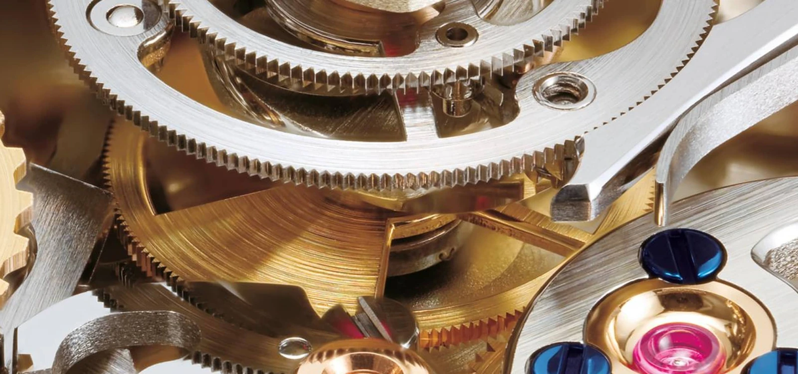
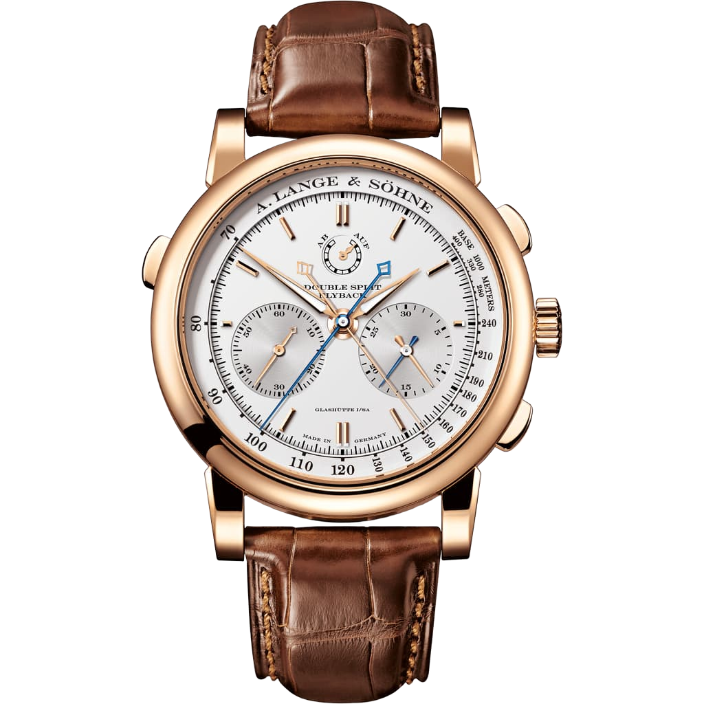

Ketten indulnak el egyszerre. Az első futó már célba ért, a másik még néhány lépéssel mögötte van. Egy hagyományos stopperrel választanod kell: megállítod az elsőnél, vagy hagyod tovább futni, és megpróbálod megjegyezni, hol járt a mutató.

Az utolérő kronográfon nem kell választanod. Megnyomsz egy gombot, és az addig egynek látszó másodpercmutató kettéválik. Az egyik ott marad az első befutó idejénél, a másik továbbmegy a másodikért. Ha az egész mérést is megállítod, mindkét eredmény a számlapon marad.

Ezt tudja a *rattrapante*. A francia szó az utolérésre utal: a megállított mutató egy újabb gombnyomásra visszatér a továbbhaladó társa mellé. Nem nullára ugrik, és nem indul új mérés. Ugyanazt az időt mutatják ismét.

## Nem két stopper van a tokban

Könnyű úgy elképzelni, mintha az órás egyszerűen betett volna még egy stoppert az első mellé. Pedig a két mutató ugyanarról az időalapról dolgozik. Nem két billegőt kell összehangolni, és nem két külön rugó hajtja őket csak azért, mert külön is megállíthatók.

A többletfeladat a kronográf kijelzésénél kezdődik. Kell egy második központi mutató, amely normálisan együtt halad az elsővel, de kérésre leállítható. A kapcsolatuknak tehát elég biztosnak kell lennie az együttfutáshoz, ugyanakkor oldhatónak is, hogy az egyik mutató rögzítése ne állítsa meg a másikat.

Ezért nem jó megoldás egyszerűen összeragasztani a két mutatót, vagy merev áttétellel egymáshoz kötni őket. A szerkezetnek két eltérő helyzetet kell tudnia: együtt haladni és egymástól függetlenül állni, illetve haladni.

## Egy fék és egy különös alakú bütyök

A mutatók tengelyei egymásba illeszkednek. A Lange műszaki rajzán a kronográf mutatóját egy üreges külső tengely viszi, ezen belül fut az utolérő mutató tengelye. Kívülről szinte semmi sem látszik ebből a rétegezésből.

A belső kapcsolat fontos eleme a szívbütyök. Nem fogaskerék: az alakja vezeti a hozzá támaszkodó kart. A kronográffal együtt forog, a rugóval terhelt követőkar pedig az utolérő kerékhez tartozik. Amíg összekapcsolódnak, a két mutató együtt halad.

A részidőgomb megnyomásakor egy apró fék fogja meg az utolérő kereket. A kronográf kereke közben tovább forog. Amikor újra elengedjük a féket, a követőkar visszaáll a bütyök meghatározott helyzetébe, az utolérő mutató pedig ismét a másik fölé kerül.

Nem az eltelt másodperceket számolja vissza, és nem egyenként pótolja a kihagyott lépéseket. A mechanikai kapcsolat állítja újra össze a két mutatót. Emiatt olyan gyors a mozdulat.

Az L001.1 részlete a Double Split gyári bemutatójából. A kerekek és karok több szinten helyezkednek el; ez nem az alábbi oktatómodell alkatrészelrendezése. Fotó: Lange Uhren GmbH.

## Miért nem elég megfogni a kereket?

Mert a megállított utolérő kerék mellett a szívbütyök tovább forog. Ha a követőkar végig hozzáérne, a forgó felület folyamatosan mozgatná a kart a rugója ellenében. Ez fölösleges terhelés lenne a szerkezetnek.

Erre való az izolátor, vagyis a leválasztó mechanizmus. Részidőmérés közben elemeli a követőkart a bütyöktől. A fék megtartja a mutatót, de a forgó résznek nem kell közben a kar ellen dolgoznia. Utoléréskor a kapcsolat helyreáll.

A megoldás pontos kialakítása gyártónként különbözhet. A Patek Philippe 5204-esének műszaki leírása például külön izolátorrendszert és módosított szívbütyökprofilt mutat be. A Lange a Double Splitnél a másodperces és a perces utolérő mechanikához is alkalmaz leválasztást. Nem elég tehát annyit mondani, hogy minden rattrapante belül ugyanolyan.

A vékony, egymásba futó tengelyek és a két oldalról záró fék beállítása szintén kényes munka. Ha egy tengely hozzáér a szomszédjához, vagy a fék nem megfelelően fog, az nemcsak a mutatók látványán jelenhet meg, hanem a működést is ronthatja. A komplikáció nehézségét nem az jelenti, hogy még egy mutatót kell a számlapra tenni.

## Próbáld ki két befutóval

A modellen először a **Példa betöltése** gombot érdemes megnyomni. Az utolérő mutató 12 másodpercnél áll, a kronográfé 18-nál. Mindketten ugyanakkor indultak, így a különbség egyszerűen 6 másodperc. Az első eredményt nem kellett felírni vagy fejben tartani.

Ezután nyomd meg az **Utolérés** gombot. A mutatók összezárnak, de a mérés nem nullázódik. Ha új próbát szeretnél, nullázz, indíts, és néhány másodperc után rögzíts részidőt. A mechanika nézetén látni fogod a fék zárását és a követőkar elemelkedését is.

<!-- lume-model rattrapante -->

A kézi léptetéshez nem kell elindítani az animációt. A **+1 másodperc** gombbal nyugodtan végigjárhatod a folyamatot, akár megállított utolérő mutató mellett is. A modell egyetlen másodperces mutatópárt szemléltet, nem a teljes Double Splitet. A 60 másodperces bemutatóhatár sem azt jelenti, hogy egy valódi kronográf egy percnél ne tudna tovább mérni.

Van még egy fontos különbség. Ha 12, majd 18 másodpercnél olvasol le részidőt, az utóbbi nem automatikusan egy új, hatmásodperces kör ideje. A mutató továbbra is a közös rajttól eltelt időt mutatja. A kettő különbségét neked kell kiszámolnod.

## A Double Split a perceket is megőrzi

Egy hagyományos rattrapante másodpercmutatója egy perc alatt körbeér. Leállítva megmutatja, hol tartott az adott percen belül, de önmagában nem árulja el, hány teljes perc telt el addig. A kronográf percszámlálója közben továbbhaladhat, ezért az nem feltétlenül őrzi meg a korábbi részidő percét.

Az A. Lange & Söhne 2004-ben bemutatott Double Splitje erre adott választ. A központi mutatópár mellé a percszámlálón is bekerült egy utolérő mutató. A részidő rögzítésekor a másodpercet és a percet együtt tartja meg; így az összehasonlító mérés tartománya 30 percre nőtt.

Képzelj el egy 8 perc 12 másodperces és egy 9 perc 18 másodperces befutót. Két nagy másodpercmutatóból még nem derülne ki a teljes különbség. A második percmutatóval viszont mindkét eredményhez megmarad a perces adat is. Innen érthető meg igazán, miért nem egyszerűen egy látványosabb változat a Double Split.

Double Split, ref. 404.032. A jobb alsó segédszámlapon a percekhez is két mutató tartozik. Fotó: Lange Uhren GmbH. AI-val támogatott kivágómaszk, az eredeti fotó órarészleteinek megtartásával.

A képen látható 404.032-es referencia rózsaarany tokja 43 milliméter átmérőjű és 15,3 milliméter magas. Az L001.1 kézi felhúzású kaliber 465 alkatrészből áll, 3 hertzen működik, járástartaléka 38 óra. Ez a teljes szerkezet alkatrészszáma, nem kizárólag a két utolérő mutatóé. A gyártó ezt a referenciát már nem sorolja az aktuális kollekcióba.

A vastagságot nézve nem egy ingmandzsetta alatt eltűnő órát látunk. Nekem viszont éppen az a vonzó benne, hogy a számlap visszafogottsága mögött ennyire összetett feladat húzódik. A két nagy mutató mellett könnyű elsiklani; a kis percszámlálón lévő párjuk még kevesebb figyelmet kér. Pedig ettől tud többet az óra.

## Az utolérés nem flyback

A Double Split számlapján a *flyback* felirat is ott van. Ez nem a rattrapante másik neve.

A flyback futó mérés közben is lehetővé teszi a nullázást és az azonnali újrakezdést. Akkor hasznos, ha egymást követő szakaszokat akarsz külön megmérni: befejezed az előzőt, és rögtön indítod a következőt. Nem kell külön megállítani, nullázni, majd újra elindítani a stoppert.

A rattrapante ezzel szemben megőrzi a közös rajtot. Egy részidőt rögzít, miközben a másik mutató ugyanazt a mérést folytatja. A flyback visszavisz nullára; az utolérő funkció a másik mutatóhoz visz vissza. A Double Splitben mindkettő megtalálható, de nem ugyanazt a feladatot végzik.

## Meddig lehet ezt folytatni?

Az ötlet jóval a Lange előtt létezett. Winnerl már a 19. század első felében foglalkozott külön megállítható, majd újra összehangolható mutatókkal. A korai megoldásokból azonban még hiányzott a ma természetesnek vett nullázás. A rattrapante hosszú fejlődés eredménye, nem egyetlen modern márka találmánya.

A Lange később a saját dupla megoldását is továbbvitte. A 2018-as Triple Split az óraszámlálóhoz is adott egy második mutatót, így a két eredmény összehasonlítása 12 óráig terjedhet. A 2026. szeptemberi gyári összefoglalóban már az új platina Triple Split szerepel. Az alapgondolat közben ugyanaz maradt: ami az egyik mérésben továbbhalad, annak a másikban meg kell tudni őrizni egy korábbi helyzetét.

Persze egy telefon mindezt jóval egyszerűbben megoldja, és több eredményt is elment. Ettől a rattrapante még érdekes marad. Kevés komplikációnál ilyen könnyű összekötni a használatot a szerkezettel: a gombnyomás, a megálló mutató és a záró fék ugyanannak a műveletnek három oldala.

Ha legközelebb két egymásra simuló másodpercmutatót látsz, érdemes elképzelni azt a pillanatot, amikor az egyik ott marad. A tokban ekkor nem egyszerűen leáll valami. A szerkezetnek úgy kell megtartania egy eredményt, hogy közben tovább tudjon mérni.
