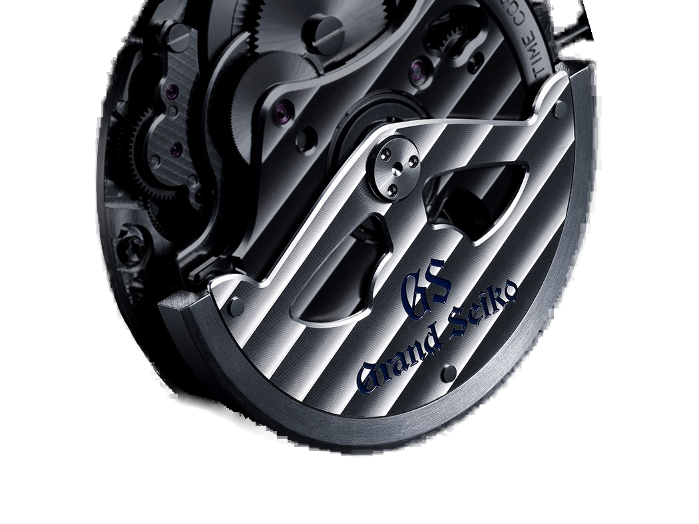
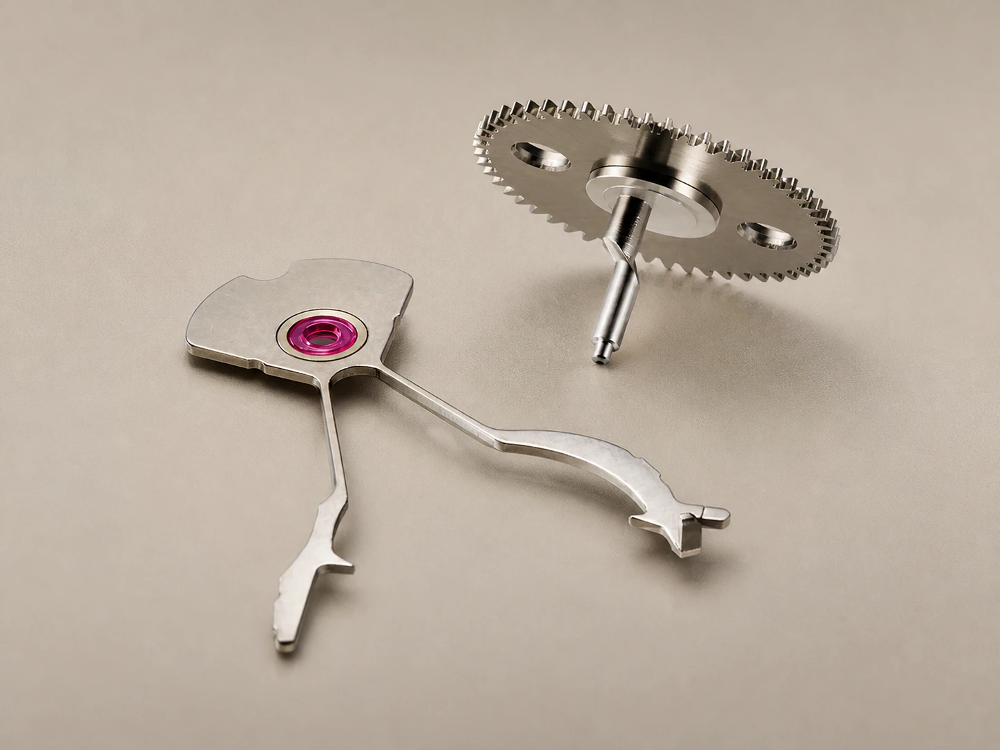
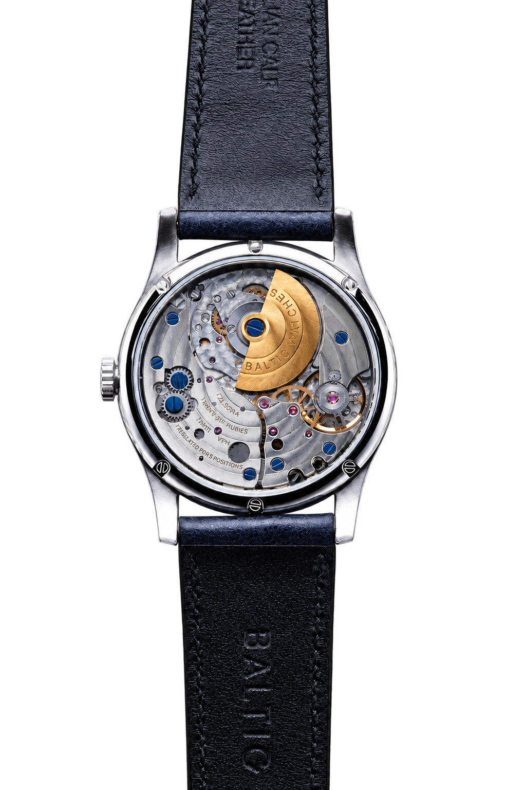

Fordíts meg egy automata órát, és az üveg hátlap mögött általában egy félkör alakú fémdarab takarja el a szerkezet felét. Ha megmozdítod a tokot, a félkör elfordul. Néha lassan követi a csuklót, néha hirtelen körbeszalad, máskor alig mozdul.

Ez a rotor. A feladata egy mondatban egyszerű: a csukló mozgásából felhúzza az órát.

Csakhogy a rotor önmagában semmit nem húz fel. Nem generátor, nem elem és nem egy apró lendkerék, amely közvetlenül hajtja a mutatókat. Csak egy szándékosan kiegyensúlyozatlan súly. Ahhoz, hogy a mozgásából használható energia legyen, kell egy irányváltó rendszer, fogaskerék-áttétel, kilincsmű, rugóház és egy olyan kuplung is, amely a teljesen felhúzott órát megvédi saját viselőjétől.

Az automata szerkezet ezért nem egy alkatrész. Egy energiaátadó lánc.

<iframe
  class="lume-widget"
  src="/widgets/rotor.html"
  title="Az automata rotor működésének interaktív modellje"
  loading="lazy"
  style="width:100%;height:780px;border:0;border-radius:4px;display:block;"
></iframe>
*Mozgasd meg a rajzolt órát, és kövesd végig az energiát a rotortól a főrugóig. Saját, sematikus modell.*

## A súlypont, amely nincs középen

A rotor középen vagy a szerkezet egyik pontján csapágyazott forgó tömeg. A tömege nem egyenletesen oszlik el a tengely körül. A külső ív vastagabb és nehezebb, ezért a súlypontja távol esik a forgástengelytől.

Ha az órát lassan elfordítjuk, a nehéz rész a gravitáció miatt lefelé akar maradni. A tok elmozdul körülötte, ezért a rotor a szerkezethez képest elfordul. Gyors csuklómozdulatnál a tehetetlenség is dolgozik: a tok már irányt váltott, a rotor viszont még továbbhalad.

Nem minden mozdulatból lesz teljes kör. Nem is kell. Egy néhány fokos elfordulás ugyanúgy továbbítható a felhúzórendszerbe. Az automata óra egész nap sok apró, rendezetlen mozgást gyűjt össze, majd ugyanabba az irányba rendezi őket: a főrugó megfeszítése felé.

A rotor tehát nem ingyen energiát készít. A viselő izommunkájának parányi részét veszi át. Emiatt egy íróasztalnál mozdulatlanul ülő ember órája kevesebbet húz fel, mint azé, aki egész nap járkál. Az „automata” szó nem azt jelenti, hogy az óra minden körülmények között örökké jár. Azt jelenti, hogy viselés közben képes pótolni az elfogyasztott energia egy részét vagy egészét.

*A rotor külső ívén összpontosul a tömeg, ezért a szerkezethez képest már kis tokmozgásra is elfordulhat. Fotó: [Grand Seiko](https://www.grand-seiko.com/ca-fr/worldofgrandseiko/manufacture/9r20th/chapter7/index), a háttér eltávolítva.*

## A fogaskerék, amelynek el kell döntenie az irányt

A rotor mindkét irányba foroghat. A főrugót viszont csak egy irányba szabad felhúzni. A szerkezetnek ezért három dolgot kell egyszerre megoldania:

1. át kell vennie a rotor szabálytalan mozgását,
2. a jó irányba kell terelnie,
3. fel kell gyorsítania vagy lassítania úgy, hogy elegendő nyomaték jusson a rugóhoz.

A legegyszerűbb automata rendszerek csak a rotor egyik forgásirányát használják. Amikor a rotor a hasznos irányba megy, egy kilincs vagy szabadonfutó kapcsolódik, és hajtja a felhúzó kerekeket. Ellenkező irányban a kapcsolat old, a rotor szabadon fut vissza. Ettől az óra még hatékony lehet, csak a mozgás egy része nem kerül a rugóba.

A kétirányú rendszerek irányváltó kerekeket használnak. Ezek úgy kapcsolják át az energia útját, hogy a rotor jobbra és balra fordulása is ugyanabba az irányba forgassa a rugóház felhúzó kerekét. A Rolex 1952-ben szabadalmaztatott, egymással összekapcsolt váltókereke ennek ismert példája.

Létezik más megoldás is. A Seiko 1959-es Magic Lever rendszere két karral dolgozik: az egyik húzza, a másik tolja a felhúzó kereket, majd irányváltáskor szerepet cserélnek. Kevés alkatrészből áll, már kis rotormozgást is hasznosít, ezért évtizedeken át sok Seiko szerkezet alapja lett.

*A Magic Lever két karja ugyanabba az irányba továbbítja a rotor jobbra és balra fordulását. Kép: [Grand Seiko](https://www.grand-seiko.com/ca-fr/worldofgrandseiko/manufacture/9r20th/chapter7/index), AI-segítséggel világosítva és részletezve.*

Az IWC Pellaton-felhúzása szintén kilincseket használ. Egy excenter a rotor forgását ide-oda mozgássá alakítja, két kilincs pedig felváltva húzza a kereket vagy siklik át fölötte. A cél ugyanaz: bármelyik irányba indul a rotor, a főrugó mindig felhúzást kapjon.

Különböző utak, ugyanaz a rendrakás. A csukló összevissza mozog. A rugó csak egy irányt ért.

## A rugóház nem akkumulátor, mégis úgy viselkedik

A fogaskerekek végül a rugóházhoz vezetik az energiát. Ez egy lapos, fogazott szélű dob, benne hosszú acél- vagy ötvözetrugóval. Felhúzáskor a főrugó szorosabb spirálba tekeredik, és rugalmas alakváltozás formájában energiát tárol.

Járás közben a rugó lassan kienged. Megforgatja a rugóházat, az pedig a kerékrendszeren és a gátszerkezeten keresztül adagolja az energiát a billegőnek. A rotor nem hajtja közvetlenül a mutatókat. Előbb feltölti ezt a mechanikus energiatárolót, az óra pedig később, szabályozott tempóban használja fel a tartalmát.

Ezért jár tovább egy automata óra levéve is. A járástartalék azt mutatja meg, mennyi ideig képes működni teljesen felhúzott állapotból újabb mozgás nélkül. Ez lehet körülbelül 38 óra egy régebbi alapkalibernél, 70 vagy 80 óra sok mai szerkezetnél, és akár több nap különleges konstrukcióknál.

A hosszabb járástartalék nem jelenti automatikusan, hogy a rotor hatékonyabb. Függ a rugó hosszától, a rugóházak számától, a billegő frekvenciájától és az egész szerkezet energiaigényétől is. A felhúzórendszer csak azt dönti el, milyen gyorsan kerül vissza energia a tárolóba.

## Miért nem törik el, ha egész nap tovább forog

Egy kézi felhúzású óránál a főrugó külső vége rögzül a rugóház falához. Amikor teljesen megfeszül, a koronán érezhető ellenállás jelenik meg. Ilyenkor meg kell állni.

Automata óránál ezt nem bízhatják a viselőre. A rotor akkor is megmozdul, amikor a rugó már tele van. Ha a rugó végét mereven rögzítenék, a következő erős csuklómozdulat túlfeszíthetné vagy eltörhetné.

A megoldás a csúszó kantár. A főrugó külső vége egy rugózó laphoz kapcsolódik, amely súrlódással kapaszkodik a rugóház belső falába. Normál állapotban elég erősen tart ahhoz, hogy a rugó felhúzható legyen. Teljes töltöttségnél a növekvő feszültség legyőzi a tapadást, a kantár pedig egy rövid szakaszon elcsúszik a falon. A rotor és a kerekek tovább mozoghatnak, de a rugó nem feszül veszélyesebbre.

Ez mechanikus kuplung. Nincs érzékelő, elektronika vagy lekapcsoló gomb. Csak gondosan megválasztott súrlódás.

Emiatt egy megfelelően működő automata órát normál használattal nem lehet túlhúzni. A csúszás néha halk, periodikus hangot is adhat kézi felhúzás közben, amikor a rugó már tele van. Ha viszont a kantár túl könnyen csúszik, az óra nem éri el a teljes járástartalékát. Ha letapad, túl nagy feszültség épülhet fel. A láthatatlan kuplung állapota ezért szervizkérdés is.

## A rotor nem mindig nagy félkör

A ma leggyakoribb megoldás a központi, teljes rotor. A szerkezet fölött forog, nagy tömeget lehet a külső ívére tenni, és egyszerűen kapcsolható a felhúzórendszerhez. Hátránya, hogy eltakarja a hidak jelentős részét, és növeli a szerkezet vastagságát.

A mikrorotor a szerkezet síkjába süllyed. Kisebb, ezért nagy sűrűségű anyagból, például volfrámból vagy aranyból készülhet. Nem takarja el a teljes hátlapot, és vékonyabb órát tesz lehetővé. Cserébe kevesebb helyen kell elegendő tömeget és áttételt biztosítani, ami bonyolultabb tervezés.

*A Baltic MR01 aranyszínű mikrorotorja nem a szerkezet fölött, hanem annak síkjában forog, így a hidak nagy része látható marad. Fotó: [Baltic](https://baltic-watches.com/en/products/mr-classic-salmon), AI-segítséggel módosítva.*

A perifériás rotor gyűrűként fut a szerkezet külső peremén. Szinte mindent látni hagy, miközben nagy átmérőn mozgatja a tömeget. Csapágyazása, ütésállósága és gyártása azonban összetett, ezért ritka és drága.

Léteztek úgynevezett kalapácsos vagy bumper automaták is. Ezek súlya nem fordult körbe, hanem egy korlátozott íven mozgott, majd rugós ütközőknek csapódva visszafordult. A viselő gyakran érezte a finom koppanást a csuklóján.

## A zsebóra problémája és a csukló megoldása

Az önfelhúzás ötlete jóval régebbi a karóránál. Abraham-Louis Breguet már 1780-ban eladta első megbízható Perpétuelle zsebóráját. A tokban oszcilláló platinasúly a viselő mozgásából húzta fel a két rugóházat. Zsebben azonban a mozgás kisebb és kiszámíthatatlanabb volt, az ilyen órák pedig ritkák és drágák maradtak.

A karóra új helyzetet teremtett. A csukló többet és nagyobb ívben mozog, de a szerkezetnek sokkal kisebb helyre kellett beférnie.

John Harwood 1923-ban szabadalmaztatta automata karóráját. A kalapácssúly korlátozott íven járt, a korona helyett a lünetta elfordításával lehetett beállítani a mutatókat. Az első sorozat a húszas évek végén készült el, majd a gazdasági válság elsodorta a vállalkozást.

1931-ben a Rolex szabadalmaztatta a szabadon, teljes 360 fokban forgó Perpetual rotort. Ez lett a modern automata óra alapképe. A rotor nagyobb utat járhatott be, egyenletesebben gyűjtötte a mozgást, az Oyster tokon pedig ritkábban kellett kinyitni a menetes koronát. 1952-ben a kétirányú felhúzáshoz váltókerekekkel fejlesztették tovább.

A rotor nem egy pillanat alatt született meg. Zsebórák súlyai, Harwood ütköző kalapácsa és a Rolex teljes köre ugyanannak a kérdésnek különböző válaszai voltak: hogyan lehet az ember mozgását úgy elraktározni, hogy közben ne kelljen gondolnia rá.

## Amit a hátlapon valójában nézünk

Az üveg hátlap mögött a rotor a legnagyobb mozgó alkatrész, ezért könnyű azt hinni, hogy ő végzi a fontos munkát. Valójában csak a rendszer bejárata.

A rotor összegyűjti a rendezetlen mozgást. Az irányváltó rendet tesz benne. Az áttétel használható nyomatékot készít belőle. A rugóház eltárolja. A csúszó kantár pedig elengedi a fölösleget.

Egyik rész sem látványos külön-külön. Együtt azonban megoldanak egy meglepően emberi problémát: elfelejtünk felhúzni egy órát.

Az automata szerkezet nem szüntette meg ezt a napi mozdulatot. Egyszerűen elrejtette a járásunkba.
