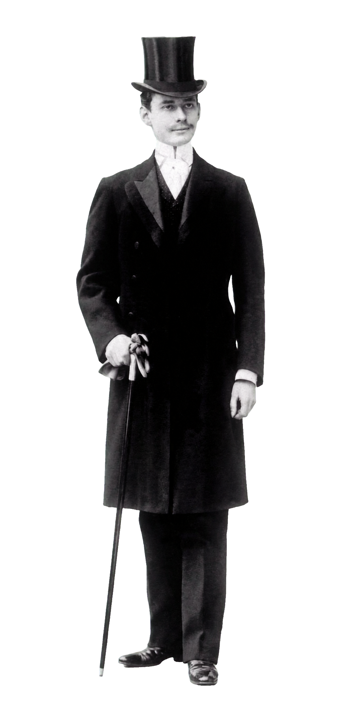

A legtöbb órás cikk itt kezdi a történetet: 1904-ben Louis Cartier csinált egy szögletes karórát a barátjának, és ezzel megszületett az első férfi karóra. Ez nagyjából igaz is. Csak épp a történet érdekesebbik fele arról szól, hogy ki volt az a barát, és mit csinált azzal az órával.

Mert Alberto Santos-Dumont nem egy gazdag megrendelő volt, aki különleges kiegészítőt akart. Ő volt a korszak egyik legismertebb embere, aki léghajókat és repülőgépeket tervezett, és aki minden találmányát ingyen odaadta a világnak.

*Alberto Santos-Dumont, a korszak egyik legnagyobb hírű embere. Fotó: Militares Estratégia (militares.estrategia.com).*

## A kávéültetvényes fia, aki Párizsba ment repülni

Santos-Dumont 1873-ban született Brazíliában, egy gazdag kávétermelő család gyermekeként. Mérnöki tanulmányokra ment Párizsba, ahol aztán élete nagy részét töltötte, és ahol beleszeretett a repülésbe.

Előbb a léghajókkal foglalkozott, és nem csak úgy, ahogy mások: gyakorlatilag ő tette működőképessé az irányítható léghajót. Ő volt az első, aki megnyújtott formát adott a ballonnak, benzinmotort, légcsavart és kormánylapátot szerelt rá, súlyáthelyezéses trimmelést és nyomáskiegyenlítést használt. 1898 és 1905 között tizennégy léghajót épített.

A nagy pillanat 1901. október 19-én jött el. A 6-os számú léghajójával Saint-Cloud-ból a levegőbe emelkedett, megkerülte az Eiffel-tornyot, és visszatért, körülbelül tizenegy kilométert téve meg fél óránál rövidebb idő alatt. Ezzel megnyerte a 100 000 frankos Deutsch-díjat, és világhírű lett. A díj pénzét pedig szétosztotta: a munkásainak és Párizs szegényeinek adta.

*A 6-os számú léghajó az Eiffel-torony körül, 1901. Archív fotó, közkincs.*

## A másik ember a történetben: Louis Cartier

Mielőtt az órára térnék, érdemes megállni annál, aki készítette, mert ő sem mellékszereplő.

Louis Cartier 1875-ben született Párizsban. A nagyapja, Louis-François Cartier alapította a műhelyt 1847-ben, az apja, Alfred vitte tovább, ő pedig 1903-ban, az apja visszavonulásakor vette át a vezetést. A két testvérével, Pierre-rel és Jacques-kal együtt csinált a családi ékszerészműhelyből világmárkát: 1899-ben a párizsi üzlet a Place Vendôme melletti elegáns Rue de la Paix 13-ba költözött, majd jött London (1902, Jacques), Moszkva (1908) és New York (1909, Pierre).

A háznak már akkor is súlya volt: VII. Eduárd angol király nevezte a Cartier-t „a királyok ékszerészének és az ékszerészek királyának". Louis mottója pedig pontosan az, amiért ez a történet megtörténhetett: soha ne utánozz, mindig újíts.

*Louis Cartier, a ház kreatív vezetője és a Santos megalkotója. Forrásfotó: Richard Jean-Jacques (richardjeanjacques.com); háttérleválasztás: Lume, AI-segítséggel.*

Egy dolog viszont hiányzott neki: a szerkezet. A Cartier ékszerész volt, nem óragyártó, ezért Louis összeállt Edmond Jaeger órásmesterrel, aki a szaktudást és a kalibereket adta. A kapcsolat 1907-ben szerződéssel is megerősödött (Jaeger kizárólagosan szállította a Cartier-óraszerkezeteket), és végül ebből a szálból nőtt ki a Jaeger-LeCoultre. Vagyis a Santos mögött két külön mesterség találkozása áll: a párizsi formaérzék és a svájci óragyártás.

Louis nem állt meg a Santosnál. A keze alól került ki a Tonneau (1906), a Tortue és a Baignoire (1912), majd a Tank (1917), amelynek szögletes formája a nyugati front harckocsijainak felülnézetét idézi. Ő állt a híres „misztériumórák" mögött is, amelyeknek átlátszó számlapján a mutatók a semmiben lebegni látszanak. Ezek a formák több mint száz éve gyakorlatilag változatlanul futnak.

## A kérés, amiből az óra lett

És itt jön az a bizonyos beszélgetés. Santos-Dumont panaszkodott a barátjának, hogy repülés közben lehetetlen zsebórát nézni: mindkét kezére szüksége van a kormányon, mire kihalászná a zsebóráját, elveszti az irányítást. Cartier pedig nem egy meglévő órát alakított át, hanem újragondolta, hol a helye az órának: a csuklón, az egyetlen ponton, ami vezetés közben egy pillantással látható.

A válasz 1904-ben egy lapos, szögletes karóra volt, bőrszíjjal. A ház a platinát részesítette előnyben, és a formanyelv már ekkor megelőlegezte az art decót, jóval annak divatja előtt. A részletek, amelyek azóta is a Santos ismertetőjegyei:

- Szögletes tok, akkoriban merész döntés, amikor minden óra kerek volt,
- polírozott lünetta, látható csavarokkal, ami ipari, gépies utalás egy ékszerésztől, és a Santos legismertebb vizuális aláírása lett,
- fehér számlap római számokkal, kékített mutatókkal, hogy egy pillantás elég legyen az olvasáshoz,
- kék cabochon kő a felhúzókoronán, ami máig a Cartier-órák visszatérő jegye,
- és a lehető legvékonyabb felépítés, hogy ne akadjon el semmiben.

A szerkezetet Edmond Jaeger szállította. Fontos részlet: ez nem tömegtermék volt. Hét éven át egyedül Santos-Dumont viselte ezt a modellt, a nagyközönség csak 1911-től vásárolhatta meg, kezdetben platinában vagy sárgaaranyban, bőrszíjjal.

## Amit a „első férfi karóra" állítás valójában jelent

Itt viszont álljunk meg egy pillanatra, mert ezt a mondatot érdemes pontosítani. Karórák már jóval 1904 előtt is léteztek, csak szinte kizárólag nők hordták őket, ékszerként; a férfiak zsebórát viseltek, és a karórát nőiesnek tartották.

Amit a Santos csinált, az nem a karóra feltalálása, hanem valami más: ez volt az első karóra, amit kifejezetten *férfinak* és kifejezetten *munkaeszköznek* terveztek. És mivel egy hihetetlenül népszerű, merész hírű férfi hordta látványosan, egyszer csak elfogadottá, sőt kívánatossá vált, hogy egy férfi a csuklóján hordja az óráját. Vagyis a Santos nem technikai, hanem kulturális elsőség. Ettől függetlenül a történelmi jelentősége ugyanakkora marad, akkor is, ha nem ő volt szó szerint az első.

## A repülőgép, ami magától szállt fel

Santos-Dumont közben rájött, hogy a léghajó zsákutca. Ahogy fogalmazott, olyan, mintha gyertyát próbálnánk átnyomni egy téglafalon. 1905-től a levegőnél nehezebb szerkezetek felé fordult.

A nagy pillanat 1906. október 23-án jött el: a Bagatelle mezején felszállt a 14-bis nevű, kacsaszárnyas kétfedelűvel, és mintegy hatvan métert repült, két-három méter magasan. Ezzel elnyerte az Archdeacon-díjat. A dátum azért fontos, mert ez volt Európa első nyilvános, motoros, levegőnél nehezebb repülése, méghozzá úgy, hogy a gép külső segítség nélkül, a saját futóművéről emelkedett fel.

Alig három héttel később, november 12-én, 220 métert repült 21,5 másodperc alatt. Ekkor filmezték le először embert repülés közben. A csuklóján ott volt a Cartier órája.

*A 14-bis a levegőben, 1906. Fotó: Ciência Escrita (cienciaescrita.com).*

Ez a „saját erőből felszállt" mozzanat áll a máig tartó vita középpontjában is. Sok brazil szerint valójában Santos-Dumont repült először, nem a Wright-fivérek, mert a 14-bis magától gördült fel a levegőbe, míg a Wright-gép induláshoz külső katapultot használt. A tények tisztelete kedvéért érdemes kimondani mindkét oldalt: a Wright-fivérek 1903-ban repültek először motoros géppel, tehát időben ők voltak előbb; Santos-Dumont viszont nyilvánosan, tanúk előtt, önerőből felszállva repült Európában. Attól függ, mit tekintünk a „repülés" definíciójának.

## A Demoiselle, és a szabadalom, amit nem kért

A folytatás talán a legjellemzőbb az egész emberre. 1908 és 1909 között megépítette a Demoiselle nevű, magasszárnyas monoplánt, ami a világ első sorozatgyártott repülőgépe lett. Könnyű, egyszerű gép volt, amit állítása szerint tizenöt nap alatt össze lehetett rakni.

És ezután jött a gesztus, amit ma nehéz elképzelni: nem kért szabadalmat rá, hanem ingyen közzétette a terveket, hogy bárki megépíthesse. Úgy gondolta, a repülés az emberiség közös öröksége, nem üzleti tulajdon.

*A Demoiselle, a világ első sorozatgyártott repülőgépe. Fotó: Airway (airway.com.br).*

Louis Blériot, aki később elsőként repülte át a La Manche-t, így fogalmazott neki: nem tett mást, mint követte és utánozta őt, és Santos-Dumont neve zászló a repülők számára.

## A vég, ami nem méltó a történethez

A történet vége szomorú, és nem hallgatom el. Santos-Dumont 1910-ben, egy Demoiselle-balesetet követően abbahagyta a repülést, romló egészsége miatt visszavonult, majd az első világháború alatt visszatért Brazíliába.

Ami igazán összetörte, az a saját álma volt. Végig kellett néznie, ahogy a repülőgép, amit az emberiség szabadságának eszközeként képzelt el, fegyverré válik és bombákat szór. 1932-ben halt meg, ötvenkilenc évesen; a széles körben elfogadott álláspont szerint önkezével vetett véget az életének, mélyen megtörve attól, amit a találmányából csináltak.

Brazíliában nemzeti hősként tisztelik. A szülővárosát átnevezték róla, október 23-a pedig a „repülők napja" lett.

## Az óra útja 1911-től máig

Az óra sorsa is érdekes. Az 1911-es piaci bevezetés után a szögletes Santos divatba jött az elit körében, majd a második világháború alatt háttérbe szorult, amikor a kerek, katonai órák uralták a terepet.

A visszatérés 1978-ban jött: a Santos de Cartier acél-arany kombinációban, a lünetta és a fémszíj látható csavarjaival. Ez lett az egyik legtöbbet másolt óradizájn a világon, és ez indította el a Cartier modern óragyártását. Ebből a vonalból nőtt ki a századik évfordulóra a nagyobb, vaskosabb Santos 100 (2004), majd a mai, 2018-ban megújított Santos de Cartier.

Fontos viszont a különbségtétel, mert két külön modellről van szó. A Santos de Cartier a sportosabb, csavaros lünettás, fémszíjas vonal. A Santos-Dumont ezzel szemben a csendesebb, laposabb, csavarok nélküli, bőrszíjas változat, amely az 1904-es eredeti legtisztább örököse. Ez utóbbi jellemzően kézi felhúzású (a 430 MC kaliberrel) vagy kvarcszerkezetes, épp azért, hogy a tok a lehető legvékonyabb maradhasson. Az arányai máig szinte változatlanok.

*A mai Santos-Dumont, az 1904-es eredeti legtisztább örököse. Forrásfotó: Cartier (cartier.com); háttérleválasztás: Lume, AI-segítséggel.*

Van a két ember történetében egy furcsa egybeesés is, amit nehéz szó nélkül hagyni. Santos-Dumont 1932. július 23-án halt meg. Louis Cartier pontosan tíz évvel később, 1942. július 23-án. Ugyanaz a nap, két évtizeddel az után, hogy egy vacsora utáni panaszból megszületett a világ egyik legmaradandóbb óradizájnja.

## Miért erről szól ez a rovat

Ha valaki csak az órát nézi, egy elegáns, szögletes Cartier-t lát, ami máig az egyik legszebb dizájn az iparágban.

De a tárgy mögött ott van egy ember, aki nem akart tulajdonolni semmit abból, amit feltalált, aki szétosztotta a díjait, és aki azért kért egy karórát, hogy közben mindkét kezével foghassa a kormányt. Ez az óra nem attól ikon, hogy egy híres ember viselte, hanem attól, hogy egy konkrét, komoly munkához készült, és ezzel véletlenül átírta azt, hogy mit hord a férfi a csuklóján.

A tárgy, nem a hype. És néha a tárgy mögött egy egész életmű áll.

*Fact check: Bálint P.*
