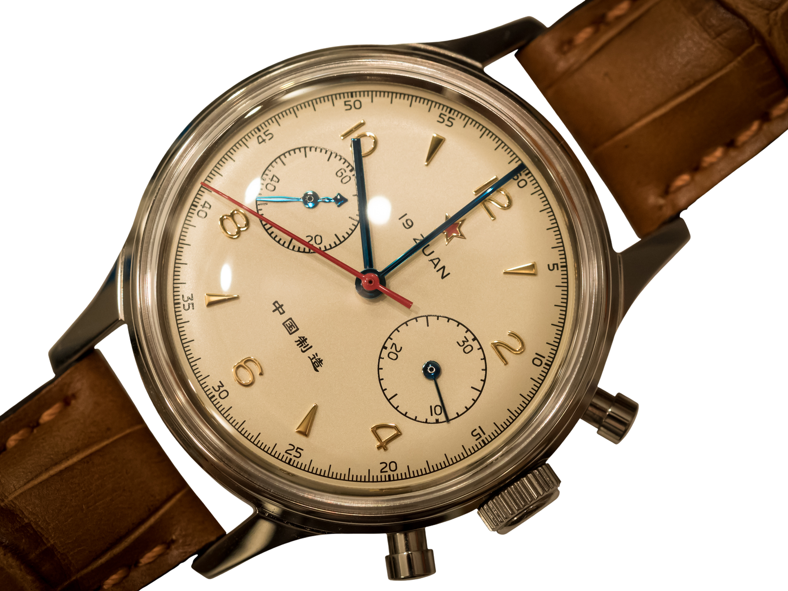
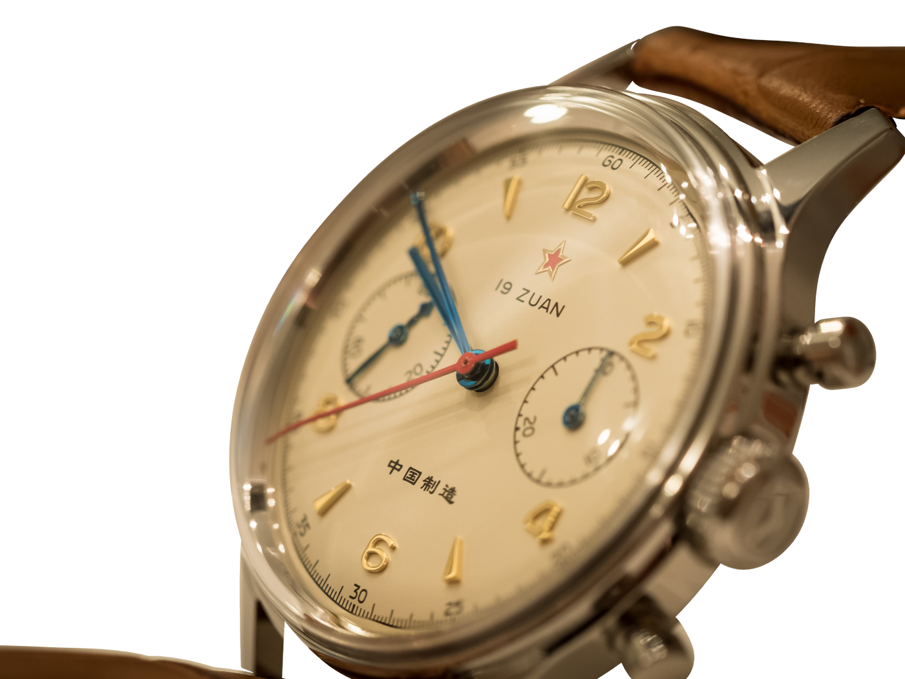
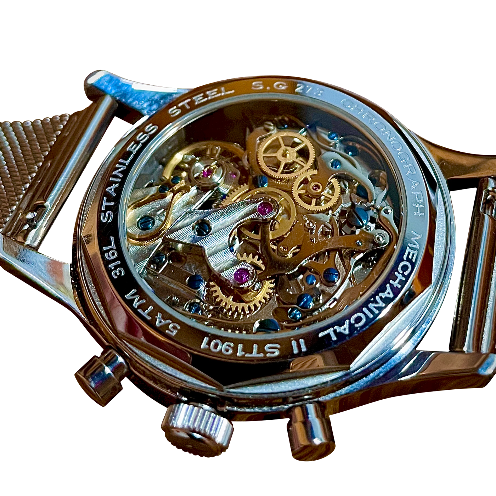
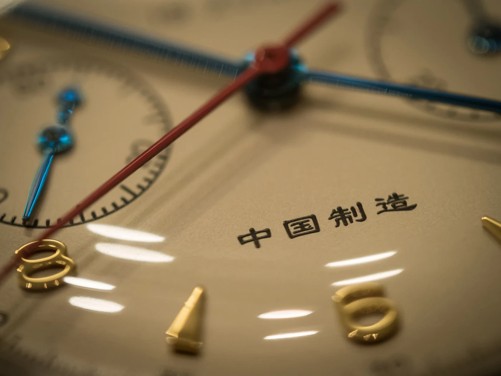
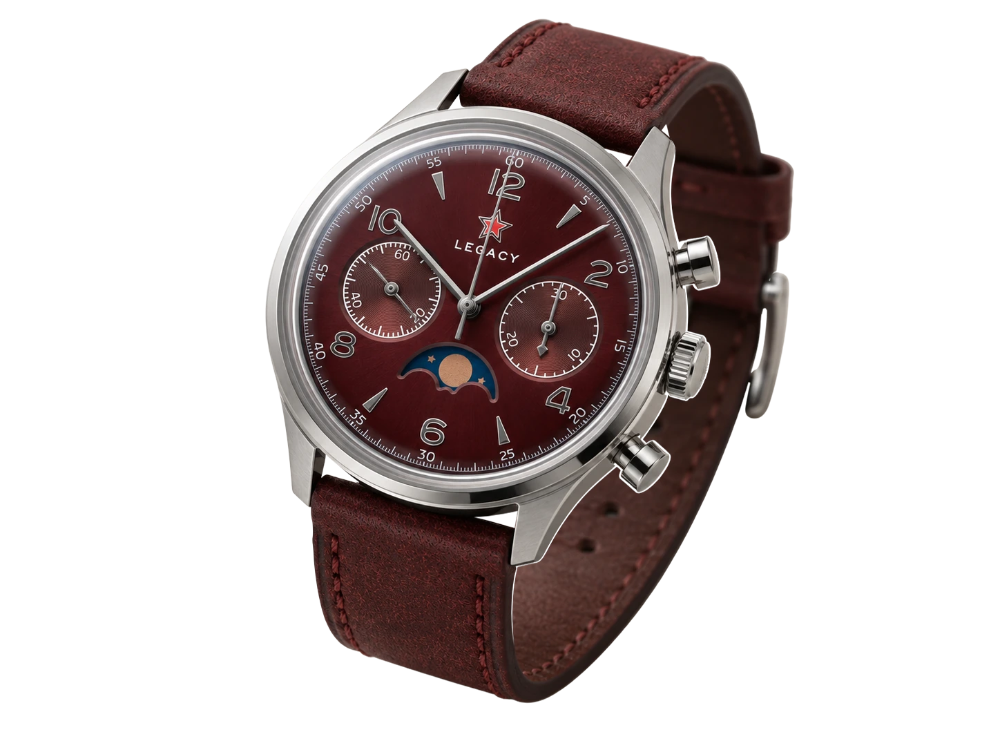

Ezen az órán előbb vesszük észre a piros csillagot, mint a nevet. Aztán a kék mutatókat, az aranyszínű számokat és azt a vékony piros vonalat, amely a számlap közepéből egészen a peremig ér. A két kis kör miatt rögtön kronográfnak látszik, de valahogy nem olyan komolynak, mint egy repülőgép műszere.

Inkább olyannak, amit valaki gondosan megőrzött egy fiókban.

A Seagull 1963-ról rendszerint az árával kezdődik a beszélgetés. Mechanikus kronográf, oszlopkerék, látványos szerkezet, mindez jóval a nagy svájci nevek alatt. Csakhogy így az óra mindig valami más olcsóbb változata marad. Pedig a legérdekesebb része nem az, hogy mit helyettesít, hanem az, hogy honnan érkezett.

Ehhez először az évszámot kell helyretenni. És azt is, hogy mit nevezünk ma 1963-nak.

*Polgári újrakiadás, 2016-os fotó. Nem eredeti katonai példány. Fotó: [Daniel Zimmermann](https://commons.wikimedia.org/wiki/File:中国制造_-_Seagull_1963_Overview_%2825901074974%29.jpg), [CC BY 2.0](https://creativecommons.org/licenses/by/2.0/). Háttér eltávolítása AI-segített maszkkal, átméretezés és WebP-konverzió: Lume. Az óra képrészletei az eredeti fotóból származnak.*

## Egy megbízás, amelyet még 304-nek hívtak

1961 áprilisában a kínai könnyűipari minisztérium a tianjini óragyárat bízta meg a légierőnek szánt kronográf fejlesztésével. A titkos feladat száma 304 volt. Az 1963-ban elkészült mintákat további munka követte; a gyártó részletes visszatekintése 1966-ra teszi az első, 1400 darabos szállítást.

A név tehát nem a teljes történetet mondja el. Egy fejlesztési állomást emel ki belőle.

Ez másfajta kezdet, mint egy új kollekció bejelentése. Itt nem volt szükség jól csengő modellnévre, alapítói portréra vagy a számlap színét magyarázó kampányra. A feladat az volt, hogy elkészüljön egy használható műszer. Olyan óra, amely a pontos idő mellett egy külön esemény hosszát is meg tudja mérni.

A mai vásárló már egy történelmi formát keres benne. Az eredeti megrendelő még egy megoldandó feladatot látott.

## A svájci rokon, akit nem érdemes elhallgatni

A kínai kronográf történetének van egy svájci ága is: a Venus 175. A Sea-Gull ma is ehhez az alapfelépítéshez vezeti vissza az ST19 szerkezetcsaládot. A korai katonai kalibert ST3-ként tartja számon; ennek korszerűsített folytatásából lett később az ST19.

Ez a rokonság nem teszi svájcivá a mai órát. Arra viszont figyelmeztet, hogy a nemzeti óragyártás története ritkán fér bele egyetlen ország határaiba.

Egy szerkezet eredete, az alkatrészek elkészítése és a kész óra összeállítása három külön kérdés. A tervezési előzmény fontos, de önmagában még nem gyárt órát. Ahhoz a méreteknek újra és újra egyezniük kell, a kerekeknek kapcsolódniuk, a rugóknak működniük, a kapcsolásnak pedig a következő gombnyomásra is ugyanúgy végbemennie.

A 1963-at ezért két irányból is félre lehet olvasni. Nem kell letagadni a svájci felmenőt ahhoz, hogy komolyan vegyük a kínai gyártást. És nem kell egy svájci névvel felmenteni az órát az alól, hogy kínai.

## A számlap, amelyet nem kell lefordítani

A piros csillagos változatnak különösen jó az arányérzéke. A krémszínű mező meleg, az aranyszínű számok és ékek majdnem ünnepélyesek. Ezt vágja át a hosszú piros kronográfmutató. A kék óra- és percmutató közben külön rétegként rajzolódik ki a háttér előtt.

Nem egyetlen szín uralja az egészet. A színek feladatot kapnak.

Kilenc óránál a folyamatos másodperc jár, háromnál a stopper eltelt percei gyűlnek. A központi piros mutató nem a hétköznapi másodpercmutató: a külön indítható méréshez tartozik. Ezért egy működő órán is állhat tizenkettőnél.

*A piros csillagos forma egy 2016-ban fényképezett polgári újrakiadáson. Nem eredeti katonai darab és nem a mai 40 mm-es modell termékfotója. Fotó: [Daniel Zimmermann](https://commons.wikimedia.org/wiki/File:中国制造_-_Seagull_1963_Closeup_%2825871232304%29.jpg), [CC BY 2.0](https://creativecommons.org/licenses/by/2.0/). Háttér eltávolítása AI-segített maszkkal, átméretezés és WebP-konverzió: Lume. Az óra képrészletei az eredeti fotóból származnak.*

A képen szereplő óra azt is megmutatja, milyen kevés kell egy felismerhető tárgyhoz. Nincs nagy márkanév, nincs sportos keret, a számlap mégsem névtelen. A kis csillag, a színek és a két egymással szembenéző segédszámlap együtt erősebb jel, mint egy hosszú felirat.

Ami katonai környezetben azonosító és műszer volt, az itt már grafikai karakter. A kettő összefügg, de nem ugyanazt jelenti annak, aki használja.

## A gombnyomás másik oldala

Az ST1901 kézi felhúzású kronográf. Nincs benne a csukló mozgásából energiát gyűjtő rotor. A koronával kell felhúzni, a tok oldalán álló két nyomógomb pedig a stoppert kezeli.

A felsővel indítunk és állítunk meg, az alsóval nullázunk. A gyártói kezelési útmutató szerint nullázás előtt meg kell állítani a kronográfot. Nem úgy használjuk, mint egy flybacket, amely menet közben is új mérést kezdhet.

Egy ilyen óra nem kéri, hogy folyamatosan foglalkozzunk vele, de időnként visszakéri a kezünket. Felhúzni. Elindítani. Leolvasni. Megállítani. Ezek külön mozdulatok, és a tárgy formája mindegyiknek külön helyet ad.

*Az ST1901 egy külön fényképezett példánya, nem a cikk órájának dokumentált szétszerelése. Fotó: [Czarcaustic, Wikimedia Commons](https://commons.wikimedia.org/wiki/File:Seagull_ST1901.jpg), [CC BY-SA 4.0](https://creativecommons.org/licenses/by-sa/4.0/). Háttér eltávolítása AI-segített maszkkal, átméretezés és WebP-konverzió: Lume. A szerkezet képrészletei az eredeti fotóból származnak; az átdolgozás ugyanilyen licenc alatt használható.*

Az oszlopkerék nem a pontos időt állítja elő. A kronográf kapcsolását vezérli. A járó óra és a külön indítható mérés között kell rendet tartania, miközben a számlapon ebből csak egy elinduló vagy megálló mutatót látunk. A működést külön is végigvettük [az oszlopkerékről szóló cikkben](/szerkezet/oszlopkerek/).

A látható mechanika itt többet ad egy díszített hátlapnál. Ugyanannak a döntésnek mutatja meg a másik oldalát, amelyet az ujjunkkal hoztunk meg. A gombnyomásnak helye és következménye van a szerkezetben.

## Három külön dolog ugyanazon név körül

A „Seagull 1963” kifejezés körül könnyű összekeverni az eredeti katonai órát, a Sea-Gull saját mai újrakiadásait és azokat a más cégektől származó órákat, amelyekben Sea-Gull szerkezet dolgozik.

A különbség nem szőrszálhasogatás.

A [Baltic Bicompax 002 gyári archívuma](https://baltic-watches.com/en/archives/bicompax-002) például kifejezetten ST1901-et nevez meg: kézi felhúzású, oszlopkerekes kronográfot, 42 órás járástartalékkal és harmincperces méréssel. Ettől a Baltic még nem Sea-Gull márkájú óra. A szerkezet beszállítóját és a kész tárgy készítőjét külön tudjuk nevezni.

Ugyanezt a különbséget egy piros csillagos óránál is meg kell tartani. Az, hogy valódi Sea-Gull kaliber van benne, önmagában nem bizonyítja, hogy a teljes óra a Sea-Gull saját terméke. Egy ismert számlaprajz pedig még kevésbé árulja el, ki ellenőrizte az összeszerelést, és ki vállal érte garanciát.

Nem az a cél, hogy egyetlen fénykép alapján eredetiséget hirdessünk vagy hamisnak bélyegezzünk valamit. Hanem az, hogy ne egyetlen névvel válaszoljunk három külön kérdésre.

*A kínai felirat a számlap karakterének része. A kép önmagában nem helyettesíti a konkrét példány eredetének ellenőrzését. Fotó: [Daniel Zimmermann](https://commons.wikimedia.org/wiki/File:中国制造_-_Seagull_1963_Dial_%2826391398891%29.jpg), [CC BY 2.0](https://creativecommons.org/licenses/by/2.0/). Átméretezés és WebP-konverzió: Lume.*

## Még a gyári újrakiadás sem egyetlen óra

A Sea-Gull saját kínálatán belül is változik, mit jelent az évszám. A 2023-ban bemutatott, piros csillagos Times Edition mellett a 2024-es Long Sky a katonai „repülő nyíl” jelvényéhez és más mutatóformához nyúl vissza. Már ez is elég ahhoz, hogy ne tekintsünk egyetlen interneten ismert számlapot a teljes történetnek.

A 40 mm-es Times Edition kínai adatlapja 14,5 mm körüli vastagságot, zafírüveget, zárt hátlapot és 30 méteres névleges vízállóságot ad meg. ST1901-es szerkezete ezen az adatlapon 22 köves, óránként 21 600 féllengéssel. A járástartalékot külön bontják: működő kronográffal 37, nélküle 45 óra.

Ezek ennek a kivitelnek az adatai. Nem minden olyan óráé, amely mellett ott áll a 1963 név.

A nemzetközi gyári oldalon szereplő 1963A például 37,3 mm-es, üveghátlapos változat. Így még az a gyakori mondat sem áll meg általánosan, hogy a 1963 egyik fő öröme a hátulról látható szerkezet. Előbb meg kell nézni, melyik 1963-ról beszélünk.

A tokátmérő ráadásul önmagában keveset mond. Egy kis számlap fölé magasra emelkedő üveg és egy vastag kronográfszerkezet egészen más tárgyat eredményez, mint egy lapos hárommutatós óra. A régi arányok nem feltétlenül jelentenek vékonyságot.

## Amikor a történet bordó számlapot kap

A Legacy Burgundy Edition más hangulatba helyezi az ismerős formát. A bordó számlap és az ezüstszínű mutatók mellett a piros csillag már nem az első színfolt, amelyet észreveszünk. Közelebb húzódik a számlaphoz, miközben a hatos fölötti kék ablak új súlypontot ad az egésznek. A két segédszámlap megmarad, de az óra kevésbé tűnik talált műszernek, inkább tudatosan felöltöztetett tárgynak.

A [forgalmazó adatlapja](https://seagull1963.com/products/limited-edition-1963-legacy-burgundy-edition-seagull-movement-moonphase) 40 mm-es tokot, kézi felhúzású ST1908 szerkezetet és holdfáziskijelzést ad meg. Ez nem az előbb bemutatott ST1901-es kivitel. A Seagull1963.com külön jelzi, hogy független forgalmazó, nem a Tianjin Sea-Gull hivatalos partnere; a Legacyt ezért sem kezeljük gyári történelmi újrakiadásként.

*Legacy Burgundy Edition. AI-illusztráció: Lume, háttér nélküli kivágás. Nem valódi termékfotó; a részletek eltérhetnek a tényleges órától.*

Ettől még érdekes folytatás. Nem kell ugyanazt a tárgyat látnunk benne ahhoz, hogy felismerjük a közös vonásokat. Éppen azt mutatja meg, mennyire el tud távolodni egy számlap a katonai eredetétől úgy, hogy a két kis kör és a csillag továbbra is összetartja a kompozíciót.

## A romantika mellett maradjon hely az órásnak

A katonai múlt könnyen felülírja a józan kérdéseket. Ha egyszer pilótáknak készült, akkor nyilván mindent kibír. Ha mechanikus, akkor biztosan örökké javítható. Ha oszlopkerekes, akkor szükségképpen jobb.

Egyik sem következik automatikusan a másikból.

A mai újrakiadásra a saját gyártójának használati szabályai vonatkoznak, nem egy régi megbízás legendája. A szervizelhetőségről pedig többet mond egy elérhető órás és egy világos garanciális vállalás, mint a hirdetésben szereplő alkatrésznév.

Ezt nem azért érdemes kimondani, hogy elvegyük az óra kedvét. Éppen azért, hogy ne kelljen később a történetet hibáztatni olyasmiért, amit soha nem tudott megígérni.

A Lume-nál ez nem tartósteszt: nem mértünk saját példányt, és nem pontozzuk a nyomógomb érzetét vagy a csuklón viselt kényelmet. A formát, az ellenőrizhető hátteret és a dokumentált szerkezeti megoldást vizsgáljuk. Egy konkrét óra napi pontosságát ebből nem lehet megmondani.

## Nem egy olcsóbb svájci történet

A 1963 akkor válik igazán érdekessé, amikor már nem kell folyamatosan megvédeni az árával.

A számlap saját nyelvet beszél. A történet nem egy luxusüzletben kezdődik, hanem egy ipari feladatnál. A szerkezet pedig olyan rokonságot őriz, amely egyszerre vezet Svájcba és Kínába. Ezek együtt akkor is megmaradnak, ha a mellette fekvő óra pontosabb, vékonyabb vagy gondosabban kidolgozott.

Nem kell azt állítani, hogy mindenben jobb. Elég észrevenni, hogy nem felcserélhető.

A piros csillag alatt egy stopper dolgozik. Az évszám mögött egy gyár története van. És amikor újra a számlapra nézünk, már nem csak azt kérdezzük, mennyibe kerül ez a kronográf.

Azt is, hogy milyen hosszú út kellett ahhoz, hogy elkészüljön.
