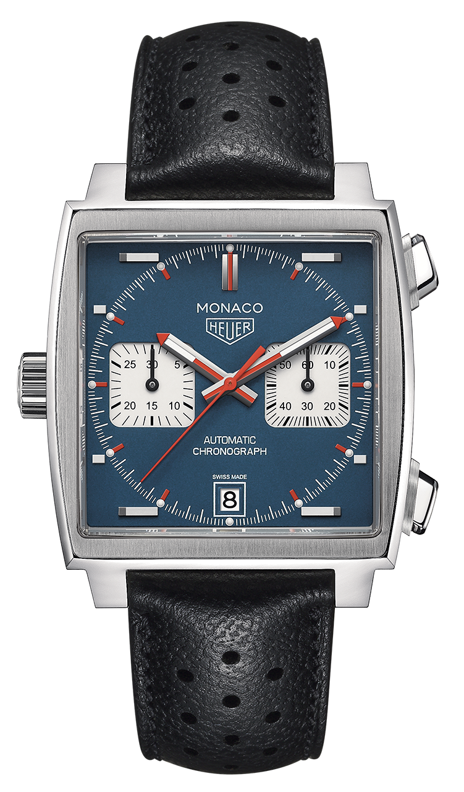
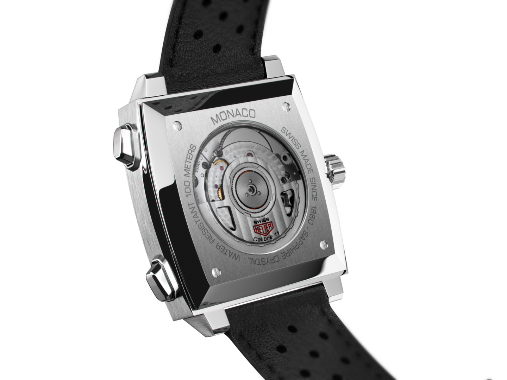
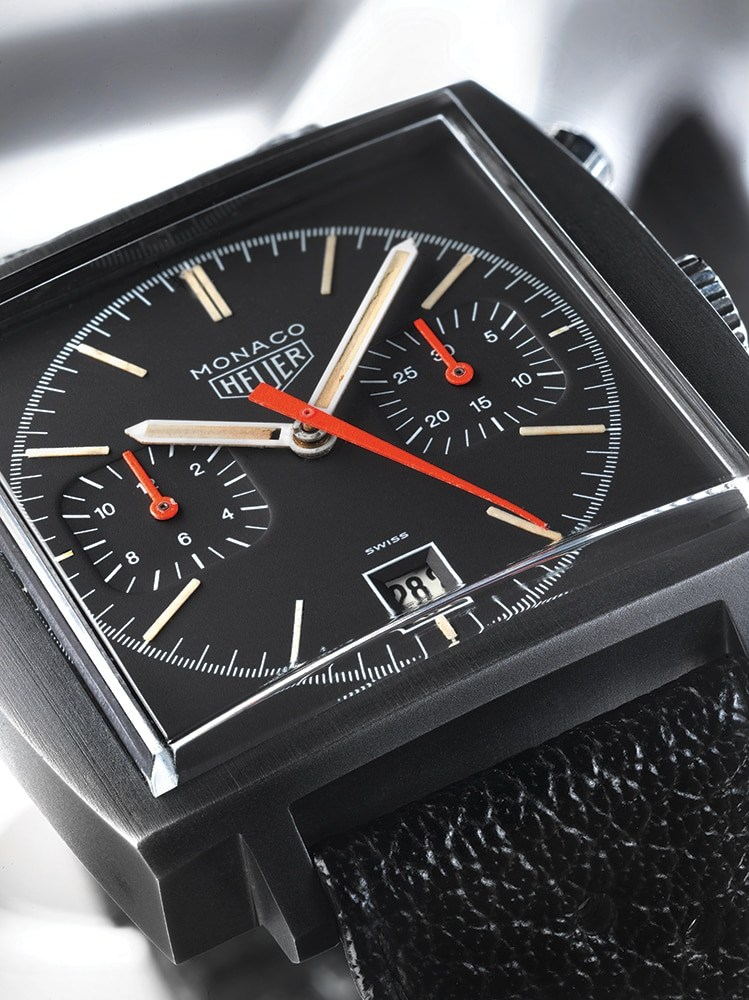
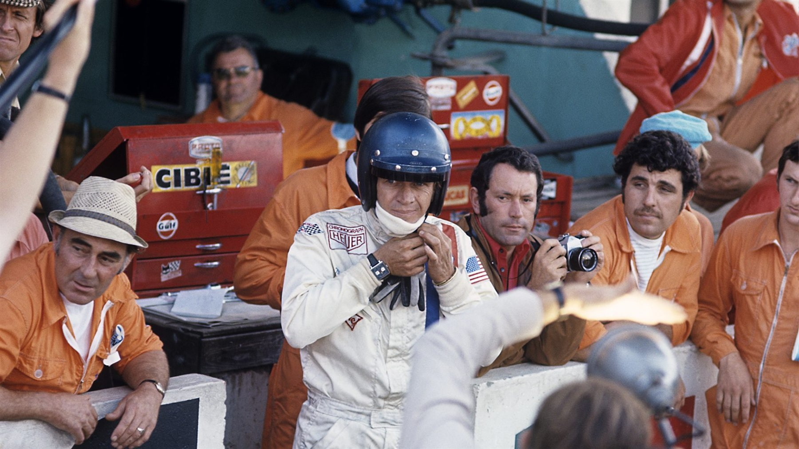

A Heuer Monaco koronája a tok bal oldalán volt. Nem azért, mert egy formatervező ott találta szebbnek, és nem is azért, mert balkezes vevőknek készült. A szerkezetet csak így lehetett értelmesen összerakni.

Az órát 1969 márciusában mutatták be. Szögletes volt egy kerek órákkal teli világban, kék egy fehér és fekete számlapokhoz szokott iparágban, vastag egy olyan korszakban, amikor az elegancia vékonyságot jelentett. Ráadásul automata kronográf dolgozott benne, vagyis egyszerre próbált megoldani egy mérnöki problémát és eladni egy formát, amelyet addig vízálló sportórán szinte lehetetlennek tartottak.

Nem lett siker.

A Monaco nagyjából hat év után eltűnt a Heuer kínálatából. Ha Steve McQueen nem veszi fel egy forgatáson, ma talán ugyanúgy lapoznánk át fölötte a katalógusokban, mint a korszak sok más különös kronográfja fölött.

Az óra története ezért nem az a kényelmes mese, amelyben egy zseniális tervet azonnal felismer a világ. Inkább arról szól, hogy egy kereskedelmi kudarcot egy film, néhány archív fénykép és a kilencvenes évek nosztalgiája évtizedekkel később ikonná tett.

*A bal oldali koronát továbbvivő modern Monaco Calibre 11. Fotó: [TAG Heuer](https://magazine.tagheuer.com/en/2024/12/09/the-history-of-the-calibre-11-and-the-tag-heuer-monaco-chronomatic/).*

## A verseny, amelyben mindenkinek más lett az első hely

Az 1960-as évek közepére az automata karóra hétköznapi technika volt. A kronográf továbbra is kézi felhúzású maradt. A két szerkezet összeépítése azért volt nehéz, mert a stopper kapcsolói, kerekei és számlálói sok helyet foglaltak, miközben a rotor számára is szabad mozgás kellett.

Három fejlesztési irány futott egyszerre.

A Zenith 1969. január 10-én jelentette be az El Primerót, egy nagy frekvenciájú, teljesen integrált automata kronográfot. A Seiko ugyanabban az évben hozta forgalomba a 6139-et Japánban, oszlopkerékkel és függőleges kuplunggal. A harmadik csapat nem egyetlen gyár volt, hanem riválisok szövetsége.

A Heuer-Leonidas és a Breitling kronográfokat készített. A Büren, amely időközben a Hamilton tulajdonába került, vékony mikrorotoros automata szerkezethez értett. A Dubois Dépraz a kronográfmodult vállalta. A titkos együttműködés kódneve Project 99 volt.

A megoldásuk nem egyetlen, alapoktól kronográfnak tervezett kaliber lett. A Büren automata alapszerkezetét egy külön Dubois Dépraz stoppermodullal kapcsolták össze. A modul a számlap felőli oldalra került, ezért a két rész vezérlőszervei ellentétes oldalra estek. A kronográf nyomógombjai jobbra maradtak, a korona balra került.

Ebből lett a Calibre 11, vagy Chronomatic. 1969. március 3-án Genfben és New Yorkban egyszerre mutatták be.

Hogy melyik volt a világ első automata kronográfja, attól függ, mit mérünk. A Zenith jelentette be előbb. A Project 99 csapata több típust mutatott be tavasszal és még abban az évben nemzetközi piacokra szállított. A Seiko 6139 valószínűleg korán került tényleges vásárlókhoz Japánban. Mindhárom fél tud magának olyan mondatot írni, amelyben ő az első.

A fontosabb tény az, hogy 1969-ben egy régi szerkezeti probléma három, egymástól lényegesen különböző megoldást kapott.

*A modern Calibre 11 hátulról: a rotor és a moduláris szerkezet mai változata. Fotó: [TAG Heuer](https://magazine.tagheuer.com/en/2024/12/09/the-history-of-the-calibre-11-and-the-tag-heuer-monaco-chronomatic/).*

## A tok, amelyet el kellett foglalni a Breitling elől

Jack Heuer az új szerkezetet az Autaviába és a Carrerába is be akarta építeni. Mindkettő ismert, kerek modell volt, csak nagyobb tokra volt szükségük a vastagabb Calibre 11 miatt. Heuer azonban úgy érezte, az új technikához kell egy harmadik óra is, amely már messziről jelzi, hogy valami megváltozott.

Ekkor érkezett hozzájuk az Erwin Piquerez SA egyik képviselője egy szögletes tok mintájával.

A szögletes órák nem számítottak újdonságnak. Vízálló szögletes sporttokot viszont nehéz volt készíteni. Kerek fedélnél és tömítésnél a nyomás egyenletesen oszlik el. A sarkokkal rendelkező tok zárása bonyolultabb, a korabeli szögletes órákat ezért inkább vékony öltönyórának szánták.

Piquerez szabadalmaztatott rendszere megoldotta a tömítést. Jack Heuer rögtön felismerte a lehetőséget, és kizárólagos jogot szerzett arra, hogy a tokot kronográfhoz használja. Ez azért is számított, mert a Calibre 11 fejlesztésében részt vevő Breitling ugyanazt a szerkezetet kapta. Együtt fejlesztettek motort, közben ugyanazokért a vevőkért versenyeztek. A szögletes tok biztosította, hogy a Heuer bemutatóóráját ne lehessen összekeverni a partner termékével.

A név a Monacói Nagydíjból érkezett. A tok 39 milliméter széles volt, az élei élesen futottak, a plexiüveg pedig egy különösen magas négyzetként ült fölötte. A kék 1133B számlapján fehér segédszámlapok, vörös mutatók és hat óránál dátumablak jelent meg. Létezett szürke 1133G is.

A Monaco egyszerre volt mérnöki bemutatódarab és színes tárgy az 1970-es évek küszöbén. Ez volt az ereje. Ez lett a baja is.

## Egy óra, amely azt üzente, hogy ne nyúlj hozzá

A bal oldali koronához később jó marketingmondat született. Az automata órát nem kell minden reggel felhúzni, ezért a korona átkerülhetett oda, ahol a viselő kevésbé éri el. A Heuer ezzel látványosan jelezte, hogy az új kronográf önmagát húzza fel.

Az igazság prózaibb: a moduláris szerkezet diktálta az elrendezést. A jó formatervezés azonban gyakran éppen abból születik, hogy egy kényszert nem próbálnak elrejteni. A Monaco nem szégyellte a rossz oldalra került koronát. Ismertetőjegyet csinált belőle.

Maga a Calibre 11 sem volt hibátlan. Az első változat 19 800 féllengéses óránkénti frekvenciája, moduláris felépítése és a mikrorotor helyigénye összetett, vastag szerkezetet adott. Hamar jött a módosított Calibre 12, magasabb, 21 600-as frekvenciával. Később Calibre 15-ös és kézi felhúzású Monaco-változatok is készültek.

A vásárlók ettől még nem rohantak érte. A tok nagynak és furcsának hatott, a kék számlap harsány volt, az ár pedig magas. A korai „Chronomatic” feliratot is lecserélték „Automatic Chronograph”-ra, mert az amerikai vevők és eladók egy része nem értette, mit jelent az új szó.

A Monaco 1975 körül eltűnt a rendes kínálatból. Néhány késői változat még készült, de a kísérlet lényegében véget ért. Az Autavia és a Carrera túlélte a nehéz évtizedet. A kifejezetten jövőbe szánt modell nem.

*A ritka, fekete bevonatos 74033N, későbbi nevén Dark Lord. Fotó: [TAG Heuer](https://magazine.tagheuer.com/en/2024/04/10/a-matter-of-time-podcast-season-3-the-grand-story-of-monaco/).*

## Az ember, aki nem reklámarc akart lenni

Steve McQueen 1970 nyarán Franciaországban forgatta a Le Mans című filmet. Nem könnyed autós mozit akart, hanem olyan versenyfilmet, amelyben a gépek és a pálya fontosabbak a párbeszédnél. A történet végül nehéz gyártás, rendezőcsere és pénzügyi káosz közepette készült el, majd 1971-ben került mozikba.

McQueen karakteréhez, Michael Delaneyhez versenyzői megjelenés kellett. A színész Jo Siffert svájci pilótát tekintette mintának, aki Heuer nagykövetként Heuer-jelzést viselt a ruháján. A film kellékese, Don Nunley ezért olyan órát keresett, amely illik az overallhoz és több azonos példányban is rendelkezésre áll a jelenetekhez, a fotókhoz és tartaléknak.

Jack Heuer későbbi beszámolója szerint McQueennek először egy Omegát is felajánlottak. Visszaadta, mert nem akarta, hogy a márka a nevével reklámozzon. A kék Heuer Monaco 1133B-t választotta. Aligha sejtette, hogy ezzel létrehozza az egyik legtovább működő, nem hivatalos órakampányt.

A filmben a Monaco nem kap külön közelképet és senki nem mondja ki a nevét. Egyszerűen ott van McQueen csuklóján, a fehér overall és a Porsche 917 környezetében. Ez hitelesebb kapcsolatot teremtett, mint egy hagyományos reklám. Az óra nem hírességhez került. Egy szerep tárgyi részlete lett.

Ez azonban nem mentette meg azonnal. Mire a Le Mans kultuszfilmmé vált, a Monaco már kifutott. A McQueen-kapcsolat értékét igazán a gyűjtői piac és a későbbi újrakiadások fedezték fel.

*Steve McQueen a Le Mans forgatásán, Monacóval a csuklóján. Fotó: Bernard Cahier / Getty Images, [TAG Heuer](https://magazine.tagheuer.com/en/2020/11/24/monaco-mcqueen-legend/).*

## Két évtized hallgatás, majd egy fekete visszatérés

A Heuer vállalat a kvarcválság alatt tulajdonost váltott, 1985-ben pedig a Techniques d’Avant Garde csoporttal létrejött a TAG Heuer. A nyolcvanas évek új márkája Formula 1 modelleket, búvárórákat és modernebb sportórákat épített. A régi Heuer-katalógus sokáig nem örökség, inkább lezárt fejezet volt.

Ez a kilencvenes években változott meg. A Carrera 1996-os visszatérése után 1997-ben elkészült az első új Monaco, a CS2110. Fekete számlapot kapott, kézi felhúzású szerkezetet és mindössze ötezer darabos sorozatot. Nem volt pontos másolata az 1133B-nek, még a számlapjára is a régi Heuer logó került.

A kék, McQueen-féle megjelenés később tért vissza. Ekkorra a Monaco már nem egy eladhatatlan furcsaság volt, hanem a márka történetének bizonyítéka. A kudarc ritkaságot teremtett, a film jelentést adott hozzá, az idő pedig megszelídítette a formát.

Azóta a Monaco készült hagyományos Calibre 11-gyel, jobb oldali koronás szerkezetekkel, csontvázas számlappal, titánból, különböző versenyszínekben és számos limitált kiadásban. Nem mindegyik őrizte meg az eredeti arányok nyers egyszerűségét.

2026-ban a TAG Heuer ismét visszalépett a kiindulóponthoz. Az új, 39 milliméteres, ötös minőségű titántok közelebb került az 1969-es geometriához. A TH20-11 már integrált, oszlopkerekes manufaktúra-kronográf, 80 órás járástartalékkal. Műszakilag semmi szüksége arra, hogy a koronája bal oldalon legyen. Mégis ott van.

Ami 1969-ben szerkezeti kényszer volt, 2026-ra örökséggé vált.

## Mi marad McQueen nélkül

Könnyű azt mondani, hogy a Monaco csak egy filmszerep miatt híres. A film nélkül valóban aligha lenne ugyanaz az óra. De McQueen sem tudott volna ikont csinálni egy teljesen jellegtelen tárgyból.

A Monaco formája ma is kényelmetlen. Vastag, nagy felületet mutat, a négyzet sarkai több helyet kérnek a csuklón, mint egy ugyanekkora kerek tok. A számlap körben és négyzetben gondolkodik egyszerre. A nyomógombok jobbra, a korona balra áll. Semmi nem akar semleges lenni rajta.

Éppen ezért élte túl a saját kudarcát. Nem azért, mert 1969-ben mindenben ez volt az első. Az automata kronográf elsősége megoszlik három fejlesztés között, a szerkezete kompromisszumos volt, a piacon pedig veszített.

A Monaco attól fontos, hogy a technikai újdonságot nem csomagolta ismerős formába. Vállalta, hogy az új szerkezethez új tárgy tartozzon. A vevőknek akkor nem kellett. Később viszont éppen azt kezdték keresni benne, amitől eredetileg idegenkedtek.

Egy szögletes tokot. Egy kék számlapot. És egy koronát a rossz oldalon.
