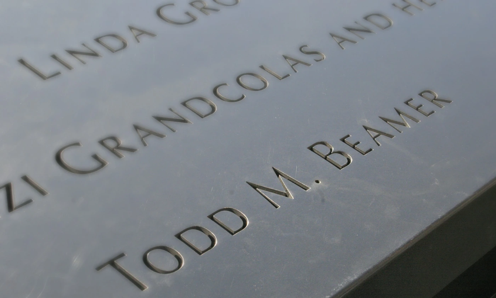
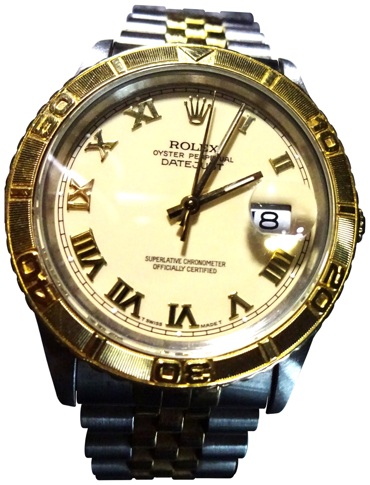

Múlt pénteken, 2026. szeptember 11-én volt a [2001-es terrortámadások huszonötödik évfordulója](https://www.911memorial.org/connect/commemoration/25th-anniversary-commemoration). Ez adta ennek a cikknek az apropóját. Todd Beamer óráján keresztül szeretnénk emlékezni rá és a 93-as járat áldozataira: egy olyan személyes tárgy felől, amelyet eredetileg a következő munkanapokra szántak.

Egy dátumablak többnyire a számlap legkevésbé érdekes része. Ha jól működik, alig figyelünk rá: egy apró szám a következő találkozó, a következő munkanap rendjében. Todd Beamer Rolexén ez a szám tizenegy.

A New York-i 9/11 Memorial & Museum [maga is kiemeli ezt a részletet](https://www.911memorial.org/connect/blog/childrens-911-tributes-display-flight-93-memorial). Az órán viszont már nehéz volna egyszerűen időt nézni. A tok deformálódott, a számlap sérült, az egykor szabályos felületek elvesztették a rendjüket. A márka még felismerhető. A tulajdonos neve fontosabb lett nála.

Egy órás történetben általában az a kérdés, hogyan készült a tárgy, és miért működik úgy, ahogy. Itt ahhoz kell közelebb kerülnünk, miért őrzünk meg egy órát akkor is, amikor már nem az időmérés miatt nézünk rá.

## A név a számlap mellett

Beamer 32 éves volt, az Oracle ügyfélkapcsolati munkatársa, és a New Jersey állambeli Cranburyben élt. Felesége, Lisa a harmadik gyermeküket várta. 2001. szeptember 11-én üzleti útra indult Kaliforniába. Ezek a [múzeumi életrajz](https://collection.911memorial.org/Detail/objects/56331/rel/1) rövid, hétköznapi adatai. Mögöttük egy olyan élet állt, amelynek a folytatását ő és a családja is természetesnek vehette.

Beamer neve a New York-i szeptember 11-i emlékmű névsorában is olvasható. A felirat nem meséli el ezt a hétköznapi életet, csak megnevezi azt, akit elveszítettek. Az óránál is innen érdemes elindulni: az emléktárgy könnyen eltakarhatja azt az embert, akire emlékeznünk kellene.

*Todd M. Beamer neve a New York-i emlékművön, 2014. március 9. Fotó: Brian Soergel, [Todd Beamer WTC / Wikimedia Commons](https://commons.wikimedia.org/wiki/File:Todd_Beamer_WTC.jpg), [CC BY-SA 3.0](https://creativecommons.org/licenses/by-sa/3.0/). Átméretezett, WebP-re konvertált változat; a felirat változatlan.*

A múzeum gyűjteményében egy megtalált Oracle-névjegykártyája is szerepel. Gyűrött, az egyik sarka hiányzik, de a név és a munkakör olvasható. A leltári bejegyzés szerint a Beamer család ajándéka. A kártya és az óra együtt egészen pontosan jelöli azt a határt, ahol a munkába vitt személyes holmik történelmi tárgyakká válnak. Egyik sem erre készült.

## Milyen Rolex volt?

Az „Oyster Perpetual” megnevezés önmagában nem elég a modell azonosításához. A Rolex névrendszerében több történet rétegződik egymásra: az Oyster a zárt tokhoz, a Perpetual az automata felhúzáshoz kapcsolódik. Ezek a kifejezések a Datejust nevében és számlapján is megjelenhetnek.

A [Hodinkee 2024-es feldolgozása](https://www.hodinkee.com/articles/remembering-911-through-the-rolex-that-is-frozen-in-time) Beamer óráját kétszínű Datejust Turn-O-Graphként azonosítja, úgynevezett *tapestry*, finoman csíkozott számlappal. Ezt az azonosítást követjük. Pontos referenciaszámot viszont nem adunk meg: a cikkhez ellenőrzött múzeumi anyag nem igazolta azt. Egy hasonló óra katalógusadata nem helyettesíti ennek az egy darabnak a dokumentációját.

A típust itt egy másik, ép órán mutatjuk meg, nem a múzeumi tárgy fényképén. Az alábbi példány római számos számlapja eltér Beamer csíkozott számlapjától, de a dátumablak, a beosztott lünetta és a kétszínű fémszíj jól követhető rajta. Az összehasonlítás a kialakítás megértését segíti; nem Beamer órájának sérülés előtti rekonstrukciója.

*Típusszemléltetés, nem Beamer órája. A fotós leírása szerint 1992-es Datejust Turn-O-Graph. Fotó: [Norbert Pietsch (Enpi48) / Wikimedia Commons](https://commons.wikimedia.org/wiki/File:Rolex_Herrenuhr_Oyster_Perpetual_Datejust_mit_Turn-O-Graph_L%C3%BCnette_Gold_(1992).jpg), [CC BY-SA 4.0](https://creativecommons.org/licenses/by-sa/4.0/). Lume: háttéreltávolítás AI-kivágómaszkkal, az eredeti óraképpontok megőrzésével; a kivágott változat is CC BY-SA 4.0. Az eredeti fotón nyolcas dátum látható, ezt nem módosítottuk tizenegyre.*

## Három név, három feladat

A [Rolex saját történeti összefoglalója](https://www.rolex.com/about-rolex/history/1926-1945) az Oystert 1926-hoz, a Perpetual rotort 1931-hez, a Datejustot 1945-höz köti. A tok védi a szerkezetet, a rotor a viselő mozgásából nyer energiát a felhúzáshoz, a dátumablak pedig a hónap napját mutatja. A Perpetual szó itt automata felhúzást jelent, nem öröknaptárat.

A Turn-O-Graph különbsége kívül van: a számlapot körülvevő gyűrű, a lünetta forgatható, és időbeosztást hordoz. Egy díszítő lünetta elsősorban fényt és formát ad az órának. Itt ugyanaz az alkatrész egyszerű időmérő segédeszközzé válik. Ettől a Turn-O-Graph a Datejust családon belül saját karaktert kap: az elegáns megjelenés mellett egy kézzel kezelhető funkciót is kínál.

## A sportos kezdetektől a Datejustig

A Turn-O-Graph története 1953-ban, a 6202 referenciával indul. A [Phillips által dokumentált korai példány](https://www.phillips.com/detail/rolex/87345) fekete lakkozott számlapot és hatvan egységre osztott forgatható lünettát kapott. A működési ötlet már itt megvan: a számlap köré helyezett mozgatható skála hozzáad egy feladatot a hagyományos, hárommutatós órához, külön stoppermechanika nélkül.

Az ötvenes évek közepére ez az ötlet a Datejuston is megjelent. A [Phillips 1955-re datált, 6309 referenciájú darabja](https://www.phillips.com/detail/rolex/CH080515/283) már dátumablakot és számozott forgatható lünettát egyesít. Nem egyszerűen új nevet kapott a régi óra: az időmérő gyűrű a Datejust más jellegű, hétköznapokra szánt formájába költözött át.

Innen ered a *Thunderbird* név is. A Phillips katalógustanulmánya a korai amerikai reklámokhoz köti az elnevezést, amelyekben az amerikai légierő Thunderbirds bemutatóköteléke szerepelt. A becenév a modell történetéhez tartozik; Beamer órájáról nem bizonyít katonai szolgálatot vagy különleges kiadást.

Ez a kettősség teszi érdekessé a típust. Az arany részletek és a mintázott számlap miatt könnyű csak az elegáns oldalát látni, miközben a számlap körüli gyűrű egy korai, praktikus ötletet őriz. A Turn-O-Graphnál a sportos funkció nem külön segédszámlapokkal vagy nyomógombokkal jelenik meg. A megszokott óraformán belül marad.

## Mire jó a forgatható gyűrű?

Képzeljünk el egy teljesen hétköznapi helyzetet. A percmutató a húszas percjelzésnél áll, amikor elfordítjuk a lünettát, és a kezdőjelét hozzá igazítjuk. Ha később a percmutató a harmincötös jelzéshez ér, a gyűrűn tizenöt eltelt percet olvasunk le. A számlapon közben továbbra is a pontos idő látható; a gyűrű csak egy második viszonyítási pontot adott hozzá.

Ez nem kronográf. Nem indul el külön mérőmutató, és nincs nullázógomb sem. Egy találkozó vagy rövid várakozás hosszát így kényelmes követni, de a gyűrű nem számolja helyettünk az eltelt órákat: a percmutató hatvan perc után újra körbeér. A megoldás ereje az egyszerűségében van. A mérés kezdetét a lünetta helyzete jegyzi meg.

A későbbi Datejust Turn-O-Graphok belsejéről egy [1996 körülre datált Christie's-tétel](https://onlineonly.christies.com/s/christies-watches-online-winter-holiday-sale/rolex-two-tone-thunderbird-turn-o-graph-datejust-ref-16263-273/64818?sc_lang=fr) ad konkrét példát: acél és 18 karátos arany kivitel, Jubilee fémszíj, 3135-ös automata kaliber. Az állapotjelentés külön említi a gyors dátumállítást is. Ezek ennek a dokumentált példánynak az adatai, nem Beamer sérült órájának igazolt specifikációi.

A gyors dátumállítás azt jelenti, hogy a dátum külön léptethető, nem kell miatta újra és újra körbehajtani az óra- és percmutatót. Ha egy automata óra a pihentetés alatt leáll, ez használatba vételkor érezhető kényelmi különbség. A rotor, a dátum és a forgatható gyűrű három külön feladatot végez: az első energiát ad, a második a naptári tájékozódást segíti, a harmadik rövid időtartamokat követhetővé tesz.

Ez a technikai kitérő segít megérteni az óra eredeti használatát. Nem mondja meg, hogyan használta Beamer az utolsó perceiben. Nincs ellenőrzött bizonyítékunk arra, hogy a lünettával időzítette volna az ellenállást, vagy egyáltalán az óráját nézte volna közben. Ezt a szerepet nem írhatjuk hozzá utólag, csak azért, mert szépen illene egy órás történetbe.

## Egy telefonbeszélgetés határai

A [National Park Service hívásösszesítése](https://www.nps.gov/flni/learn/historyculture/phone-calls-and-seating-chart.htm) szerint Beamer az üléshez tartozó Airfone telefonon egy GTE-telefonkezelővel beszélt. A feleségét nem sikerült elérnie; üzenetet hagyott számára a közvetítőnél. A beszélgetésből az is kiderült, hogy az utasok cselekvésre készülnek.

A hozzá kötődő „Let's roll” mondatot a telefonkezelő beszámolójából ismerjük. Nem Beamer nyilvánosan hozzáférhető hangfelvételét idézzük. A hívásokat bemutató NPS-oldal különbséget tesz a rögzített üzenetek és az utólagos tanúbeszámolók között; ezt az olvasatban is meg kell őriznünk.

Egy rövid mondat könnyebben megmarad a közös emlékezetben, mint egy eseménysor. Beamer neve ezért sokak számára az ellenállás jelképe lett. A jelkép azonban nem szűkítheti egyetlen emberre a történetet. A gépen más utasok és a személyzet tagjai is telefonáltak, információkat adtak tovább, és részt vettek a közös fellépésben.

## Amit 10:03-ról tudunk

A [9/11-bizottság jelentése](https://www.9-11commission.gov/report/911Report_Ch1.htm) 9:57-re teszi az utasok ellentámadásának kezdetét. A gépeltérítők a küzdelem alatt is a kormánynál maradtak, végül a földbe vezették a repülőt. A 93-as járat Pennsylvania államban, Shanksville közelében csapódott be, helyi idő szerint 10:03-kor. Nem érte el washingtoni célját.

A jelentés a pontos időpontot többek között radaradatokkal és a fedélzeti adatrögzítők vizsgálatával támasztja alá. A karóra sérült mutatóinak állásából ezt nem lehet független bizonyítékként kiolvasni. Egy erőhatás elmozdíthatja a mutatókat, és egy tárgy fényképe önmagában nem mutatja meg, mikor állt meg a szerkezet.

A megkülönböztetés nem csökkenti az óra jelentőségét. Csak pontosabb helyet ad neki. A repülés utolsó pillanatait a vizsgálati adatokból ismerjük; a dátumablakban látható tizenegyes az emlékezés személyes részéhez tartozik.

## Megőrizni, nem tovább járatni

Egy sérült óránál a gyűjtői gondolkodás könnyen a javítás felé fordul. Lehetne-e új üvege? Cserélhető-e a számlap? Járna-e ismét egy teljes szerviz után? Itt ezek félrevisznek. Nem állapotfelmérést végzünk, és a szerkezet működőképességéről sincs ellenőrzött adatunk.

Érdemes inkább megfigyelni, hogyan változott meg a tárgy feladata. Használati óraként az volt a dolga, hogy a tegnapot maga mögött hagyva a következő napot mutassa. Emléktárgyként éppen egyetlen naphoz köt bennünket. A sérülés ezért nem egyszerűen esztétikai hiba: része annak, amit a tárgy elbeszél. Ez az írás olvasata, nem állítás a múzeum konkrét restaurálási eljárásáról.

A [Flight 93 National Memorial](https://www.nps.gov/flni/learn/flight93nps.htm) a járat negyven utasának és személyzeti tagjának állít emléket. A negyven név mellett Beamer órája egyetlen élethez vezet közelebb. Arra emlékeztet, hogy a történelmi összefoglalók szereplőinek munkanapjuk, családjuk és megszokott személyes tárgyaik voltak.

Az arany, az acél és az automata szerkezet megmagyarázza, milyen óra volt. Hogy miért őrizzük meg az emlékét, arra Todd Beamer neve ad választ. A dátumablakban pedig tizenegy marad.
